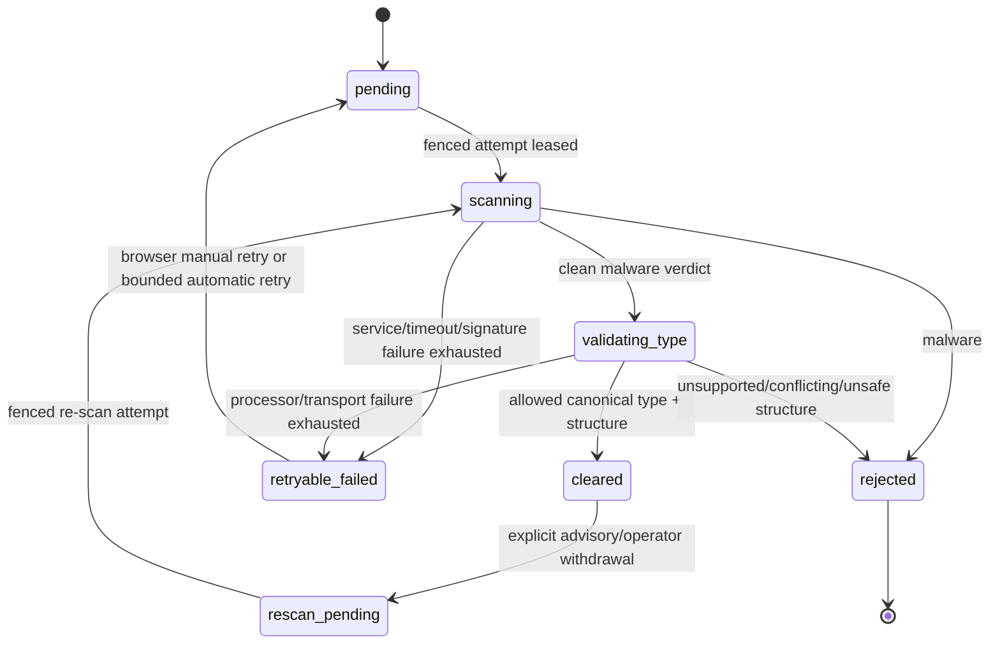
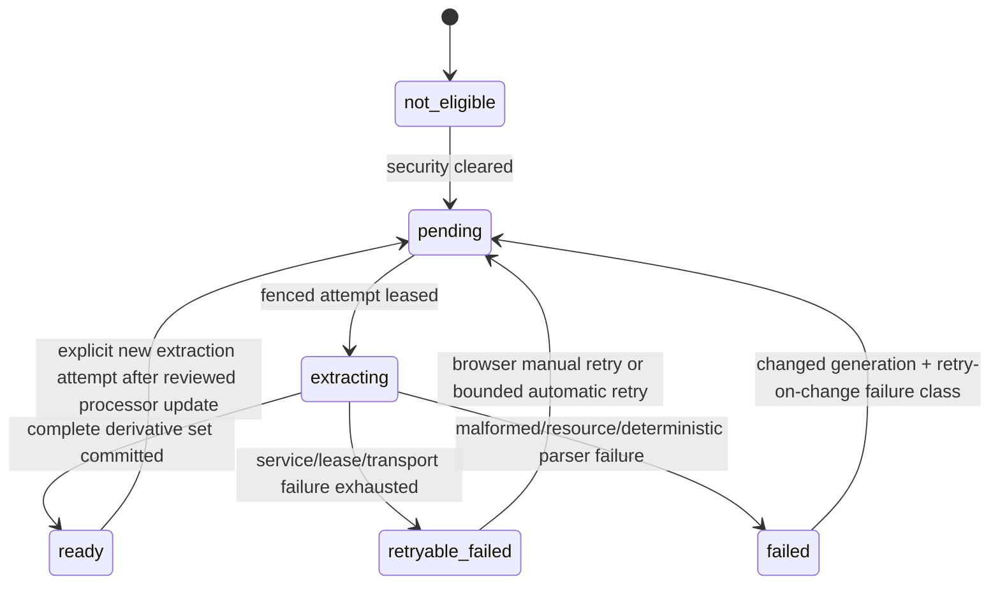

# V2 artifact quarantine, extraction/OCR, and derived-artifact contract

- **Status:** Approved design; implementation is owned by follow-on tickets.
- **Approval date:** 2026-08-23
- **Architecture ticket:** [HOR-460](https://linear.app/horizonshift/issue/HOR-460/v2-approve-artifact-quarantine-extractionocr-and-derived-artifact)
- **Product contract:** Obsidian `Platform V2 — Managed Digital Workforce — Product Requirements`, especially `REQ-028`–`REQ-033` and `SCN-005`–`SCN-007`
- **Related authority:** [`v2-authentication-authority.md`](v2-authentication-authority.md), especially `DES-HOR-451-05`, `DES-HOR-451-13`, and the artifact endpoint classification
- **Related Chat contract:** [`v2-chat-tool-confirmation.md`](v2-chat-tool-confirmation.md), especially `DES-HOR-456-10`, sections 12 and 16, and artifact-drift staleness
- **Implementation owners:** HOR-461, HOR-462, HOR-458, HOR-517, and HOR-467 as bounded in section 22

This record is the repository authority for V2 artifact admission, quarantine, MIME and malware clearance, deterministic extraction/OCR, immutable derivatives, shared library/search registration, raw-compatible workflow use, retention, and deletion. It does not implement the design. Where the pre-V2 artifact service uses one `pending -> available -> deleting -> deleted` state and treats caller-declared MIME as authoritative, this record supersedes those semantics only after the V2 artifact epoch described in section 19.

## 1. Approved design decisions

The founder approved the original complete package below for HOR-460 on 2026-08-23; that approval and its consequences are durable in the Linear issue. The historical RWX signature-transport amendment to `DES-HOR-460-07` was superseded for V2 by approved `DES-HOR-469-03` / `DES-HOR-538-01`: all processor pods run on the one K3s node, so the reconstructible signature bundle uses one default-class local-path RWO claim outside the dedicated AgentPool workspace filesystem. A product-behavior change or a different inherited datastore, component, transport, isolation, failure, or lifecycle model requires a new durable decision rather than an implementation-local interpretation.

### DES-HOR-460-01 — Preserve PostgreSQL and MinIO as the artifact authorities

- **Approved by:** Nuno Gonçalves
- **Approved on:** 2026-08-23
- **Scope:** Durable processing state, queueing, search, immutable original/derived bytes, and recovery.
- **Decision:** PostgreSQL remains authoritative for artifact metadata, independent state machines, leased processing attempts, lineage, library/search projections, references, and lifecycle. MinIO remains authoritative only for immutable byte objects. No message broker, external search engine, second metadata store, or hosted processing dependency is introduced.
- **Consequences:** Workers converge through database leases and compare-and-swap. PostgreSQL full-text indexes serve V2 artifact search. MinIO state alone never proves that bytes are safe or customer-visible.
- **Evidence:** Founder approval recorded in HOR-460.

### DES-HOR-460-02 — Enforce storage-level quarantine and least-privilege byte zones

- **Approved by:** Nuno Gonçalves
- **Approved on:** 2026-08-23
- **Scope:** Upload, scanner access, serving, derived storage, and deletion credentials.
- **Decision:** Unique immutable objects use policy-separated quarantine, cleared-original, and derived zones with distinct least-privilege credentials. Customer API and gateway processes may write quarantine and read cleared bytes but cannot read quarantine. Only the trusted coordinator may promote exact digest-verified bytes into cleared/derived storage or purge every zone. No presigned or object-store URL is customer-visible.
- **Consequences:** A serving-route defect cannot fetch unscanned bytes with its serving credential. Follow-on migration rotates the current broad bucket credential and fails closed during cutover.
- **Evidence:** Founder approval recorded in HOR-460.

### DES-HOR-460-03 — Represent storage, security, and extraction independently and fail closed

- **Approved by:** Nuno Gonçalves
- **Approved on:** 2026-08-23
- **Scope:** Artifact state machines, customer projections, and every Chat/workflow/download/reuse boundary.
- **Decision:** Storage lifecycle, security verdict, extraction lifecycle, and library registration are separate durable fields and attempt histories. Only a current `cleared` security verdict permits download, shared registration, Chat/extraction consumption, or workflow input. Extraction pending or failure never changes or implies the security verdict; malware or type rejection never masquerades as extraction failure.
- **Consequences:** Aggregate UI states are projections rather than a competing mutable state. Missing, ambiguous, stale, or unavailable security authority denies use.
- **Evidence:** Founder approval recorded in HOR-460.

### DES-HOR-460-04 — Fix the V2 format and admission policy

- **Approved by:** Nuno Gonçalves
- **Approved on:** 2026-08-23
- **Scope:** Customer uploads, Chat attachment count, MIME/container validation, and parser admission.
- **Decision:** The exact V2 set is PDF, DOCX, CSV, XLSX, UTF-8 TXT, JPEG, PNG, and TIFF. Each file is limited to 25 MiB (26,214,400 bytes), and each Chat message may reference at most six distinct artifacts, including new uploads, pasted captures, and reused artifacts. Detected canonical type plus bounded structural validation is authoritative. Conflicting extension/type, archives other than validated OOXML containers, executables, macro-enabled or embedded-active containers, encrypted files, and unsupported formats are permanently rejected.
- **Consequences:** Both early `Content-Length` checks and streaming hard limits apply. Workflow or API-specific inputs may narrow but never widen this set without a new product and architecture decision.
- **Evidence:** Founder approval recorded in HOR-460.

### DES-HOR-460-05 — Use ClamAV 1.4.6 LTS as the malware verdict engine

- **Approved by:** Nuno Gonçalves
- **Approved on:** 2026-08-23
- **Scope:** Malware scan engine, signature freshness, verdict evidence, and security retry behavior.
- **Decision:** Pin ClamAV 1.4.6 LTS by immutable image digest. Record engine, configuration, and signature versions on every attempt. Refresh official signatures at least every two hours; make the scanner unready and issue no new clean verdict when signatures exceed 24 hours. Malware verdicts and deterministic policy rejections are permanent for unchanged bytes. Scanner outage, timeout, or stale signatures are retryable but never safe.
- **Consequences:** Engine and security updates require reviewed image/version changes. Signature data updates independently through an isolated updater with no artifact or database credential.
- **Evidence:** Founder approval recorded in HOR-460.

### DES-HOR-460-06 — Use deterministic Tika/Tesseract extraction; keep LLMs non-authoritative and deferred

- **Approved by:** Nuno Gonçalves
- **Approved on:** 2026-08-23
- **Scope:** MIME detection support, document/table extraction, OCR, derived evidence, and any future LLM role.
- **Decision:** Pin Apache Tika 3.3.1 and Tesseract 5.5.0 with English, Portuguese, and orientation data as the V2 extraction/OCR baseline. Deterministic parser/OCR output, processor configuration, coverage, and lineage are the only extraction authority. An LLM may later be useful downstream for bounded semantic interpretation, labeling, or workflow reasoning over an already security-cleared immutable derivative, but it is not needed for byte parsing or OCR and cannot silently repair, replace, certify, or enrich the canonical derivative or search index in V2. Any LLM-based extraction fallback, document-vision/OCR provider, canonical enrichment, or claim that changes extracted evidence, lineage, retention, network/data handling, or failure semantics requires a separate approved architecture and, where customer behavior changes, product decision.
- **Consequences:** Extraction remains reproducible, customer-controlled, attributable, and testable without hosted inference. Chat may reason over ready derivatives but must cite deterministic coverage and never claim unread content.
- **Evidence:** Founder approval and explicit LLM-role clarification recorded in HOR-460.

### DES-HOR-460-07 — Isolate untrusted parsers behind credentialless mTLS services

- **Approved by:** Nuno Gonçalves
- **Approved on:** 2026-08-23
- **Scope:** Deployment topology, service transport, credentials, filesystem, network, and resource isolation.
- **Decision:** A trusted control-plane-owned coordinator alone holds bounded PostgreSQL and MinIO credentials and leases work. Separate scanner and extractor pods accept one bounded stream over internal mTLS, hold no database, artifact, Kubernetes, or customer credential, use no service-account token, run non-root with read-only roots, seccomp, capability drop, and bounded scratch, and have deny-by-default ingress and zero egress. A separate FreshClam updater pod and network identity is the only signature-source client; it atomically writes a dedicated default-class `ReadWriteOnce` signature PVC that same-node scanner pods mount read-only, so no updater or synchronizer shares the scanner network namespace. The claim remains on K3s's normal platform path and never uses `iterabase-agentpool-local-path`.
- **Consequences:** Malformed bytes never execute in an API, gateway, coordinator, or credentialed parser process. Processor resources and replicas may be operator-sized without making scanner or parser choice customer-configurable. Artifact processing requires the fixed one-node default local-path RWO contract and fails enablement when access-mode, class, node, sole-writer/read-only, or identity enforcement is absent or ambiguous. Updater, source, or signature-volume failure may leave scanners on the last validated bundle only while it remains within the 24-hour freshness limit; after that, scanners are unready and issue no clean verdict. Signature-volume data is reconstructible non-customer security data rather than artifact or backup authority, so recovery refetches and validates it. Preflight, monitoring, tests, and runbooks must cover atomic publication, sole-writer/read-only enforcement, capacity and availability, outage/freshness behavior, recovery, and multi-replica same-node visibility.
- **Evidence:** Original package approval is recorded in HOR-460. The 2026-08-23 RWX amendment remains historical evidence in Obsidian `HOR-460 — FreshClam RWX Signature Topology Decision`; `DES-HOR-469-03` / `DES-HOR-538-01` supersede only its storage transport/class for the one-node V2 release.

### DES-HOR-460-08 — Use append-only attempts, fenced leases, and bounded retries

- **Approved by:** Nuno Gonçalves
- **Approved on:** 2026-08-23
- **Scope:** Asynchronous scheduling, crash recovery, timeout, transient/permanent classification, and manual retry.
- **Decision:** PostgreSQL `FOR UPDATE SKIP LOCKED` leasing plus attempt generation and fencing drives scan and extraction. Each processing trigger permits exactly three total pre-verdict transient attempts: attempt 1 immediately, attempt 2 after one minute, and attempt 3 after five minutes; there is no automatic attempt 4. Browser-only manual retry creates a new attributable trigger and attempt. Late or expired workers cannot commit. Scanner timeout is 120 seconds and extractor/OCR timeout is five minutes. Deterministic malformed, password, and resource-policy failures are permanent under the same processor/configuration/policy generation; service, lease, and transport failures are retryable.
- **Consequences:** No stage silently retries forever or changes a prior attempt. Retry never converts unchanged malware bytes to clean, and uncertain or missing verdicts remain unavailable.
- **Evidence:** Founder approval recorded in HOR-460.

### DES-HOR-460-09 — Make derived text and tables immutable, bounded, and exactly attributable

- **Approved by:** Nuno Gonçalves
- **Approved on:** 2026-08-23
- **Scope:** Extracted text, OCR, tables, retry output, storage, lineage, and customer evidence.
- **Decision:** Every successful extraction attempt creates a new immutable derivative set—normalized UTF-8 text plus structured tables where present—under unique keys. It records the parent original and digest, attempt, processor/Tika/Tesseract/language/config/image identities, coverage and limits, byte digests, timestamps, and system actor. A transactional manifest selects the completed set. Retries never mutate or replace prior bytes or history, and partial or uncommitted objects are never customer-visible.
- **Consequences:** Search, Chat, and work evidence resolve an exact derivative set and can state incomplete coverage honestly. Derived bytes have no independent customer reference or retention lifecycle.
- **Evidence:** Founder approval recorded in HOR-460.

### DES-HOR-460-10 — Delay shared registration and use PostgreSQL for installation-wide search

- **Approved by:** Nuno Gonçalves
- **Approved on:** 2026-08-23
- **Scope:** Upload status, list/recent/search visibility, metadata/content indexing, and shared reuse.
- **Decision:** Only the uploader or authorized security-status path can see a quarantined upload handle. Security clearance atomically sets library registration, after which all installation Operators and Admins may list, find in recent, search, and reuse it under `artifacts.read`. PostgreSQL indexes safe display metadata immediately and bounded deterministic derivative text/table content only when extraction is ready. Rejected, deleting, deleted, and unregistered content is absent before ranking and snippet generation.
- **Consequences:** There is no private library, top-level navigation, or external search service, and no quarantined-content leak through IDs, counts, ranking, snippets, logs, or recent lists.
- **Evidence:** Founder approval recorded in HOR-460.

### DES-HOR-460-11 — Require exact versioned raw-input compatibility

- **Approved by:** Nuno Gonçalves
- **Approved on:** 2026-08-23
- **Scope:** Chat context, workflow definitions, confirmation/start validation, materialization, and extraction failure.
- **Decision:** Chat reads only a ready deterministic derivative. A security-cleared original may be supplied as raw bytes only when the exact immutable workflow version and input field explicitly declare raw compatibility for the canonical MIME. Compatibility and security are rechecked at proposal, confirmation or start, and materialization. Raw use may proceed independently of extraction but never implies content was extracted or read.
- **Consequences:** Extraction failure preserves useful safe originals without widening arbitrary workflow inputs or allowing Chat to claim unavailable content.
- **Evidence:** Founder approval recorded in HOR-460.

### DES-HOR-460-12 — Purge bytes safely and retain only an attributable tombstone

- **Approved by:** Nuno Gonçalves
- **Approved on:** 2026-08-23
- **Scope:** Retention expiry, Admin deletion, active-reference races, search removal, byte purge, and audit.
- **Decision:** Safe artifacts use the installation retention policy, indefinite by default. Transient quarantine expires after seven days, incomplete uploads after one hour, and permanently rejected bytes purge immediately. Admin-personal deletion and retention use one row-lock and compare-and-swap lifecycle: block while active work references the artifact; fence processing, stale pending Chat confirmation use, unregister search/recent, gate reads, then idempotently purge quarantine, original, and all derivative bytes. Retain a content-free tombstone with artifact ID, digest, size, canonical MIME, source, credential, owner, actor, lifecycle reason and times, plus independently retained historical reference IDs—never filename or extracted content.
- **Consequences:** Partial object-store failure remains `deleting` and retries without restoring availability. Completed historical work remains attributable but bytes cannot be recovered through the product.
- **Evidence:** Founder approval recorded in HOR-460.

## 2. Scope, non-goals, and invariants

### In scope

- Customer, Chat, workflow, sandbox, and tool-produced bytes that enter the V2 shared artifact domain.
- Upload admission, digest and size verification, content-derived MIME and container validation, malware scan, quarantine, promotion, and security re-scan.
- Deterministic extraction of text and tables and OCR for supported image/scanned-document content.
- Independent durable state and append-only processing evidence.
- Installation-wide metadata/recent/content search without a top-level library screen.
- Immutable artifact references and exact raw or derivative consumption evidence.
- Finite/indefinite retention, active-reference deletion guards, object-store reconciliation, and minimal tombstones.
- Packaging requirements for scanner, extractor, signature update, mTLS, network policy, resources, metrics, and operational validation.

### Non-goals

- Runtime, schema, API, worker, UI, chart, or image implementation in HOR-460 itself.
- Private or per-user libraries, sharing grants, cross-installation access, or a top-level Artifact Library.
- Arbitrary archives, executables, legacy DOC/XLS, macro-enabled Office formats, HTML/SVG/RTF, audio/video, password-protected content, or customer-added parsers.
- Hosted file processing, hosted OCR, or an LLM/document-vision service as extraction authority.
- Customer configuration of scanner, parser, OCR engine, signatures, security limits, or search backend.
- Sanitizing or rewriting the immutable original, format conversion, content disarm and reconstruction, or claiming that malware clearance makes business content correct.
- Preview rendering, thumbnail generation, semantic entity extraction, embeddings/vector search, translation, classification, summarization, or accuracy guarantees.
- Self-service deletion UI; V2 deletion remains the approved personal Admin API/runbook operation.

### Non-negotiable invariants

1. An object-store key, filename, caller MIME, extension, prior extraction, or prior reference never proves safety.
2. No customer, Chat, workflow, supervisor, runner, or tool caller can read quarantine bytes through a product or workload route.
3. `security_state = cleared` is required at the database authorization boundary immediately before every original or derivative use.
4. Security and extraction have separate state, attempt, error, retry, version, and audit evidence.
5. A clean scan does not imply extraction success, business correctness, or permission to widen a workflow input.
6. A ready extraction does not override a rejected, withdrawn, deleting, or deleted security/storage state.
7. Derived bytes are immutable children of one immutable original and one exact successful attempt; no derivative becomes a new independent uploaded original by implication.
8. Chat context contains only a ready derivative and its coverage/lineage reference, never raw bytes or a false claim that extraction occurred.
9. Raw workflow materialization requires both current security clearance and an exact immutable workflow-input declaration for the canonical MIME.
10. Shared list/recent/search queries filter registration and current security/storage eligibility before ranking, counting, or generating snippets.
11. Deletion gates reads and search before object deletion begins and never returns to available after the transition starts.
12. Logs, metrics, status events, search telemetry, and normal audit never contain artifact bytes, extracted text, filenames as labels, scanner payloads, object-store credentials, or signed URLs.

## 3. Existing foundation and exact V2 gaps

| Current foundation | Reuse | Exact V2 gap |
| --- | --- | --- |
| `artifact.artifacts` plus MinIO unique object keys and SHA-256 verification | Preserve immutable IDs/digests, non-overwrite keys, streaming I/O, and object-store reconciliation | Current `pending -> available` publishes immediately after upload, trusts caller MIME, and has one broad bucket credential. V2 needs quarantine, split credentials, independent states, processing attempts, and promotion only after scan and type clearance. |
| `work.artifact_links` | Preserve immutable work/attempt/node references and historical FK continuity | Add consumption mode, exact original/derivative evidence, active-reference deletion query, and three-principal attribution. A link cannot make unscanned bytes available. |
| Customer REST `POST/GET/HEAD/DELETE /v1/artifacts` | Preserve streaming single-object upload/download shape and existing download path | V2 upload returns processing state rather than immediately available; add shared list/search/recent/status and derivative reads; apply exact V2 actions and mixed-credential denial; delete must block active work and purge all bytes. |
| Workload `ArtifactService` over gateway mTLS | Preserve exact assignment/invocation authorization and no object-store credential in supervisor/runner/child | Outputs enter quarantine and are not returned as usable refs until clearance. Workload reads require V2 clearance and exact consumption mode. Processing services are a separate internal identity, not a new caller scope. |
| MinIO chart bucket and dedicated user | Preserve customer-controlled object storage and unique immutable objects | Replace the broad read/write/delete identity with write-only quarantine, read-only cleared-serving, and coordinator lifecycle policies. Expand the MinIO NetworkPolicy only for the coordinator; scanner/extractor and signature updater receive no artifact-bucket path. |
| Existing retention/deletion sweeper | Preserve idempotent cross-store retries and metadata tombstones | Split pending/rejected/transient/safe retention, fence processing, remove search atomically, block active work, purge every derivative, and minimize tombstone content. |
| PostgreSQL with pgvector available | Preserve PostgreSQL as the durable database | Use built-in full-text `simple` configuration and GIN indexes; no embeddings or vector search enter V2 artifact search. |
| Authentication decisions in HOR-451 | Preserve current role/account/action checks and owner/actor/credential evidence | Replace v1 `artifact:read|write` and broad Admin scope with `artifacts.read`, `artifacts.upload`, and personal-current-Admin `artifacts.delete`; processing retries remain cookie-only. |
| Chat reference contract in HOR-456 | Preserve immutable refs, confirmation drift checks, and no copied bytes | HOR-460 supplies authoritative security/extraction/compatibility state, deterministic derivative identity, six-reference policy, and deletion staleness. |

The baseline inspection covered `control-plane/internal/artifact`, `internal/server/artifact_api.go`, `internal/gateway/artifact_rpc.go`, migrations `000016_work_graph` and `000017_artifact`, the gateway protobuf, current artifact E2E tests, the control-plane artifact chart values/deployments, MinIO credential policy and NetworkPolicy, and the two related V2 architecture records.

## 4. Target topology and trust boundaries

```text
Browser or bounded API client
  | Product API auth; one raw stream; no object-store URL
  v
Control-plane API / Gateway
  | write-only quarantine credential
  | read-only cleared-original/derived credential
  v
MinIO policy-separated zones
  quarantine/<artifact-id>/<upload-generation>
  originals/<artifact-id>/<sha256>
  derived/<artifact-id>/<derivative-set-id>/<kind>
                  ^
                  | lifecycle credential only
                  |
Artifact coordinator (trusted control-plane binary)
  | PostgreSQL lease/CAS + exact object stream
  | mTLS client identity; no parser in-process
  +----------------------+----------------------+
                         |                      |
                         v                      v
              Scanner adapter pod      Extractor adapter pod
              mTLS -> local clamd       mTLS -> local Tika/Tesseract
              no data credentials       no data credentials
              zero egress               zero egress
                         ^
                         | read-only filesystem mount
                         |
             dedicated default-class RWO signature PVC
                         ^
                         | sole read-write mount; atomic version publish
                         |
             FreshClam updater pod
             separate network identity; update-source egress only
```

Trust rules:

- The API and gateway authenticate and stream bytes but do not parse, scan, extract, OCR, or promote them.
- The coordinator holds only its exact database and object-zone lifecycle grants. It computes transport digests and interprets bounded processor result envelopes; it never loads document parser libraries.
- Scanner and extractor pods receive exactly one bounded stream and return a bounded verdict/output stream. They cannot list or fetch artifacts and cannot assert artifact, human, credential, work, or workflow identity.
- The mTLS adapter in each processing pod authenticates the coordinator, binds one request ID, enforces limits, and talks only to its local engine. Engine processes receive no TLS key or service-account token.
- Scanner pods have an empty egress policy and no signature synchronizer container. They mount the dedicated signature PVC read-only; `clamd` observes only complete version directories selected by an atomic current-manifest switch.
- The FreshClam updater is a separate pod and network identity, the sole read-write mounter of the signature PVC, and the only workload with signature-source HTTPS/DNS egress. It has no route or credential to artifact bytes, MinIO, PostgreSQL, Product API, or the scanner processing port.
- Extractor egress is empty. Tika external-resource resolution, XML external entities, URL fetching, embedded launch, and macro execution are disabled or rejected.
- Product clients, Chat, supervisors, runners, tools, and workflows continue to receive artifact references, never MinIO credentials, storage keys, processor endpoints, or signed URLs.

## 5. Threat model

### Protected assets

- Quarantined, cleared-original, and derived customer bytes.
- Uploader filename/display metadata, source, digest, MIME, size, retention, and lineage.
- Initiating-human, request-actor, executing-identity, browser-session/API-key, and deletion attribution.
- Malware verdict, engine/config/signature version, extraction coverage, and retry/failure evidence.
- Database and object-store credentials, processor mTLS keys, signature-update credentials, and internal endpoints.
- Search index content and snippets, which are customer content even though derived.
- State, lease, object, and reference evidence required to prevent an unsafe use or incomplete deletion.

### Threat actors and failures

- Unauthenticated uploader, malicious Operator, compromised personal/automation key, or user guessing an artifact UUID.
- A caller spoofing `Content-Type`, filename extension, `Content-Length`, digest, source, owner, actor, or workflow compatibility.
- Malware, parser exploit, decompression/image/OCR bomb, polyglot, macro, embedded object, encrypted container, active PDF, malformed Unicode, or formula/content injection.
- Compromised scanner, extractor, signature updater, API, gateway, coordinator, or object-store credential.
- Scanner outage, stale or corrupt signatures, type-detector disagreement, parser/OCR timeout, process OOM, or bounded-output overflow.
- Duplicate upload, lease, attempt, retry, promotion, derivative commit, deletion, or retention delivery.
- Database, object store, processor, or process crash at every cross-store boundary.
- Search/list/recent leakage before clearance or after security withdrawal/deletion.
- Delete racing a Chat proposal, work start, active assignment, tool invocation, extraction, download, or retention worker.
- Restore pairing PostgreSQL with missing, extra, or stale quarantine/original/derived objects.

### Required controls

| Abuse or failure | Required control and evidence |
| --- | --- |
| Oversized or slow upload | Reject declared size over 25 MiB before body; enforce streaming `25 MiB + 1` hard stop, body rate/idle deadline, bounded concurrent admission, and orphan cleanup. |
| MIME/extension spoof | Treat claimed MIME and extension as advisory; scan first, then credentialless content detection plus bounded structural validation; persist both claims and canonical result. |
| Renamed executable/archive | Canonical detector and magic/container policy rejects it independent of name; no clean scan can widen the allow-list. |
| OOXML or image bomb | Enforce entry, recursion, uncompressed-byte, page, pixel, output, CPU, memory, scratch, PID, and wall-clock limits before a customer-visible derivative. |
| Encrypted/active content | Reject encrypted PDF/Office, macro-enabled content, embedded executable/OLE/package, PDF JavaScript/Launch/embedded file, and external-resource dependency. |
| Malware verdict unavailable | Security remains pending or retryable failure; no promotion, registration, download, derivative, raw use, or workflow/Chat reference validation. |
| Stale signatures | Scanner readiness fails at 24 hours; no new clean verdict. Existing verdict evidence remains attributable; a security advisory can atomically withdraw and schedule exact re-scan. |
| Parser RCE or SSRF | Parser pod has no data/customer/Kubernetes credential, no service-account token, no egress, read-only root, bounded scratch/resources/PIDs, mTLS-only ingress, and no shared process namespace. |
| Scanner compromise | Scanner has only the current stream and read-only signatures, no artifact/DB credential, no customer egress, and no Product API path. |
| Processor result spoof | Coordinator authenticates exact service identity, validates bounded protocol/version/request/digest/result schema, and commits only under the matching lease generation. |
| Object copied before DB promotion | Serving route still requires the DB security/storage predicate; unique unreferenced safe-zone object is orphan-swept. |
| DB promoted before response or quarantine cleanup | Safe original is already exact and readable; replay converges on the same state; quarantine deletion is idempotent. |
| Cross-user quarantine status guess | Every status query requires the browser role or bearer `artifacts.read`; an unregistered row additionally requires the initiating-human/exact-credential or browser security-operation predicate in the same SQL query. Return not found otherwise. |
| Shared search leak | Registration/security/storage filters execute before count, rank, and snippet; index rows are transactionally removed before delete/withdraw. |
| Stale artifact confirmation | HOR-456 current-state recheck transitions pending confirmation to `stale`; no work or tool effect is created. |
| Delete races active work | Artifact row lock plus authoritative active-reference query returns `409 artifact_in_use`; no state or object changes. |
| Partial byte purge | State remains `deleting`, all reads/search stay denied, failed object list is retryable, and no transition restores availability. |
| Restore mismatch | Reconcile by DB state and digest, fence leases, deny missing/ambiguous bytes, remove orphans after hold, and never invent clearance or extraction from object presence. |

## 6. Admission and supported-format contract

### Exact size and count boundaries

- `25 MB` in customer copy means exactly **25 MiB = 26,214,400 bytes**.
- Every V2 artifact byte stream, including browser/personal/automation upload, pasted-text capture, sandbox publication, and tool/workflow output intended for the V2 library, uses the same hard limit.
- A known `Content-Length` over the limit is rejected before a quarantine row or object is created. Missing/chunked length is accepted only through the bounded streaming reader and fails after reading one excess byte.
- One API upload creates one artifact. A multi-file browser action issues bounded individual uploads and retains each returned handle.
- The Chat composer accepts at most six distinct attachment selections across provisional upload handles, pasted-text handles, and canonical recent/search refs. Duplicate selections are invalid rather than a way to alter count or order.
- The Chat message transaction accepts at most six canonical artifact refs and rejects every provisional handle. The standalone upload count is independent; uploading a seventh object does not attach it, and the UI must return the approved explicit excess message.

### Exact V2 allow-list

| Canonical MIME | Extensions | Required structural policy | Extraction |
| --- | --- | --- | --- |
| `application/pdf` | `.pdf` | Header/xref parse succeeds; not encrypted; no JavaScript, Launch action, embedded file/package, or required external resource | Tika PDF text; OCR only for pages without usable text under the page/pixel limits |
| `application/vnd.openxmlformats-officedocument.wordprocessingml.document` | `.docx` | Valid bounded OOXML ZIP and content types; no VBA, OLE/embedded package, encryption, or external relationship required for extraction | Tika/POI text and tables |
| `text/csv` | `.csv` | Valid UTF-8 with optional BOM; bounded row/cell/field structure; formula-looking cells remain inert strings | Deterministic text plus table JSON |
| `application/vnd.openxmlformats-officedocument.spreadsheetml.sheet` | `.xlsx` | Valid bounded OOXML ZIP and workbook/content types; no VBA, OLE/embedded package, encryption, or external workbook dependency | Tika/POI sheet/table text; formulas are not executed |
| `text/plain` | `.txt` | Valid UTF-8 with optional BOM; reject NUL/binary control profile | Normalized UTF-8 text |
| `image/jpeg` | `.jpg`, `.jpeg` | Complete decoder validation and bounded dimensions | Tesseract `eng+por` with orientation detection |
| `image/png` | `.png` | Complete decoder validation and bounded dimensions; no active ancillary behavior | Tesseract `eng+por` with orientation detection |
| `image/tiff` | `.tif`, `.tiff` | Complete bounded multi-page decoder validation | Per-page Tesseract `eng+por` with orientation detection |

Rules:

- A required original display filename is normalized for display and bounded separately from storage identity. Path segments, controls, bidi overrides, and executable double-extension tricks are removed or rejected; the original raw header is not retained in the tombstone.
- Caller `Content-Type` may match the canonical type or be `application/octet-stream`. Any other conflicting claim is rejection evidence, not a request to coerce the parser.
- Detection must agree with the extension family. A missing extension may be accepted only when the customer channel supplies a safe generated name for pasted TXT; other ambiguous names are rejected.
- ZIP is never a customer-visible accepted MIME. DOCX/XLSX acceptance requires the exact package type and bounded entries. Legacy DOC/XLS, DOCM/XLSM, generic ZIP, gzip/tar/7z/RAR, and nested archives are rejected.
- SVG and HTML are rejected despite being text because they can carry active/external behavior. GIF/WebP/BMP are outside the complete V2 image set.
- CSV/XLSX values are data. Extraction never executes formulas, DDE, macros, links, queries, or external connections. Customer rendering escapes values and never treats derived text/table content as HTML.
- Parser resource-limit failure is an extraction failure only after security clearance. A type/container policy violation is a permanent security rejection.

### Bounded structural and processor limits

- Maximum nested/container recursion: 16.
- Maximum package entries: 10,000.
- Maximum aggregate expanded bytes examined: 256 MiB.
- Maximum OCR pages for PDF/TIFF: 250.
- Maximum rasterized pixels per page/image: 50 megapixels; maximum aggregate OCR raster: 500 megapixels.
- Maximum canonical extracted UTF-8 text object: 10 MiB.
- Maximum table cells: 1,000,000; maximum canonical table JSON object: 32 MiB.
- Maximum customer search contribution: 1,000,000 normalized Unicode characters, with `search_truncated=true` and exact indexed coverage recorded.
- Exceeding an extraction/output/OCR limit produces permanent `resource_limit` extraction failure and preserves the cleared original. It never emits a partial ready derivative as if complete.

The operator may lower concurrency or resources but cannot raise admission/security/output limits through a customer setting. A contract change to the format set or hard limits requires product review and a new architecture decision.

## 7. Independent state machines and projections

### Storage lifecycle

```mermaid
stateDiagram-v2
    [*] --> uploading
    uploading --> quarantined: complete stream + digest/size committed
    uploading --> deleted: invalid/incomplete cleanup
    quarantined --> promoting: scan + type policy passed
    promoting --> stored: exact safe object + DB promotion committed
    quarantined --> deleting: permanent reject or expiry
    promoting --> deleting: promotion canceled/fails permanently
    stored --> stored: security withdrawal/re-scan; bytes retained but gated
    stored --> deleting: eligible Admin delete/retention or rejecting re-scan
    deleting --> deleting: object purge retry
    deleting --> deleted: every byte absent + tombstone committed
    deleted --> [*]
```



No state returns to `quarantined` after promotion, and no state returns from `deleting` or `deleted`. A security withdrawal leaves the immutable original in `storage_state='stored'`, withdraws registration, and gates all reads through `security_state='rescan_pending'`; it scans through the coordinator's lifecycle credential without changing storage state. A clean re-scan can return security to `cleared` and re-register the same original. Only a rejecting re-scan or an eligible deletion/retention request enters `deleting`.

### Security lifecycle



- `cleared` records one exact successful attempt, engine/config/signature version, canonical type, and verdict time.
- Signature refresh alone does not rewrite historical verdicts or make the entire library flap. A concrete security advisory, known-bad digest, engine defect, or operator incident can transition selected artifacts to `rescan_pending`; that transition immediately unregisters and gates them before scanning while storage remains `stored`.
- A malware/type/policy `rejected` artifact cannot retry unchanged bytes. Replacement means a new upload/artifact ID and digest; a rejecting re-scan also starts the storage deletion path.
- A transient trigger has exactly three total attempts: the initial attempt plus two automatic retries. After attempt 3 fails, only an eligible browser security retry can create a new trigger.

### Extraction lifecycle



Extraction state never changes security state. A security withdrawal gates a previously ready derivative but retains its historical extraction evidence until lifecycle purge. A new successful extraction set does not mutate the prior set. `retryable_failed` may retry under the same processor/configuration/policy generation. `failed` is terminal for that generation: it can transition only when the current approved generation differs from the failed attempt and its fixed failure classification is `retry_on_new_generation=true` (limited to `malformed_document`, `parser_limitation`, or `resource_limit`). Password/encryption/active-content rejection never reaches extraction and cannot use this transition.

### Library registration

- `registered_at` is set in the same transaction that first commits `security_state='cleared'` and `storage_state='stored'`.
- `withdrawn_at/reason` is set before security re-scan, delete, retention purge, or other loss of eligibility.
- Re-registration after a clean explicit re-scan is an audited transition. It does not erase the earlier withdrawal or scan evidence.
- Extraction readiness updates the content-search projection but is not required for metadata registration, safe original download, recent reuse, or raw-compatible workflow use.

### Customer aggregate projection

| Predicate | Customer state | Allowed behavior |
| --- | --- | --- |
| Storage uploading/quarantined; security pending/scanning | `checking_security` | Originator status only; no shared listing, download, Chat, workflow, preview, or reuse |
| Security retryable failure | `security_check_failed_retryable` | Originator/Admin status and browser retry; no other use |
| Security rejected | `rejected` | Safe reason and replace/remove guidance; bytes are purged; no retry of unchanged artifact |
| Security cleared; extraction pending/extracting | `processing_content` | Shared metadata/recent/download; raw-compatible workflow allowed; Chat cannot read content |
| Security cleared; extraction retryable/permanent failed | `safe_content_not_extracted` | Shared metadata/download; browser extraction retry only when the failure/generation eligibility contract permits; exact raw-compatible workflow only |
| Security cleared; extraction ready | `ready` | Shared metadata/download/search; Chat uses exact derivative; raw-compatible workflow may still choose declared raw mode |
| Storage deleting/deleted or security withdrawn | `unavailable`/`deleted` | Tombstone/reference-safe projection only; no byte/derivative/search use |

These stable semantic codes are localized by HOR-458/HOR-517. Customer messages never expose ClamAV/Tika/Tesseract, pod, queue, storage key, signature database, or technical error names.

## 8. Logical data contract

Names below are normative logical contracts. A migration may extend the current physical table or split tables, but it must preserve authority, uniqueness, immutability, state constraints, and transaction boundaries.

### 8.1 `artifact.artifacts`

Required identity and attribution:

- stable artifact UUID and installation scope;
- source type and immutable source reference;
- initiating-human identity, request-actor identity, optional executing identity;
- optional browser session/API key, credential kind, and owner snapshot required by HOR-451;
- uploader/customer-safe display name while content exists;
- caller MIME/extension claims as non-authoritative evidence;
- canonical digest and exact byte size after upload;
- canonical MIME only after successful validation.

Required independent state:

- storage state/timestamps and current original object reference;
- security state/current successful attempt or current failure reason;
- extraction state/current selected derivative set or current failure reason;
- first/current library registration and withdrawal evidence;
- retention deadline, deletion reason/actor/times/error class;
- row version for lifecycle compare-and-swap;
- `contract_epoch` so older binaries cannot interpret V2 rows as v1 `available`.

Identity/source/digest/size/canonical MIME/attribution become immutable once established. Lifecycle, current-attempt pointers, registration, and failure summary may change only through the state-machine procedures. Database triggers/checks reject illegal transitions and direct mutation.

### 8.2 `artifact.objects`

One append-only metadata row per physical object:

- object UUID, artifact UUID, optional derivative-set UUID;
- zone exactly `quarantine|original|derived` and kind exactly `original|text|tables`;
- unique opaque storage key, digest, size, content type, created time;
- lifecycle `writing|committed|purging|purged` and purge evidence;
- upload/promotion/extraction attempt generation that created it.

Storage keys and object bytes are never reused or overwritten. An object is readable only when joined through the currently eligible artifact and, for derivatives, selected complete derivative set. Object presence never creates authority.

### 8.3 `artifact.security_attempts`

Append-only rows contain:

- artifact ID, monotonically increasing attempt number and fencing generation;
- trigger `initial|automatic_retry|manual_retry|security_advisory` and initiating actor where applicable;
- state `queued|leased|scanning|validating|cleared|rejected|retryable_failed|abandoned`;
- lease owner/acquired/expiry and retry schedule;
- input object/digest/size;
- scanner engine/image/config/signature version and age;
- detector/validator/Tika image/config version;
- start/end times, duration, verdict/error class, bounded customer reason;
- no raw scanner output, signature payload, filename, or customer bytes.

A unique partial constraint permits one nonterminal security attempt per artifact. Only the exact unexpired generation may commit a terminal result. Clean scan and type validation evidence must belong to the same input digest.

### 8.4 `artifact.extraction_attempts`

Append-only rows contain:

- artifact ID, attempt number/generation/trigger/actor/lease fields;
- required security-attempt and original-object digest pinned at lease time;
- processor adapter, Tika, Tesseract, OCR language-data, image, and canonical configuration identities;
- declared and observed document/page/table/character coverage and applied limits;
- state `queued|leased|extracting|ready|retryable_failed|failed|abandoned`;
- exact failure class, retry schedule, duration, resource high-water evidence, and selected derivative-set ID when ready.

One nonterminal attempt per artifact is allowed. A late attempt cannot select a derivative set after security, original digest, lifecycle, or lease generation changes.

### 8.5 `artifact.derivative_sets` and `artifact.derived_artifacts`

A derivative set is immutable after `complete`:

- set UUID, parent artifact/original object/security attempt/extraction attempt;
- status `building|complete|abandoned|purged`;
- processor/config/language/image identity and created system actor;
- complete coverage summary and content-safety projection version;
- one required text derivative when text exists and zero/one table derivative when tables exist.

Each derived-artifact row points to one `artifact.objects(zone='derived')` row and records kind, MIME, digest, size, logical encoding/schema version, page/sheet/table span, and coverage. No customer can upload or independently delete/reference a derivative ID. The original artifact ref plus selected set and kind resolve it.

A successful transaction marks every object committed, the set complete, the extraction attempt ready, and the artifact's selected set in one database commit. Objects written before that transaction are inaccessible and orphan-swept. A retry creates a new set and preserves prior metadata until parent purge.

### 8.6 `artifact.search_documents`

One current projection per registered artifact:

- safe display metadata and normalized metadata-search text;
- selected derivative-set ID and bounded normalized extracted contribution;
- language-neutral PostgreSQL `to_tsvector('simple', ...)` plus GIN index;
- exact indexed character/table coverage and `search_truncated`;
- registration/security/storage/extraction projection version.

The row is inserted/updated only from committed safe metadata/derivatives and is deleted in the same transaction that withdraws registration. Authorization and current eligibility join before count/rank/headline. Raw user search text is not persisted in application logs.

### 8.7 References and active-use projections

Existing `work.artifact_links` gains or composes with immutable evidence for:

- original artifact ID and digest;
- consumption mode `raw|derived_text|derived_tables`;
- selected derivative-set/digest where applicable;
- exact workflow definition/input field and canonical MIME compatibility snapshot;
- initiating human, request actor, and executing identity snapshots.

Chat message refs remain original artifact refs and safe display metadata. Chat context items point to the exact derivative set and coverage used; they do not duplicate derivative bytes. Tool invocation refs retain exact original/derivative consumption evidence according to their immutable descriptor contract.

An authoritative active-reference projection covers nonterminal work attempt/node/turn/assignment/invocation, active Chat execution, confirmed-undelivered command, and pending artifact-bearing workflow/tool confirmation. It is derived from owning-domain state, not a caller flag.

### 8.8 Artifact lifecycle events and tombstone

Append-only domain events cover upload acceptance/failure, attempt transitions, verdict, registration/withdrawal, extraction selection/failure, retry, raw/derivative use, retention block, deletion start/retry/completion, and security advisory.

After deletion, the artifact row becomes a non-searchable tombstone containing only:

- artifact ID, digest, size, canonical MIME and source class/reference needed by retained domain evidence;
- credential ID/kind, owner human, request actor, optional executing identity;
- created/cleared/deleted times, deletion reason/actor, and security/extraction outcome codes;
- independently retained work/Chat/invocation reference IDs.

Filename, extracted text/tables, object keys, scanner details not required for security audit, and customer content are removed. Historical domain ledgers may retain their own content-free source UUID and attribution under their approved retention.

## 9. Upload, scan, promotion, and extraction sequences

### Upload and quarantine

1. Resolve exactly one browser or supported bearer credential and current `artifacts.upload` authority; mixed credential classes fail.
2. Validate required safe display name, declared type syntax, known length, admission/backpressure, and idempotency evidence before reading.
3. Create one `uploading` artifact and one unique quarantine object generation.
4. Stream once through the `25 MiB + 1` reader into the write-only quarantine object while calculating SHA-256 and exact size. Caller digest is an optional integrity assertion, not a safety verdict.
5. On complete matching stream, atomically set digest/size and `storage_state='quarantined'`, enqueue security attempt 1, and return `202 Accepted` with status handle.
6. On cancellation, oversize, mismatch, object failure, or DB failure, preserve the minimum reconciliation handle, delete the inaccessible object idempotently, and never return a reusable ref.

A repeated request with the same upload idempotency key and exact committed payload returns the existing handle. Changed metadata or digest conflicts. If the first body never committed, cleanup/fencing decides whether the same key may resume by creating a new upload generation; byte append/resume is not supported.

### Security scan and type validation

1. Coordinator leases the next eligible security attempt using database time and a generation token.
2. Recheck artifact/storage/object digest/lifecycle and scanner readiness/signature age.
3. Stream the exact quarantine object over mTLS to the scanner adapter. The adapter enforces request size and sends the bounded stream to local ClamAV `INSTREAM`.
4. A malware verdict commits permanent `rejected`, withdraws any visibility, schedules immediate byte purge, and records only bounded signature/verdict evidence. No type extraction runs.
5. A clean verdict is not yet clearance. Stream the same immutable digest to the detector/validator mode in the extractor pod; require the allow-list, claim/extension compatibility, and structural policy in section 6.
6. A deterministic policy violation commits permanent `rejected` and immediate purge. Service/transport/timeout failure commits or schedules retryable failure without a clean customer verdict.
7. After both checks pass, create the unique safe-zone object by exact server-side copy or coordinator stream, verify source and destination digest/size, and enter `promoting`.
8. One transaction commits the original object, `storage_state='stored'`, canonical MIME, `security_state='cleared'`, successful-attempt pointer, library registration, metadata search row, and extraction attempt 1.
9. Delete the quarantine object idempotently after commit. A leftover quarantine copy is never readable and is swept.

### Deterministic extraction/OCR

1. Coordinator leases an extraction attempt only for a currently cleared, stored, registered original and pins its security attempt and digest.
2. Stream the exact safe original over mTLS to the extractor adapter. No URL, storage key, owner, credential, or workflow context enters the parser.
3. Tika deterministically parses text and table structure. Tesseract runs only for supported images or PDF pages without usable extracted text, with `eng+por+osd` and the section 6 limits. It never calls a network model or external resource.
4. The adapter emits versioned bounded UTF-8 text/table streams plus coverage and deterministic diagnostics. Coordinator validates schemas, computes digests, and writes unique building derivative objects.
5. Complete the set and select it atomically as defined in section 8.5, then update the content-search projection from the selected immutable set.
6. A deterministic parser, password, malformed, or resource-limit error commits permanent extraction failure without changing clearance, registration, original download, or raw-compatible use.
7. A service, lease, transport, or process failure uses the bounded retry contract. Partial objects remain inaccessible and are swept.

### LLM role and boundary

LLMs can be useful **after** this pipeline for workflow-specific semantic work such as interpreting a ready extracted passage, classifying a business document, mapping deterministic table values into an approved workflow schema, or explaining a cited artifact to a user. That is ordinary policy-bounded Chat/workflow inference over an immutable derivative, with the existing inference/tool authority and attribution.

LLMs are deliberately not part of V2 extraction because they would add nondeterministic evidence, model/prompt/version lineage, false repair risk, different network and payload-retention boundaries, additional failure/cost states, and potentially hosted data processing. Therefore V2 does not use an LLM to:

- decide MIME or malware safety;
- OCR or parse raw bytes;
- repair corrupt/encrypted/unsupported documents;
- fill missing text/cells or choose a canonical value;
- create or silently enrich the artifact search index;
- certify extraction completeness or business correctness;
- replace Tika/Tesseract after a failure.

A future proposal may add a separate, immutable, non-canonical semantic derivative while preserving deterministic source evidence, but it first requires an approved decision covering model location, exact data path, prompt/output schema, reproducibility, confidence/customer copy, lineage, retention, authorization, network, cost, fallback, and failure semantics. It cannot overwrite a deterministic derivative or weaken security clearance.

## 10. Component, version, update, and license review

### Selected baseline

| Component | Selected version/reference | Purpose | License and boundary |
| --- | --- | --- | --- |
| ClamAV | Engine **1.4.6 LTS**; upstream base `clamav/clamav:1.4.6_base@sha256:1b6920e8c32cca47ea33b1e2611d9a4740ccc622cf13b30b29f8283d60175e39` reviewed 2026-08-23 | Malware verdict over the exact original stream | GPL-2.0; runs as an isolated unmodified process/image and is not linked into Iterabase. Any redistributed derived image must retain license/source obligations. |
| Apache Tika | **3.3.1**, upstream full image `apache/tika:3.3.1.0-full@sha256:d8e6ed96260ad89307a93195a1b856102987a818ac648502f8efbaf313d32470` reviewed 2026-08-23 | Deterministic content detection, structural parser substrate, text/table extraction | Apache-2.0; deployed in a separate credentialless extractor image/pod. |
| Tesseract OCR | **5.5.0** as verified in the selected Tika image, plus pinned `eng`, `por`, and `osd` trained data | OCR for supported images and scanned PDF pages | Apache-2.0 engine; language-data license/checksum must be included in the image SBOM and notice inventory. |
| PostgreSQL full-text | Existing PostgreSQL 16-compatible database, `simple` text-search configuration and GIN | Metadata and extracted-content search | Existing repository dependency; no new external service. |
| MinIO | Existing chart-owned customer-controlled object store | Quarantine/original/derived byte zones | Existing repository dependency and artifact identity; policies/credentials change in HOR-461. |

The final project-owned scanner adapter, extractor image with Portuguese data, and coordinator image digests do not exist in this design ticket. HOR-461/HOR-462 must build them from the reviewed upstream references, generate SBOM/provenance, run license and vulnerability policy, and pin exact release digests before enablement. A security patch may advance an engine/parser patch version through a reviewed implementation/release ticket only when all state, output, isolation, and compatibility contracts remain unchanged. Replacing ClamAV/Tika/Tesseract, adopting a new major with changed semantics, or introducing an LLM/document service requires a new architecture decision.

### Signature and image update policy

- FreshClam in the separate updater pod checks the official Cisco/ClamAV source or an operator-controlled exact mirror at least every two hours.
- The updater validates the database using ClamAV tooling, records version/time/checksum, writes a new immutable version directory to the dedicated default-class ReadWriteOnce signature PVC, and atomically changes a bounded current-manifest only after validation. It never receives artifact, MinIO, database, or Kubernetes credentials.
- Scanner pods mount the PVC read-only, have no sync sidecar and zero egress, and configure `clamd` self-check/reload to adopt only the complete manifest-selected version. Readiness returns only after the adapter verifies engine/database self-test, version, checksum, and age.
- Signature age over 24 hours prevents a new clean verdict. Pending work remains unavailable and reports retryable scanner state.
- An updater, source, or signature-volume failure alerts but does not rewrite prior attempt evidence. Scanners may continue with the last validated bundle only while it remains within the 24-hour freshness limit; loss of a usable fresh bundle makes them unready and fail closed. A known-bad signature release is rolled back to the last validated bundle with explicit operational evidence; new verdicts record that exact version.
- Signature-volume contents are reconstructible non-customer security data, not artifact or backup authority. Recovery refetches and validates a complete bundle before readiness; an unverified copied or restored volume never establishes signature authority.
- Engine/parser/base-image CVE review runs for every release candidate. Critical exploitable findings block release or require an explicit recorded exception; tags alone are never deployment authority.
- No customer artifact bytes, digests, filenames, or scan results are sent to update servers.

### License acceptance boundary

- Apache Tika and Tesseract are Apache-2.0 and compatible with distribution when required notices are retained.
- ClamAV is GPL-2.0 and deliberately remains a separate executable/process. Iterabase does not link libclamav into proprietary/product binaries.
- ClamAV signature redistribution terms and selected OCR trained-data notices must be rechecked when building/publishing the exact implementation images. The preferred default is customer-installation FreshClam retrieval rather than bundling stale signatures in the source repository.
- The release evidence must retain image SBOMs, upstream versions/digests, license inventory, and signature version without exposing customer content.

## 11. Isolation, resources, and network policy

### Workload identities and transport

- Coordinator has one internal client identity. Scanner and extractor have distinct server identities issued through the existing certificate substrate.
- Every processing RPC uses HTTP/2 mTLS, exact SPIFFE/DNS identity verification, protocol version, request UUID, attempt generation, input size/digest, deadline, and bounded result envelope.
- Scanner/extractor accept only the coordinator identity. API, gateway, manager, dispatch, Harness, runner, AgentPool, customer, and cluster ingress identities are denied.
- Processing Services are ClusterIP-only and receive no Ingress. Metrics use a separate plaintext in-cluster metrics-only port selected by Prometheus NetworkPolicy, never the processing port.
- Plain `clamd`/Tika protocols stay on pod-local loopback behind the adapter and are not Services.

### Pod hardening

Scanner and extractor pods require:

- `automountServiceAccountToken: false` and no Kubernetes RBAC;
- non-root fixed UID/GID, `allowPrivilegeEscalation: false`, all capabilities dropped, `RuntimeDefault` seccomp, no host namespace/device/mount;
- read-only root filesystem and bounded `emptyDir` scratch with no executable shared mount where the runtime supports it;
- no shared process namespace and no secret/customer volume mounted into engine containers;
- one in-flight artifact per engine pod; process/PID and wall-clock limits; engine restart after OOM/protocol violation;
- pod-level deny-all egress for both scanner and extractor, with no signature synchronizer in the scanner pod;
- the dedicated signature PVC mounted read-only in scanner containers; scanner has no write mount or signature-source credential.

Coordinator requires only:

- exact database role for artifact tables/procedures and owning-domain active-reference projections;
- exact object-zone lifecycle credential; no root MinIO credential;
- egress to PostgreSQL, MinIO, scanner/extractor Services, DNS, and metrics only;
- no customer-facing listener or Kubernetes write authority.

The separate FreshClam updater pod requires only update-source HTTPS/DNS and the sole read-write signature PVC mount. Its NetworkPolicy cannot reach PostgreSQL, MinIO/artifact zones, API/gateway, scanner processing port, extractor, or customer systems; scanner pods cannot reach the updater or its update source.

The chart must bind the signature claim to an fixed default local-path StorageClass with ReadWriteOnce on the one node and fail enablement when same-node RWO access, sole-writer/read-only mounts, or identity enforcement cannot be proved. The volume contains only signature versions and the current manifest. Capacity must cover one staged bundle, the current bundle, and the retained validated rollback bundle with headroom; usage and backend availability are monitored rather than allowing a partial publish.

### Reference resource profile

These are the approved starting limits for implementation sizing, not a throughput promise:

| Workload/container | Requests | Limits | Concurrency/scratch |
| --- | --- | --- | --- |
| Coordinator | 250m CPU / 256 MiB | 1 CPU / 512 MiB | 2 leased streams; 128 MiB scratch/buffers |
| Scanner adapter | 100m / 128 MiB | 500m / 256 MiB | 1 stream |
| ClamAV engine | 500m / 1536 MiB | 2 CPU / 3 GiB | 1 scan; 512 MiB scratch |
| Extractor adapter + Tika/Tesseract pod | 1 CPU / 1 GiB | 2 CPU / 2 GiB | 1 extraction; JVM `-Xmx1g`; 1 GiB scratch |
| Signature updater | 100m / 128 MiB | 500m / 256 MiB | one atomic bundle publish at a time; 512 MiB staging |

- Scanner deadline is 120 seconds per artifact.
- Detection and complete extraction/OCR share a five-minute extraction-service deadline; detector failure before clearance is security retryable, while deterministic extraction limits after clearance follow section 7.
- Horizontal replicas are safe because PostgreSQL leases and unique attempt/object/set constraints fence duplicates. Reference release begins with one scanner and one extractor replica and proves a second replica does not duplicate attempts or derivatives.
- Upload admission fails with customer-safe `503 processing_capacity_unavailable` before accepting bytes when DB/object storage is unavailable or configured hard quarantine headroom is exhausted. Existing queued artifacts retain honest status.
- Processor degradation does not make unrelated authenticated API health fail, but processor readiness and artifact-processing availability are distinct and observable.

## 12. Retry, failure, and crash semantics

### Attempt and retry rules

- Every attempt is immutable after terminal state.
- Lease acquisition uses database time, `FOR UPDATE SKIP LOCKED`, a unique owner, generation, expiry, and heartbeat. Commit requires the exact non-expired generation and unchanged input/lifecycle pins.
- Each initial or manual trigger has a maximum of three total executions: attempt 1 runs immediately, automatic retry attempt 2 runs after one minute, and automatic retry attempt 3 runs after five minutes. There is no 15-minute retry and no automatic attempt 4; failure of attempt 3 makes the trigger terminal and projects retryable failure only when its class permits a new manual trigger.
- Manual retry is cookie-session-only with current account/role, exact-origin CSRF, and owner/shared-resource authorization. Security retry on an unregistered artifact is limited to its initiating human or current Admin. Extraction `retryable_failed` may create a new trigger under the same generation; extraction `failed` may do so only after the approved processor/configuration/policy generation changed and the prior fixed class is marked `retry_on_new_generation`. Every retry records actor/session/reason and source/target generation.
- Personal/automation keys may upload. Status polling additionally requires `artifacts.read`, and an unregistered status read also requires the initiating-human/exact-credential predicate; bearer credentials cannot invoke security or extraction retry.
- Malware, unsupported/conflicting type, unsafe container, encrypted/active content, oversize, and deterministic malformed/resource-policy failures do not automatically or manually retry unchanged bytes under the same generation.
- Scanner timeout is retryable because engine/service health may differ. An extractor process timeout caused by service loss is retryable; a repeatable document deadline/resource cap reported by the bounded adapter is permanent `resource_limit` until an approved changed generation makes that fixed class retry-on-change eligible.

### Failure matrix

| Boundary/failure | Durable/customer state | Recovery rule |
| --- | --- | --- |
| Auth/admission/known length invalid | No accepted artifact or safe bounded rejected handle | Correct request; no processing |
| Upload disconnect/object error before commit | `uploading` reconciliation handle, never visible/shared | Purge object; same idempotency key converges or creates fenced generation |
| DB fails after object write | Quarantine object without committed authority | Object is inaccessible; reconciler deletes after hold |
| Scanner unavailable/stale signatures/timeout | `checking_security` then retryable failure after bounded attempts | New attempt only; no prior clean verdict |
| Malware | Permanent `rejected`; byte purge | New bytes/new artifact only |
| Detector service unavailable | Retryable security failure | New attempt over same immutable digest |
| Unsupported/conflicting/unsafe structure | Permanent `rejected`; byte purge | New supported bytes only |
| Safe copy fails before promotion | Quarantined/security attempt remains uncommitted or retryable | Copy may retry; no registration |
| DB promotion response lost after commit | Stored, cleared, registered, extraction queued | Replay returns current handle; no duplicate original |
| Quarantine deletion fails after promotion | Cleared original remains authoritative; inaccessible quarantine residue | Idempotent residue sweep |
| Extractor unavailable/crash/transport loss | Clearance and original unchanged; extraction retryable | Bounded new attempt; no partial set visible |
| Deterministic malformed/parser-limitation/resource limit | `safe_content_not_extracted` | Browser may create a new attempt only after an approved generation change and `retry_on_new_generation=true`; raw-compatible workflow remains possible |
| Derived object write/DB commit fails | Building/abandoned set, not selected | Purge orphan; new attempt/set |
| Search projection fails in extraction transaction | Do not select ready set until projection is consistent | Retry projection/commit; original remains cleared |
| Signature security advisory | Immediate withdrawal and `rescan_pending` | Re-scan exact stored digest; clean may re-register, reject purges |
| Delete active reference | `409 artifact_in_use`; artifact unchanged | Retry after owning domain becomes terminal |
| Delete object failure | `deleting`, search/read denied | Retry missing objects idempotently |
| Process/cluster restart | Leases expire/fence; states remain durable | Resume safe pre-verdict/pre-commit work; never invent verdict or ready set |
| Catastrophic restore | Nonterminal leases fenced; missing/mismatch denied | Reconcile from DB and digests; do not infer clearance/extraction from objects |

### Cross-store reconciliation

- `uploading` older than one hour: remove every quarantine object generation, then remove customer content metadata or retain a content-free failed-upload event.
- `quarantined` without a nonterminal security attempt: enqueue under lock unless expired/deleting.
- committed original missing/mismatched: withdraw registration, mark security unavailable, alert, and require restore or reprocessing from verified quarantine/backup; never serve another object.
- safe-zone object without a committed original row: retain for a bounded 24-hour forensic/replay hold, then purge as orphan.
- building/abandoned derivative object without a selected complete set: purge after 24 hours.
- selected complete derivative missing/mismatched: remove content-search projection, mark extraction retryable/unavailable, preserve clearance/original, and alert.
- deleting artifact: enumerate all known object rows and issue idempotent deletes until every row is purged, then minimize tombstone.
- unknown object-store key: never import it. Hold and alert before policy-driven purge.

## 13. Customer API and authorization contract

Exact path spelling may follow current server conventions, but authentication mode, action, visibility, and behavior are fixed.

| Route/family | Authentication/action | Contract |
| --- | --- | --- |
| `POST /v1/artifacts` | Browser current Operator/Admin or personal/automation `artifacts.upload` | One raw stream, required safe name and idempotency key, 25 MiB limit; returns `202` processing handle, never immediate reusable bytes |
| `GET /v1/artifacts?search=&recent=&cursor=&limit=` | Browser current Operator/Admin or personal/automation `artifacts.read` | Registered installation-wide metadata/search/recent only; stable pagination and safe snippets |
| `GET /v1/artifacts/{id}/status` | Browser current Operator/Admin or personal/automation `artifacts.read` | Registered rows are shared. An unregistered row additionally requires the same initiating human (browser/personal), the exact automation credential/accountable-owner browser authority, or Admin browser security authority; otherwise not found. Returns independent safe state/retry evidence only. |
| `GET /v1/artifacts/{id}` / `HEAD` | Browser current Operator/Admin or personal/automation `artifacts.read` | Preserve existing byte route; only current cleared/stored/registered original; no content sniff override or inline active rendering |
| `GET /v1/artifacts/{id}/extraction` | Browser current Operator/Admin or personal/automation `artifacts.read` | Ready selected derivative text/table pages plus lineage/coverage; no object URL or raw parser data |
| `POST /v1/artifacts/{id}/security-retries` | Cookie session only + CSRF | Initiating human or Admin; only retryable security state; create one new three-attempt trigger |
| `POST /v1/artifacts/{id}/extraction-retries` | Cookie session only + CSRF | Current Operator/Admin; `retryable_failed`, or `failed` only with changed approved generation and `retry_on_new_generation=true`; create one new trigger |
| `DELETE /v1/artifacts/{id}` | Current personal Admin key with both `artifacts.read` and `artifacts.delete` | Controlled API/runbook; active-reference block; async/idempotent purge may return accepted/deleting status |
| Processing RPCs | Exact coordinator mTLS only | Internal bounded stream; no customer action/listener |
| Workload ArtifactService | Existing exact supervisor/runner mTLS plus current artifact predicates | Put goes to quarantine; Get/Stat require cleared exact authorized ref/consumption mode |

Rules:

- A request chooses one authentication channel. Any route that is browser-only rejects an `Authorization` header even if a valid cookie is also present. Bearer routes never fall back to a cookie.
- API-key authority records key, owner human, request actor, credential kind, and current action. Automation upload retains its active Admin owner as initiating human and service actor as request actor.
- Customer list/search/status/download responses omit storage keys, processor/engine/signature names, internal error strings, lease/worker data, raw scan reports, and other users' credential detail.
- `Content-Disposition: attachment` plus canonical safe filename and `X-Content-Type-Options: nosniff` apply to original download. No browser inline rendering of PDF/Office/image is required by this contract.
- Status polling and download re-evaluate current role/account/action and artifact state on every request. A previously returned ref or URL is not continuing authority.
- Cursor/search semantics follow the repository's customer-safe pagination conventions. A stale page never authorizes a now-withdrawn row.

## 14. Shared library, recent, and search behavior

### Registration and visibility

- V2 is one installation-wide library. After registration, uploader identity does not create private visibility; all active Operators/Admins with browser authority and all applicable personal/automation credentials with `artifacts.read` receive the same artifact metadata set.
- Before registration, a browser status read requires a current Operator/Admin plus the initiating-human or Admin-security predicate. A bearer status read always requires `artifacts.read` and additionally the same initiating human for personal keys or the exact automation credential; its accountable Admin owner may inspect through the browser security path. Other callers, including an upload-only key, receive not found/forbidden without learning row state.
- `recent` orders registered eligible artifacts by library registration or last safe reference time using a stable cursor. It is not an activity feed containing quarantined attempts.
- Work-item source/result artifacts remain visible through work views under their owning work projection. Shared-library visibility is additional and never bypasses work-field safety.
- There is no top-level library screen in V2. HOR-458/HOR-517 consume these APIs contextually from Chat and work evidence.

### Search fields

Metadata search includes only:

- normalized current display filename while not deleted;
- canonical MIME/format and safe source label;
- uploader safe display name;
- customer-safe work/source label where independently authorized;
- created/registered timestamps for filtering.

Content search adds only selected deterministic derivative text and inert table cell strings, bounded to the recorded index coverage. It excludes:

- quarantine/rejected/deleting/deleted bytes or metadata;
- raw scanner/parser output, macros, formulas as executable expressions, embedded files, hidden metadata, comments/revisions not included by the approved extraction config, and external-resource content;
- object keys, digests as ordinary snippets, credentials, processor details, technical errors, prompts, model output, or Chat/work content not already in the derivative;
- LLM summaries, classifications, inferred entities, embeddings, or repaired text.

Authorization and eligible-registration predicates execute inside the search query before `ts_rank`, count, and `ts_headline`. Snippets are bounded and escaped as text. Search metrics record duration/result count and a query hash at most, never raw query or snippet.

### Index consistency

- Clearance transaction inserts metadata search with no extracted content.
- Extraction ready transaction selects the derivative set and replaces the content contribution atomically.
- Security withdrawal/deletion transaction removes the search row before object work.
- A search-index failure cannot expose stale content; readiness/metrics report projection backlog, and the artifact remains metadata-only or withdrawn according to its authoritative state.
- Rebuilding the projection reads only currently registered cleared rows and selected complete derivatives. It never scans MinIO or imports unknown objects.

## 15. References, Chat, and raw-compatible workflows

### Reference contract

The customer-facing artifact ref remains:

```json
{
  "artifactId": "uuid",
  "mimeType": "canonical MIME",
  "sizeBytes": 123,
  "digest": "sha256:..."
}
```

It identifies the immutable original. It does not assert current availability, extraction readiness, permission, raw compatibility, or a derivative set. Every consuming boundary resolves those facts live and snapshots exact evidence when work begins.

A `202 Accepted` upload returns a distinct opaque provisional status handle:

```json
{
  "uploadId": "uuid",
  "state": "checking_security"
}
```

The handle has no canonical MIME, digest, size, or artifact-ref semantics. It may occupy one of the six composer attachment slots and identify the subject of a bounded status query, but the browser role or bearer `artifacts.read` plus the pre-registration predicate still authorizes that query. The handle cannot be stored in `chat.message_artifact_refs`, a work input, confirmation, tool call, or shared-library result. After security clearance, status returns a separate complete canonical artifact ref; this does not mutate any message because no message can accept the provisional handle.

### Chat behavior

- The composer accepts no more than six distinct provisional handles or canonical refs. A Chat message accepts no more than six canonical refs and preserves them immutably.
- Message submission is gated until every selected provisional handle has either promoted to a canonical ref or been removed/replaced. Submitting `checking_security`, transient-failed, or rejected handles returns stable `attachments_not_cleared` and creates no message/execution. A security-cleared canonical ref may be submitted while extraction is pending, but model context receives no content until a complete selected derivative exists.
- When ready, Chat context points to the exact derivative set, digest, coverage, and page/sheet spans supplied. It never copies raw bytes into conversation tables.
- Safe extraction failure is explicit. Chat may state that a file is attached and safe but not that it read, summarized, or understood unavailable content.
- Artifact security, extraction selection, library, workflow version, or raw compatibility drift makes a pending confirmation stale under HOR-456.
- LLM reasoning over ready deterministic content is normal Chat inference, not extraction. Its answer remains model output and cannot mutate the derivative or search authority.

### Workflow definition and start

An immutable workflow version declares each artifact input logically as:

```yaml
artifactInputs:
  - name: reference
    acceptedMimeTypes:
      - application/pdf
    consumption: derived_text # derived_text | derived_tables | raw
    required: true
```

Rules:

- `acceptedMimeTypes` is a non-empty subset of section 6.
- `derived_text` requires a selected ready text derivative. `derived_tables` requires a selected ready table derivative. `raw` requires only current clearance/stored original and is the sole raw-compatible declaration.
- Workflow `raw` means the trusted supervisor/tool receives verified original bytes for that exact field; it never grants Chat/model content access or arbitrary artifact reads.
- Proposal/start resolves the exact immutable workflow version/input field, artifact canonical MIME, security state, and required derivative/raw mode. Confirmation repeats current safe reference and raw/extracted status.
- Work start atomically writes `work.artifact_links` with exact consumption evidence. Materialization rechecks current clearance, lifecycle, workflow/input declaration, and digest. A deletion/security race fails closed rather than substituting bytes.
- API starts apply the same policy. A key action or caller-supplied `raw=true` cannot widen the workflow declaration.
- Existing workflow/tool output refs enter quarantine. A workflow cannot consume its newly produced output until security clearance; orchestration must represent that asynchronous dependency rather than bypass it.

## 16. Retention, deletion, and tombstones

### Retention classes

| Class | Default | Behavior |
| --- | --- | --- |
| Incomplete upload | 1 hour | Purge quarantine generation and customer content metadata; never visible |
| Security pending/retryable quarantine | 7 days from completed upload | Preserve for bounded retry; on expiry purge bytes and retain `unscanned_expired` tombstone/status |
| Permanently rejected | Immediate purge after verdict commit | Retain content-free reason/verdict attribution; no unchanged-byte retry |
| Cleared original and derivatives | Installation policy captured on artifact; default indefinite | Retention expiry uses the same active-reference and purge state machine as Admin deletion |
| Building/orphan processor object | 24-hour reconciliation hold | Never visible; purge after DB/object reconciliation |
| Tombstone | Indefinite while retained domain references require it | Content-free minimum in section 8.8; a later approved installation audit policy may lengthen, not restore content |

Changing installation retention affects newly created artifacts unless an approved migration explicitly recalculates existing deadlines. Derived objects inherit the parent's deadline and cannot outlive or be independently retained through the product.

### Active deletion block

Under the artifact row lock, deletion/retention queries owning-domain authority and blocks when the artifact is referenced by:

- a nonterminal work item attempt, node execution, turn assignment, workflow step, or tool invocation that may still materialize/read it;
- an active Chat execution;
- a confirmed but undelivered artifact-bearing command/work start;
- another owning-domain state that can still produce an effect with the bytes.

A merely historical terminal work/Chat reference does not block. A pending unconfirmed Chat proposal is atomically transitioned to `stale` before eligible deletion; it is not an active effect. Scan/extraction leases are fenced and abandoned as part of deletion start rather than treated as customer work.

A block returns stable `409 artifact_in_use` with customer-safe owning work identifiers/count and no processor internals. It changes no retention deadline, state, search row, or byte. Retention worker records `retention_blocked` and retries; it never forces deletion through active work.

### Eligible deletion transaction and purge

1. Authenticate a current personal Admin key with both required actions; preserve owner/actor/credential evidence.
2. Lock artifact, reject terminal conflict or return idempotent existing deletion, and run active-reference query.
3. Fence attempts and stale pending unconfirmed Chat proposals.
4. In one transaction set `storage_state='deleting'`, withdraw library registration, delete search projection, append lifecycle event, and record deletion actor/reason.
5. From that commit onward every status/download/derivative/workload/use query denies bytes.
6. Coordinator enumerates every quarantine, original, selected/unselected derivative, and known orphan object row and issues idempotent object deletes.
7. Partial failure records bounded error class and remains `deleting`; sweeper retries without making content available.
8. When every object is confirmed absent, commit `deleted`, remove filename/extracted/search/object-key content, and retain only the section 8.8 tombstone.

Delete never mutates `work.artifact_links`, Chat message refs, gateway invocation evidence, or prior processing attempts into a false success. Those domains continue to resolve the artifact as deleted/unavailable with preserved attribution.

## 17. Metrics, logs, readiness, and operations

### Required metrics

Metrics use bounded state/reason/component-version labels only; never artifact ID, digest, filename, uploader, content, query, or object key.

- upload accepted/rejected bytes and duration by channel/reason;
- quarantine object/byte count, oldest age, and configured headroom;
- security queue depth/oldest age, attempts, duration, clean/malware/policy/transient outcome;
- scanner readiness, engine version, signature version/age, update success/failure/reload duration;
- extraction queue depth/oldest age, attempts, duration, input bytes/pages, ready/transient/permanent reason, OCR use;
- processor timeout/OOM/protocol/auth rejection and lease-expiry/fenced-commit count;
- derivative bytes/text chars/table cells/search indexed chars and truncation count;
- library registered/withdrawn count and list/search latency/result count;
- deletion request/block/start/retry/completion, deleting oldest age, and purged bytes by zone;
- reconciliation missing/mismatch/orphan count and age.

### Readiness and alerts

- API artifact upload readiness requires database plus quarantine write and admission headroom, not immediate scanner availability.
- Coordinator readiness requires database, exact object-zone access, and at least one protocol-compatible processing endpoint; a degraded stage remains separately visible.
- Scanner readiness requires engine self-test, protocol, and signature age <=24 hours.
- Extractor readiness requires exact Tika/Tesseract/config/language checks and a bounded self-test fixture.
- Alert on signature age approaching/exceeding 24 hours, queue oldest age, quarantine headroom, repeated transient failures, OOM/timeouts, missing/mismatched committed object, search projection backlog, deletion stuck, or orphan growth.
- No automatic alert action declares content safe, changes a permanent verdict, or forces deletion through active work.

### Logs and runbooks

Normal logs carry correlation ID, artifact UUID only where operationally necessary, stage/attempt generation, bounded reason, duration, component/config version, and object-zone class. They never carry bytes, extracted text, filename, scanner raw output, user search query, credentials, storage key, signed URL, prompts, or LLM content.

HOR-461/HOR-462 update the artifact operations runbook for:

- component/image/signature/version inspection;
- queue and quarantine diagnosis;
- browser-only retry evidence;
- security advisory withdrawal/re-scan;
- active-reference deletion diagnosis;
- object/search reconciliation and restore;
- signature mirror outage and validated rollback;
- safe component security update and release evidence.

### Operational sizing validation

Before implementation acceptance, benchmark the exact pinned images/config/resources against a versioned offline corpus containing every supported format, representative 1/10/25 MiB files, text/scanned/mixed PDFs, EN/PT OCR, tables, malformed/polyglot/encrypted/active containers, and malicious fixtures. Record throughput, p50/p95/max duration, peak RSS/CPU/scratch, derivative size, search contribution, timeout/resource-limit behavior, and queue recovery at reference concurrency 1 and 2. This evidence may tune requests/concurrency downward or upward within the approved security caps; it cannot silently widen limits or change components.

## 18. Security signature re-scan and incident behavior

- A clean verdict means the exact digest was scanned by the recorded supported engine/config/signature set while the signature set was fresh. It does not promise that future signatures can never classify it differently.
- Routine signature updates affect new attempts and do not withdraw every previously cleared artifact.
- A ClamAV engine defect, compromised signature version, security advisory, known-bad digest, or operator incident invokes the explicit withdrawal path: select exact affected artifacts, atomically remove library/search/use authority, set `rescan_pending`, and append evidence before any re-scan.
- A clean re-scan may re-register and preserve the existing extraction set only when original digest, canonical type, extractor config, and derivative lineage remain valid. A changed original is impossible; any mismatch is an incident and remains unavailable.
- A malware re-scan commits rejection and deletion of original and derivatives. Historical work/Chat refs become unavailable tombstones; no already completed external effect is described as undone.
- Security operations are cookie-session-only and operationally audited. No customer API key can force a re-scan or clear/override a verdict.
- There is no allow-list/false-positive override in V2. A false positive requires corrected signatures or replacement bytes and a new successful attempt; no Admin can mark malware bytes clean.

## 19. Migration, enablement, rollback, and restore

### Expand

1. Add independent artifact state, object, attempt, derivative, search, event, and attribution contracts while existing v1 behavior remains disabled from V2 routes.
2. Add policy-separated MinIO zones/users without revoking the current credential yet.
3. Deploy disabled coordinator/scanner/extractor/signature pipeline and exact mTLS/network/resource policy.
4. Add nullable consumption and principal seams to existing references; legacy rows remain representable.
5. Publish no V2 library result until exact component/image/license/SBOM/signature and corpus validation passes.

### Preflight

Fail V2 artifact enablement when any of the following is absent or ambiguous:

- active V2 identity/action authority and owner/actor attribution;
- supported PostgreSQL schema/index/procedure and object-store backup evidence;
- distinct quarantine-write, cleared-read, and lifecycle credentials with no broad/default policy;
- an fixed default local-path StorageClass with ReadWriteOnce on the one node and a dedicated signature PVC with exactly one updater read-write identity, scanner read-only mounts, sufficient monitored capacity for staging/current/rollback bundles, and no scanner/synchronizer network egress;
- scanner/extractor exact identities, protocols, images, licenses, resources, and NetworkPolicies;
- fresh validated ClamAV signature set and EN/PT/OCR self-test;
- format/malicious/resource corpus pass;
- every legacy artifact has a preserved ID/digest/size/object/reference migration plan;
- active-reference deletion projection covers every owning domain;
- restore rehearsal can reconstruct state without treating MinIO presence as clearance.

### V2 artifact epoch cutover

Under a maintenance lock:

1. Quiesce v1 artifact upload/download/workload routes and sweep incomplete writes.
2. Verify backup/restore and source/object fingerprints.
3. Rotate/revoke the broad current artifact bucket credential and install exact zone policies.
4. Preserve legacy artifact UUID, digest, size, source, creator, retention, and work links, but classify every legacy `available` object as **unscanned**. No legacy row is grandfathered to `cleared`.
5. Move or expose each immutable legacy object only to the lifecycle/quarantine processing path and enqueue scan/type validation. Until clearance, customer/workload reads return unavailable.
6. Atomically set durable `artifact.contract_epoch='v2'` and start only V2-aware API/gateway/coordinator consumers.
7. Verify no old binary, credential, policy, route, search query, or object URL can read quarantine or interpret legacy `available` as safe.
8. Process existing rows through normal attempts; preserve references and register only after exact clearance.

There is no split interval where v1 immediate availability and V2 security authority both serve customer bytes.

### Rollback

- Before epoch flip and V2 writes: restore prior binaries/schema/policies from the rehearsed backup.
- After epoch flip: roll forward only. Older binaries that treat `available` as safe, trust caller MIME, or use the broad credential must fail startup/authorization.
- Disabling new upload or processors may preserve status and safe existing reads, but it cannot restore quarantine visibility or ignore security state.
- Catastrophic full restore requires exact PostgreSQL plus object-store backup set and accepts explicit post-backup loss. It fences attempts, withdraws missing/mismatched artifacts, reconciles objects/digests, and never invents a clean verdict or ready derivative.

### Restore reconciliation

- PostgreSQL is authoritative for expected IDs/states/digests; MinIO supplies bytes only after exact object verification.
- Restored nonterminal leases are expired/fenced before workers start.
- Quarantined restored bytes re-enter pending attempts, not clearance.
- A selected original/derivative missing or mismatched remains unavailable and alerts until restored or lifecycle-deleted.
- Extra unknown objects are held and then purged; they are never imported into the library.
- Search projection rebuild uses eligible DB rows/selected derivatives only.
- Restore never reruns a completed workflow/tool effect because an artifact became available again.

## 20. Validation and executable test strategy

### Static and schema tests

- Every state transition, illegal transition, immutability rule, current-attempt pointer, lease generation, object/set selection, registration, and tombstone minimization, including stored-byte preservation across `rescan_pending` and deletion only after a rejecting re-scan.
- One nonterminal attempt per stage/artifact; `SKIP LOCKED` multi-worker races; expired/late generation cannot commit; attempt 1 is immediate, attempts 2/3 occur after one/five minutes, and no automatic attempt 4 exists.
- Exact action/route classification, mixed credential denial, owner/actor/credential attribution, and no wildcard/internal route.
- MinIO policy regression proves API/gateway cannot read/list quarantine or write/overwrite cleared/derived, processor services hold no data credential, and lifecycle cannot access root/admin scope.
- Static chart check for no ServiceAccount token, hardened contexts, mTLS-only processing Service, deny-default NetworkPolicies, resource/scratch limits, zero scanner/extractor egress, separate updater pod/network identity, and updater-write/scanner-read-only signature PVC mounts.
- Image/SBOM/license/provenance and pinned upstream/final digests; no floating tags.

### Admission and malicious-file corpus

Offline, versioned fixtures include:

- each allowed type at boundaries, empty files, UTF-8/BOM/invalid Unicode, extension and MIME conflicts;
- EICAR plain and inside every inspectable supported container representation;
- PE/script/archive renamed to an allowed extension; PDF/ZIP and image/polyglot cases;
- generic/nested archives, excessive entries/expanded bytes/recursion, macro DOCM/XLSM, VBA/OLE/embedded package, external OOXML relationship;
- encrypted/password PDF/Office, PDF JavaScript/Launch/embedded file, malformed xref/ZIP/XML;
- image dimension/decompression bombs, multi-page TIFF, corrupt images;
- exact 25 MiB and one-byte-over streams, false `Content-Length`, slow/chunked/canceled streams;
- filenames with traversal, controls, bidi, double extension, invalid encoding, and HTML/script characters.

Assertions cover permanent versus transient classification, immediate rejected-byte purge, no library/search/download/ref, exact bounded customer reason, and no retry of unchanged malware.

### Component and extraction tests

- ClamAV engine/config/signature version capture; fresh/current/stale/corrupt/missing signature readiness; updater source/mirror/signature-volume failure before and after the freshness limit; validated rollback and refetch recovery without trusting copied volume state.
- Tika text/table extraction for PDF/DOCX/CSV/XLSX/TXT and Tesseract EN/PT/mixed/orientation OCR for JPEG/PNG/TIFF/scanned PDFs.
- Formula/macro/external-resource non-execution; XML entity/URL/SSRF negative tests.
- Digital, scanned, and mixed PDF coverage; page/sheet/table provenance and canonical deterministic bytes/digests across repeated attempts.
- Page/pixel/expanded/output/table-cell/deadline/OOM limits produce honest failure and no partial selected set.
- Retryable failures create a new attempt/set without mutating prior rows/objects. A permanent failure cannot retry under the same processor/configuration/policy generation; a changed generation succeeds only for a fixed `retry_on_new_generation` class. Identical deterministic output may share bytes only if a future approved dedupe design exists—V2 still creates distinct lineage.
- Portuguese language data presence/checksum and reviewed sample accuracy are extraction evidence, not a business correctness claim.

### Isolation and transport tests

- Wrong/no/expired cert, API/gateway/AgentPool/child/runner identity, unversioned/oversized request, digest mismatch, replayed attempt, and expired generation fail before engine/DB mutation.
- Scanner/extractor cannot reach PostgreSQL, artifact zones, Product API, Internet, DNS, Kubernetes API, metadata endpoints, each other, updater, or customer systems; extractor cannot resolve/fetch an embedded URL.
- Engine containers cannot read adapter TLS key, updater state, service-account token, or another container filesystem.
- Scanner receives only the read-only validated signature PVC and cannot alter it; the separately selected updater can reach the signature source but cannot reach customer artifact paths or scanner processing endpoints.
- Missing or wrong-class/access-mode signature storage blocks enablement. Full/outage/corrupt-volume and updater-restart tests preserve the freshness fail-closed boundary, refetch and revalidate before recovery, and never treat volume contents as backup authority.
- Concurrent scanner replicas observe only complete manifest-selected versions; updater/scanner races, sole-writer enforcement, mount modes, backend interruption, and capacity exhaustion cannot expose a partial bundle or issue a clean verdict without a fresh validated set.
- Resource limit, process crash, adapter restart, packet loss, and mTLS rotation preserve documented failure state and no unsafe promotion.

### API, shared visibility, and search tests

- Browser Operator/Admin, personal Operator/Admin, automation, missing/disabled/revoked/demoted credentials, wrong action, mixed cookie/bearer, other upload owner, and guessed UUID matrix for every route; an upload-only key cannot poll status, while `artifacts.read` plus the pre-registration identity/credential predicate can.
- Upload response is a provisional processing handle, never an artifact ref. Before clearance no other user can see status/count/recent/search/download, no work/Chat reference validates, and message submission containing the handle creates no message/execution.
- Clearance atomically returns a separate canonical ref and registers it for another installation user while extraction remains pending; metadata search works and content search does not.
- Ready extraction adds bounded content search and safe snippets; failed extraction remains metadata-searchable and raw-compatible only.
- Security withdrawal/delete removes count/rank/snippet before object work; projection rebuild cannot reintroduce it.
- Search query/log/event/metric safety and EN/PT stable status/retry/delete copy.
- Six distinct refs with new/paste/reuse; seventh and duplicate behavior; message idempotency and race with status changes.

### Workflow, Chat, and deletion tests

- Chat cannot receive pending/failed/raw content; ready exact derivative plus coverage is the only model context.
- Workflow exact MIME and `derived_text|derived_tables|raw` matrix at proposal/start/materialization; caller cannot widen mode; extraction failure permits only declared raw.
- Artifact drift stales confirmation; cancel/expire/stale creates no work or invocation.
- Active Chat execution/work attempt/node/turn/tool blocks deletion; pending proposal stales; terminal historical ref permits purge and later resolves tombstone.
- Admin personal key with both actions succeeds; Operator, automation, Admin missing prerequisite, browser-only UI path, and stale authority fail.
- Object-delete failure at every object keeps reads/search denied and retries to one tombstone; no derivative/orphan survives.
- Retention expiry uses the same active block and never forces through work.

### Failure injection, recovery, and E2E

Inject process/database/object-store/network failure before and after upload object write, upload DB commit, scan verdict, type verdict, safe copy, promotion commit, quarantine delete, derivative object write, derivative-set commit, search update, deletion transition, each object purge, and tombstone commit.

Required scenario evidence:

- **SCN-005:** another user sees/reuses one artifact only after exact clearance; deterministic extraction is ready/searchable and attributable.
- **SCN-006:** malware is permanently unusable and bytes purge; scanner timeout remains unregistered/unavailable and a browser retry creates one new attempt without a clean claim.
- **SCN-007:** cleared original survives deterministic extraction failure, Chat cannot read it, retry is attributable, and only an exact raw-compatible workflow can materialize it.
- Restore PostgreSQL/object store, fence every nonterminal attempt, reconcile missing/orphan objects, rebuild search, and prove no unsafe byte, derivative, workflow, tool effect, or search row is fabricated.
- Threat-model review walks every section 5 row and records pass/finding ownership before HOR-461/HOR-462 acceptance.

## 21. Requirement and acceptance traceability

| Requirement/scenario | Contract evidence |
| --- | --- |
| `REQ-028` installation-wide shared library and metadata | Sections 7–8 and 14: independent metadata, delayed registration, installation-wide visibility/search, attribution/lineage/lifecycle. |
| `REQ-029` contextual interaction, limits, supported formats | Sections 6, 13–15: exact 25 MiB/six-ref policy, complete format set, contextual list/recent/search, no top-level UI. |
| `REQ-030` quarantine/security | Sections 4–7, 9–12: storage-level quarantine, ClamAV/type validation, fail-closed states/retry, no unsafe route. |
| `REQ-031` independent extraction/OCR | Sections 7–12 and 15: separate state/attempt, Tika/Tesseract, immutable derivatives, honest failure/retry/raw use, deterministic LLM boundary. |
| `REQ-032` references/evidence | Sections 8.7 and 15: original refs, exact derivative/consumption snapshots, no duplicate bytes, work/Chat attribution. |
| `REQ-033` controlled deletion | Sections 8.8 and 16: personal Admin prerequisite, active-work block, full byte purge, minimal owner/actor/credential tombstone. |
| `SCN-005` | Upload/scan/promotion/extraction sequences plus cross-user registration/search E2E. |
| `SCN-006` | Permanent malware rejection/immediate purge versus transient scanner retry state and tests. |
| `SCN-007` | Independent clearance/extraction failure, no Chat read, retry, and exact raw-compatible workflow matrix. |
| HOR-460 threat model/components/versions/isolation/resources/network | Sections 4–6 and 10–11. |
| HOR-460 schemas/APIs/state/failure/lifecycle/metrics/tests | Sections 7–9 and 12–20. |
| Unsafe or unscanned bytes never become input/reusable | Invariants 1–4; storage credential split; current-state checks in sections 13 and 15. |
| Derived bytes/lineage immutable and attributable | `DES-HOR-460-09`, sections 8.4–8.5 and extraction tests. |
| Open architecture choices resolved | `DES-HOR-460-01`–`12`, including the historical signature-volume decision as superseded for V2 by `DES-HOR-469-03` / `DES-HOR-538-01`; future LLM/component/format/storage changes require separate decisions. |

## 22. Implementation ownership and sequencing

| Owner | Contract delivered |
| --- | --- |
| HOR-460 | This approved architecture/decision record only. |
| HOR-454 | Current Operator/Admin and owner/actor/credential schema and server authority consumed by artifact routes. |
| HOR-461 | Admission/quarantine/security states and attempts, ClamAV/signature pipeline, split MinIO credentials/zones, shared registration/list/recent/search, exact customer actions/routes, active-reference deletion, tombstones, metrics/charts/runbook, and v1 artifact epoch migration. |
| HOR-462 | Tika/Tesseract extractor, immutable derivative sets/lineage, extraction retry/status/results, workflow input-mode schema, raw/derived materialization, content search contribution, resources/metrics/tests. |
| HOR-452/HOR-455 | Chat context and confirmation/start enforcement using the current artifact/derivative state; no raw Chat content. |
| HOR-458 | Contextual browser upload/paste/reuse chips, six-reference/25 MiB customer behavior, status/retry/ref handoff; no architecture change. |
| HOR-517 | Binding interaction/presentation design for approved quarantine/extraction/raw/deletion states; no processor/runtime implementation. |
| HOR-467 | Exact image/SBOM/license/signature, malicious corpus, isolation/network, fresh install/upgrade/restore, EN/PT/accessibility, and `SCN-005`–`007` release evidence. |

`control-plane/` owns artifact domain/API/coordinator/workflow/reference integration. `charts/` owns scanner/extractor/signature/MinIO/mTLS/network/resource packaging. Those named contract surfaces are cross-component only because HOR-460 explicitly selects deployment topology. `inference-gateway/` and Forge require no HOR-460 design change; a future LLM extractor, new substrate, or external service would require separate scope and approval.

## 23. Production and publication classification

HOR-460 is design and documentation only:

- no runtime behavior, schema, route, object, customer data, image, chart, deployment, or migration changes;
- no scanner, parser, signature updater, network egress, or resource consumption is deployed by this ticket;
- semantic publication classification is **none**;
- follow-on implementation introduces new processor images, security signatures, MinIO credentials/policies, database migration, mTLS/network policy, CPU/memory/scratch, and operational alerts, and publishes only through the approved affected-target candidate/protected promotion flow;
- merge of this record is not an implementation release or customer-production acceptance.
