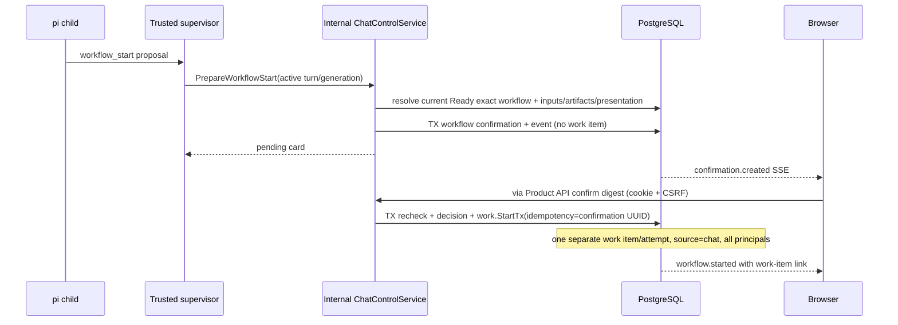

# V2 durable Chat, tool policy, and consequence-confirmation contract

- **Status:** Approved design; implementation is owned by follow-on tickets.
- **Approval date:** 2026-08-23
- **Architecture ticket:** [HOR-456](https://linear.app/horizonshift/issue/HOR-456/v2-approve-durable-chat-tool-policy-and-confirmation-architecture)
- **Product contract:** Obsidian `Platform V2 — Managed Digital Workforce — Product Requirements`, especially `REQ-005`–`REQ-009`, `SCN-003`, `SCN-004`, `SCN-008`, and `SCN-018`
- **Related authority:** [`v2-authentication-authority.md`](v2-authentication-authority.md), especially `DES-HOR-451-04`, `DES-HOR-451-05`, `DES-HOR-451-13`, the three-principal seam, and the cookie-only Chat route classification
- **Implementation owners:** HOR-452, HOR-455, HOR-458, and the dependency owners identified in section 20

This record is the repository authority for V2 customer Chat durability, runtime/pi-session mapping, ChatProfile policy, tool authorization, consequence confirmation, customer streaming, artifact references, and confirmed Chat-to-workflow handoff. It does not implement the design. Where the pre-V2 runtime describes a PVC transcript as authoritative, this record supersedes that statement only for new V2 customer Chat rows; legacy technical runs remain unchanged.

## 1. Approved design decisions

The founder approved the following bounded decisions for HOR-456. The full approval text is also durable in the Linear issue. Product behavior or a different inherited architecture requires a new durable decision rather than an implementation-local interpretation.

### DES-HOR-456-01 — Make PostgreSQL authoritative and rotate at most one active pi-session generation

- **Approved by:** Nuno Gonçalves
- **Approved on:** 2026-08-23
- **Scope:** V2 conversation/message authority, legacy runtime run/turn mapping, pi-session lifecycle, dispatch fencing, and recovery.
- **Decision:** Each conversation has at most one active mapped pi-session generation. Each submitted message creates an isolated runtime run or turn that normally resumes that session. Pi state is a disposable cache. If the session is missing, stale, incompatible, or corrupted, reconstruct context from PostgreSQL, create a new pi session, atomically rotate the conversation mapping, and prevent the retired generation from accepting new turns.
- **Consequences:** PostgreSQL customer messages plus server-only execution context are sufficient to resume; a PVC is never backup authority. Rotation needs compare-and-swap generation fencing. Recovery never replays a completed turn or consequential effect.
- **Evidence:** Founder clarification and approval recorded in [HOR-456](https://linear.app/horizonshift/issue/HOR-456/v2-approve-durable-chat-tool-policy-and-confirmation-architecture) on 2026-08-23.

### DES-HOR-456-02 — Keep Chat private and cookie-session-only

- **Approved by:** Nuno Gonçalves
- **Approved on:** 2026-08-23
- **Scope:** Customer Chat routes, conversation ownership, transcript access, and confirmation decisions.
- **Decision:** A conversation is private to its initiating human and is available only through that human's current active Operator/Admin cookie session. Bearer credentials are denied even if the request also carries a valid cookie. Admin has no transcript or confirmation override.
- **Consequences:** No Chat API-key action, service-actor Chat, shared conversation, impersonation, or administrative transcript browser enters V2. Server enforcement, not UI hiding, owns the boundary.
- **Evidence:** Founder approval recorded in HOR-456 on 2026-08-23.

### DES-HOR-456-03 — Use immutable operator-owned Chat profile versions

- **Approved by:** Nuno Gonçalves
- **Approved on:** 2026-08-23
- **Scope:** Deployment configuration for Chat model, instructions, AgentPool, executing identity, and allowed capabilities.
- **Decision:** Add an operator-only, immutable-versioned `ChatProfile` CRD/materialization with one active installation selection. Each run snapshots its exact version and explicit tool/control allow-list.
- **Consequences:** Profile changes affect only later runs. Chat receives no workspace tools, publish control, shell, arbitrary network, credentials, or customer-system access. Customer users cannot inspect or widen the profile.
- **Evidence:** Founder approval recorded in HOR-456 on 2026-08-23.

### DES-HOR-456-04 — Re-evaluate the three-principal authorization intersection at every boundary

- **Approved by:** Nuno Gonçalves
- **Approved on:** 2026-08-23
- **Scope:** Turns, read tools, write proposals, confirmation decisions, workflow starts, attribution, and resource access.
- **Decision:** Every boundary re-evaluates current initiating-human authority intersected with the trusted request actor, executing Chat identity, immutable ChatProfile capability, pool grant, resource constraint, and exact turn pin. Persisted role/action/configuration snapshots are audit evidence only.
- **Consequences:** No caller or model assertion can widen access. A stale snapshot never grants continuing authority. Missing or ambiguous authority fails closed while historical attribution remains intact.
- **Evidence:** Founder approval recorded in HOR-456 on 2026-08-23 and the principal contract in `DES-HOR-451-04/05`.

### DES-HOR-456-05 — Reuse the gateway ledger and split direct reads from prepared writes

- **Approved by:** Nuno Gonçalves
- **Approved on:** 2026-08-23
- **Scope:** Chat tool authorization, preparation, invocation, retry, audit, and recovery.
- **Decision:** Read-only tools may call the existing gateway and invocation ledger directly. Direct Chat-turn invocation of either write effect class is denied. A new gateway prepare path validates and durably creates the Chat confirmation before returning to the model; confirmation enqueues an exact `chat_confirmation` caller-scope command, and the existing invocation ledger remains the sole execution ledger.
- **Consequences:** Canceled or unconfirmed proposals create no invocation. Chat writes never automatically retry after dispatch begins, including proven-idempotent writes. Ambiguous external completion becomes `outcome_unknown`. Duplicate preparation, decision, and command delivery converge through durable idempotency.
- **Evidence:** Founder approval recorded in HOR-456 on 2026-08-23.

### DES-HOR-456-06 — Require immutable customer-safe Chat tool contracts

- **Approved by:** Nuno Gonçalves
- **Approved on:** 2026-08-23
- **Scope:** Chat eligibility for tool descriptor versions, safe output, citations, and confirmation presentation.
- **Decision:** Every Chat-eligible descriptor version requires a validated customer-safe output contract and citation projection. Write versions additionally require immutable English/Portuguese action, target, supplied-reference, and consequence templates.
- **Consequences:** Existing write versions without the complete contract are not Chat-eligible and are never mutated in place. Raw arguments/results, credentials, tool internals, and technical errors remain outside customer projections and search.
- **Evidence:** Founder approval recorded in HOR-456 on 2026-08-23.

### DES-HOR-456-07 — Make confirmation decisions single-use, current, and separate from outcomes

- **Approved by:** Nuno Gonçalves
- **Approved on:** 2026-08-23
- **Scope:** Write-effect confirmation states, expiry/staleness, authorization, idempotency, copy, and invocation outcome.
- **Decision:** Decision state is `pending -> confirmed|canceled|expired|stale`, separate from invocation/work outcome, with a fixed ten-minute TTL and no extension. A later user message in the conversation or authority/profile/tool/version/resource/artifact drift makes a pending confirmation stale. Only the same current human may decide. Replay of the same decision is idempotent; the opposite decision conflicts.
- **Consequences:** Confirmation authorizes only the exact immutable proposal digest. Expiry or staleness requires a new proposal. Completed or uncertain effects are never described as canceled or undone.
- **Evidence:** Founder approval recorded in HOR-456 on 2026-08-23.

### DES-HOR-456-08 — Treat workflow start as a reserved confirmed control, not a gateway write

- **Approved by:** Nuno Gonçalves
- **Approved on:** 2026-08-23
- **Scope:** Chat workflow resolution, confirmation, idempotent work creation, inputs/artifacts, and source/principal attribution.
- **Decision:** Snapshot the exact Ready workflow version/digest, validated inputs and artifact references, persona, first business step, and localized consequence. Confirmation transactionally reuses the work-start service with the confirmation UUID as the idempotency key and records Chat/conversation/initiating-human/request-actor/executing-workflow attribution.
- **Consequences:** Confirm creates exactly one separate work item. Cancel, expiry, or staleness creates none. Workflow start never appears in the tool invocation ledger and ordinary Chat never becomes a work item.
- **Evidence:** Founder approval recorded in HOR-456 on 2026-08-23.

### DES-HOR-456-09 — Use durable event cursors with ephemeral token deltas and explicit cancellation

- **Approved by:** Nuno Gonçalves
- **Approved on:** 2026-08-23
- **Scope:** Customer Chat SSE ordering/reconnect, streaming, terminal message authority, cancellation, and process restart.
- **Decision:** Append-only `chat.events` provide ordered durable cursors and `Last-Event-ID` resume. Token deltas are bounded best-effort PostgreSQL `NOTIFY` events without durable IDs; the final persisted DB assistant message is authoritative. Disconnect never cancels. Explicit cookie-only cancel fences only the active Chat turn.
- **Consequences:** Reconnect may omit or duplicate presentation deltas but reconciles from durable events/messages. Slow clients cannot create durable token-volume growth. Cancellation never reverses a completed tool effect, and recovery never automatically replays a turn.
- **Evidence:** Founder approval recorded in HOR-456 on 2026-08-23.

### DES-HOR-456-10 — Persist immutable artifact references, not duplicate bytes

- **Approved by:** Nuno Gonçalves
- **Approved on:** 2026-08-23
- **Scope:** Chat messages, model context, tool/workflow proposals, workflow inputs, and artifact status checks.
- **Decision:** Chat messages and workflow starts retain immutable artifact references only. Chat may consume only security-cleared extracted content. Raw-compatible workflow use remains an explicit validated workflow-input choice.
- **Consequences:** No artifact bytes are copied into Chat tables or customer event streams. Current security, extraction, and compatibility state is checked before use or confirmation. Unavailable content is never represented as read.
- **Evidence:** Founder approval recorded in HOR-456 on 2026-08-23.

### DES-HOR-456-11 — Separate searchable customer records from execution-only context and disposable cache retention

- **Approved by:** Nuno Gonçalves
- **Approved on:** 2026-08-23
- **Scope:** Conversation search, customer projections, model/tool context, retention, purge, backup, and pi-session cleanup.
- **Decision:** Owner-scoped search indexes titles, customer-visible messages, safe citations, tool names/targets, and confirmation decisions—not raw arguments/results, hidden model context, prompts, or technical events. Database Chat records default to indefinite retention unless installation policy purges whole inactive conversations. Pi cache is cleanup-eligible after 30 days of inactivity and must remain reconstructable. PostgreSQL plus artifact and existing ledger state is backup-authoritative; PVC state is not.
- **Consequences:** Execution-only context never enters customer HTTP/SSE/search/log/audit projections. Purge cannot run while a turn or confirmation is active and preserves independently authoritative work, artifact, invocation, and minimal audit records.
- **Evidence:** Founder approval recorded in HOR-456 on 2026-08-23.

### DES-HOR-456-12 — Migrate by compatibility seams without legacy transcript backfill

- **Approved by:** Nuno Gonçalves
- **Approved on:** 2026-08-23
- **Scope:** Legacy `kind=chat` rows and PVC sessions, schema expansion, rollback, restore, and historical visibility.
- **Decision:** Preserve legacy Chat runtime rows/PVC sessions as operator-only technical history but do not backfill or expose them as V2 customer conversations. Add nullable compatibility seams for old rows while requiring every new V2 Chat row to satisfy the full contract.
- **Consequences:** No risky PVC transcript importer or split authority exists. Pre-cutover rollback may ignore untouched new tables. Post-cutover recovery rolls forward from database authority, never automatically replays a turn/write, and preserves uncertain effects as `outcome_unknown`.
- **Evidence:** Founder approval recorded in HOR-456 on 2026-08-23.

## 2. Scope, non-goals, and hard invariants

### In scope

- Customer-owned durable conversations, messages, safe tool-use projections, confirmation decisions, search, and SSE.
- One active mapped pi-session generation per conversation, database reconstruction, generation rotation, and retired-generation fencing.
- One isolated Chat execution per submitted message, composed with existing `runtime.workflow_runs`, `run_steps`, `turns`, assignments, and events.
- Operator-owned ChatProfile versioning and exact capability/model/pool snapshots.
- Current-human/request-actor/executing-identity policy intersection for inference, tools, artifacts, and workflow proposals.
- Existing Tool Gateway read invocation and ledger reuse; a preparation path and confirmed caller scope for writes.
- Confirmed workflow start through the existing idempotent work service.
- English/Portuguese consequence presentation, artifact-reference handling, retention, backup, and migration.

### Non-goals

- Runtime/API/schema/controller/UI/CRD/gateway implementation in HOR-456 itself.
- API-key, automation-credential, service-actor, external-identity, or anonymous Chat.
- Shared conversations, Admin transcript access, impersonation, transcript export, or customer-visible technical traces.
- Customer workflow/tool/profile/model/provider/routing/rate/capability configuration.
- Unrestricted autonomy, shell, filesystem workspace tools, arbitrary network, generic web search, direct customer credentials, or internal endpoint access.
- Chat-triggered schedules, Outlook/Graph, Teams, notifications, or a customer workflow builder.
- Universal undo, compensation, automatic turn replay, automatic write retry, or memory-reconciliation claims.

### Non-negotiable invariants

1. A Chat conversation is not a `work.work_item`; only a confirmed workflow-start proposal creates one.
2. Every V2 Chat query begins with `owner_user_identity_id = current_session.user_id`; an Admin role never removes that predicate.
3. PostgreSQL can reconstruct the next model context without any pi/PVC file.
4. A conversation has zero or one active mapped pi-session generation and zero or one nonterminal Chat execution.
5. A runtime assignment is valid only for the exact current conversation generation, execution, worker, and worker fencing generation.
6. A V2 Chat run always has an explicit capability request. Legacy `nil = all pool-granted tools` behavior never applies to it.
7. The model and child can propose business arguments but cannot assert identity, credential, pool, policy, tool digest, target version, or confirmation.
8. A read invocation uses the existing gateway invocation row. A prepared write has no invocation row until the customer confirms it.
9. The gateway invocation row is the only tool-execution ledger. A Chat command row is delivery state, not an effect/outcome ledger.
10. Confirmation decision and effect outcome are separate states.
11. No customer Chat response, event, search index, audit, or normal log contains chain-of-thought, system/model prompts, raw tool arguments/results, credentials, internal endpoints, provider/routing data, or worker details.
12. A disconnect changes no durable execution state.

## 3. Existing foundation and exact gaps

| Current foundation | Reuse | Exact V2 gap |
| --- | --- | --- |
| `runtime.workflow_runs(kind='chat')`, one `run_steps.agent_task`, `runtime.turns`, and first-terminal-writer settlement | Keep the state machine, one-active-turn-per-session index, append-only runtime audit, assignment fencing, cancellation, and no execution redelivery | Current comments make a run's PVC transcript authoritative and current dispatch sends `SessionEnd` when the run terminates. V2 needs a conversation-owned generation shared by sequential message runs, deferred cleanup, DB context, and generation fencing. |
| Harness `TurnEvent` sequence/ACK/WAL and complete `AssistantMessage` | Keep durable source-order dedup and final complete assistant text | Add Chat execution/generation binding and a server-only context checkpoint. Runtime events remain technical; they are not the customer transcript. |
| Harness `TokenDelta` | Keep ephemeral text streaming | Drop thinking deltas and bridge bounded text deltas through `NOTIFY`; never assign a durable cursor to a delta. |
| `runtime.turn_assignments` worker/generation binding | Keep worker fencing and active-assignment checks | Bind V2 Chat assignments to `chat_execution_id` and `chat_session_generation`; deny a retired generation. |
| Inference Gateway live workload authorization | Keep supervisor mTLS, active running-turn, pool, assigned model, and worker fencing checks | Current scope returns only `workflow_runs.scope_identity_id`. V2 Chat requires current human/request actor/executing identity/profile/model intersection and conversation-generation validation. |
| `toolgateway.attempt_tool_pins` | Keep exact immutable per-run versions | Current legacy Chat can snapshot every eligible pool tool and `ResolveTurnScope` treats absent graph capabilities as no narrowing. V2 must snapshot only the explicit ChatProfile set and preserve explicit empty as deny-all. |
| `DiscoverEffectiveTools` and `InvokeTool` | Keep mTLS caller resolution, descriptor pins, argument/resource/artifact validation, credentials held outside the child, and invocation ledger | Direct write invocation from a V2 Chat turn currently is not distinguished. Add prepare mode, write denial for the turn scope, current human/profile checks, and safe Chat result projection. |
| Gateway effect classes, lease recovery, consequence summary, and at-most-once key | Keep `dispatching -> running -> succeeded|failed|outcome_unknown`, exact pins, and recovery classification | Current proven-idempotent writes may retry. `chat_confirmation` overrides this: one dispatch attempt after the effect boundary for both write classes. Existing consequence template lacks separate action/target/reference card fields and read-result safety/citation contracts. |
| `work.Store.Start` | Keep atomic workflow resolution, snapshots, artifact validation, idempotency, and work/runtime/timeline creation | Refactor to a transaction-aware internal command and add Chat source plus three-principal/conversation/confirmation attribution. A Chat confirmation UUID is the start idempotency key. |
| `work.timeline_events` + SSE | Reuse the global monotonic cursor, append-only safe projection, `Last-Event-ID`, heartbeat, polling fallback, and `pg_notify` wake-up pattern | Chat needs its own owner-filtered event table and ephemeral delta channel. Work timeline data is not a conversation transcript. |
| Artifact references and gateway artifact checks | Keep immutable references, digest validation, and no credentials/MinIO endpoints in the child | V2 Chat must authorize refs from the exact message/execution and later security/extraction state from HOR-460/461/462, not only work-attempt/node links. |
| `v2-authentication-authority.md` | Keep opaque cookie sessions, current account/role, CSRF, mixed-credential denial, and three-principal history | HOR-452/455 must apply the approved cookie-only route class and add no Chat action to the bearer catalogue. |

No competing runtime, effect ledger, artifact store, identity authority, or work-start implementation is introduced.

The baseline review covered `control-plane/internal/database/migrations/000009_runtime.up.sql`, `000011_toolgateway.up.sql`, `000016_work_graph.up.sql`, `000017_artifact.up.sql`, and `000023_gateway_workload_grant.up.sql`; the runtime, dispatch, gateway, work, and server stores/services; both Harness and Gateway protobufs; `inference-gateway/internal/workload`; and `docs/architecture/v2-authentication-authority.md`.

## 4. Target components and trust boundaries

```text
Browser
  | same-origin opaque cookie; CSRF on unsafe methods; no bearer
  v
Control-plane Product API / Chat service
  |-- chat.* customer authority, search, confirmations, events
  |-- current identity/role/session and resource authorization
  |-- Work StartTx for confirmed workflow proposals
  |-- internal ChatControlService for workflow proposal preparation
  v
PostgreSQL (chat + identity + runtime + toolgateway + work + artifact)
  ^                         ^
  | Harness.Work mTLS       | GatewayService mTLS
Dispatch ----------------> trusted supervisor ----------------> Tool Gateway
  | PrepareChatSession        | child-safe descriptors/stubs       | invocation ledger
  | AssignTurn                | disposable pi child                | trusted runner stream
  | event ACK/fencing         | no credentials/endpoints           | credential resolution
  v                                                             v
Inference Gateway workload listener                         Tool runners
  | supervisor mTLS + exact running turn/generation/principals
  v
Operator-enabled model backend
```

Trust rules:

- The browser talks only to the Product API. It never receives a Tool Gateway, Harness, Inference workload, runner, object-store, or database endpoint.
- The disposable child receives the prompt/context, customer-safe tool descriptors, and IPC stubs. It receives no mTLS key, customer credential, bearer, Kubernetes credential, gateway URL, arbitrary egress, or workspace tool.
- The supervisor may authenticate to workload gateways but cannot choose broader scope than the active assignment persisted by the control plane.
- The Tool Gateway is the only process that resolves runtime credentials or dispatches a gateway tool.
- The API/Chat service is the only customer-route writer of conversation decisions. Gateway preparation may insert a confirmation only after it resolves the active V2 Chat turn.
- The Chat tool command consumer runs inside the Tool Gateway and reads an exact confirmed command; there is no customer-callable execute RPC.

## 5. Threat model

### Protected assets

- Private conversation/message content and server-only model context.
- Current identity, role, browser session, profile, model, pool, tool, resource, and artifact authority.
- Tool/workflow proposal arguments, exact target, decision, external-effect outcome, and attribution.
- Runtime/tool/customer credentials, system instructions, provider details, worker state, and internal endpoints.
- Ordering, idempotency, generation, invocation, and work-start evidence needed to prevent duplicate effects.

### Threat actors and failures

- Unauthenticated attacker or a user guessing another conversation/confirmation UUID.
- Operator or Admin attempting to read another user's transcript.
- Holder of a personal or automation API key attempting Chat routes.
- Browser attacker using CSRF or a mixed cookie/Authorization request.
- Prompt injection asking for shell, network, credentials, hidden prompts, internal APIs, or an unsupported tool.
- Model or compromised child fabricating identity, tool digest, resource scope, artifact ID, confirmation, or gateway request.
- Compromised/stale supervisor generation or a worker reusing a retired pi session.
- Tool descriptor/template output attempting customer-visible injection or secret leakage.
- Duplicate HTTP, stream, prepare, decision, command, runner, or work-start delivery.
- API/dispatch/supervisor/gateway crash around the session-swap or external-effect boundary.
- PostgreSQL restore paired with stale or absent PVC data.

### Required controls

| Abuse/failure | Required control and evidence |
| --- | --- |
| Cross-user conversation ID | Owner predicate in the same query as lookup/search/event fetch. Return not found; never disclose existence. Admin has no bypass. |
| Bearer or mixed credentials | Any `Authorization` header on a Chat route is rejected before cookie fallback. No Chat action exists in personal/automation catalogues. Record a secret-free denial. |
| CSRF | Exact-origin/session-bound CSRF on create, message submit, cancel, and confirmation decision. |
| Prompt requests forbidden capability | Forbidden tools/controls are absent from the explicit pin set. Workspace tools are false. Direct network and credentials do not exist in the child. |
| Fabricated tool/version/scope | Gateway resolves active assignment, Chat execution, current generation, pool, principals, capability request, and immutable pin from PostgreSQL. |
| Fabricated artifact | Resolve only artifact refs linked to the exact message/execution/proposal and recheck current security/extraction/compatibility state. |
| Stale account/role/session | Re-evaluate current account, role, and initiating browser-session eligibility at dispatch/model/tool/decision boundaries; fail closed. Existing authorized effects are not described as reversed. |
| Stale profile/policy/target | Snapshot for audit, re-evaluate current policy, and transition a pending confirmation to `stale` rather than executing changed intent. |
| Compromised child invokes write | `InvokeTool` detects a V2 Chat turn and denies both write classes before `BeginInvocation`; only `PrepareChatConfirmation` may create a proposal. |
| Unsafe read result | Validate and project through the immutable Chat output/citation contract before returning to the child or persisting customer-safe metadata. Raw gateway result remains operator-only. |
| Template/content injection | Trusted immutable template; validated JSON pointers; bounded scalar/resource-label substitution; UI text rendering/escaping; no model-authored consequence copy. |
| Duplicate confirm/effect | Proposal digest, decision CAS, unique command, gateway invocation key, and work-start idempotency compose without a second effect. |
| Lost write result | Existing invocation becomes `outcome_unknown`; Chat-specific policy never redispatches it. Customer copy says it may have happened and was not retried. |
| Lost token delta | No durable impact. Final persisted assistant message replaces the partial stream. |
| PVC tamper/loss | Validate context ordinal/digest/format before assignment; reconstruct a candidate from PostgreSQL; atomically rotate; fence old generation. |
| Retired worker event | Assignment and generation CAS deny event/tool/inference acceptance for a retired mapping. Late evidence is operator-only after-terminal audit and cannot change customer state. |
| Backup restore | Fence nonterminal turns/commands, do not auto-replay, reconstruct cache from DB, and classify possibly dispatched writes conservatively. |

## 6. Operator-owned `ChatProfile`

`ChatProfile` is installation configuration, not a customer Settings surface. The Kubernetes object is reconciled using the existing Git-to-database materialization pattern. Every observed valid spec produces an immutable `chat.profile_versions` row keyed by version and canonical digest; changing content never updates that row. One singleton selection points to the active version.

Logical spec:

```yaml
apiVersion: iterabase.io/v1alpha1
kind: ChatProfile
metadata:
  name: default
spec:
  version: "2026-08-23.1"
  model: iterabase-inference/customer-chat
  agentPoolRef: default/chat
  executingIdentityRef: chat/default
  instructions: <operator-owned system instructions>
  capabilities:
    - tool: work.lookup
      maxEffectClass: read_only
      actions: [work.read]
    - tool: customer.update
      maxEffectClass: idempotent_write
      actions: [customer.update]
  controls:
    - workflow_start
```

Validation/materialization requirements:

- Exactly one active installation selection; absence/invalid status makes Chat unavailable with `503 chat_not_configured` and no fallback model/profile/pool.
- Resolve the model, pool, and executing identity during materialization. No customer-supplied names enter runtime authority.
- `capabilities` is explicit. Empty means deny all tools. `nil = all` is invalid for V2 Chat.
- A capability cannot exceed the pool grant or descriptor effect class/actions.
- `workspace_tools=false` is fixed. `read`, `write`, `edit`, `bash`, publish controls, arbitrary skills, and direct network are never enabled by this profile.
- Only reserved product controls named by this record may appear. V2 permits `workflow_start`; schedules, blocker mutation, cancel/restart/revision, artifact deletion/retry, identity/security operations, and arbitrary HTTP are not Chat controls.
- The profile's instructions/model details are execution-only and never returned by customer APIs, SSE, search, usage evidence, audit detail, or normal logs.
- A message-run snapshots the exact profile version/digest/model/capabilities/controls. A later profile selection does not mutate an already-running turn, but it makes any still-pending proposal from the older profile stale.

## 7. Logical schema and ownership

Names are normative logical names. An implementation may consolidate migrations, but it must preserve the keys, authority, state constraints, immutability, and transaction boundaries below.

### 7.1 `chat.profile_versions` and `chat.profile_selection`

`chat.profile_versions` is immutable operator materialization:

- `id`, `key`, `version`, `digest` with unique `(key, version)` and `(key, digest)` identities.
- `model_snapshot`, `pool_id`, `executing_identity_id`, `instructions`, `capabilities`, and `controls`.
- validation status/evidence and `created_at`; no customer serialization.

`chat.profile_selection` is a singleton mutable pointer containing `active_profile_version_id`, observed CR generation, and update time. Selection changes append an operator audit event. Existing execution snapshots are unchanged.

### 7.2 `chat.conversations`

- `id` UUID primary key.
- `owner_user_identity_id` required canonical human FK; immutable.
- customer-safe `title` and search vector.
- `current_session_generation` nullable bigint and `row_version` for compare-and-swap.
- `active_execution_id` nullable deferred FK.
- `next_message_ordinal` and `next_context_ordinal` monotonic counters.
- `last_activity_at`, optional policy-derived `retention_until`, `created_at`, `updated_at`.

There is no work-item FK and no visibility grant table. A content-purged conversation leaves only a non-customer-listable minimal tombstone when another authoritative ledger needs its source UUID.

### 7.3 `chat.session_generations`

- Composite primary key `(conversation_id, generation)`; generation increases monotonically.
- Unique opaque `pi_session_id`/sandbox ID, session directory, UID allocation reference, pi format/protocol version, and expected context checkpoint/ordinal/digest.
- State `preparing|active|retired|failed`.
- `prepared_by_worker_id`, preparation lease, activation/retirement timestamps, and bounded reason code.
- A partial unique index permits at most one `active` row and at most one `preparing` candidate per conversation.

A `preparing` candidate cannot accept a turn. The active mapping is exactly the row referenced by `conversations.current_session_generation`. Activation and retirement of the previous row happen in one transaction after candidate preparation succeeds.

### 7.4 `chat.messages` and `chat.message_artifact_refs`

`chat.messages` is the customer transcript:

- `id`, `conversation_id`, unique `(conversation_id, ordinal)`.
- `role = user|assistant`; no system/tool/thinking role is customer-visible.
- customer-visible `content`, source locale, originating `execution_id`, and `created_at`.
- user-submission idempotency evidence is on the execution; assistant messages are inserted only by the terminal projection.
- append-only until an approved conversation-retention purge.

`chat.message_artifact_refs` contains only immutable artifact ID, digest, MIME/size metadata, role, and safe display metadata. It stores no bytes or storage URL. The artifact domain remains authoritative for current security/extraction/deletion state.

### 7.5 `chat.executions`

One row represents one submitted user message and one isolated V2 Chat runtime run:

- `id`, `conversation_id`, required unique `user_message_id`, nullable unique `assistant_message_id`.
- unique `runtime_run_id`; selected V2 mapping is one `runtime.workflow_runs(kind='chat')`, one legacy `agent_task` run step, and one turn for this message.
- snapshotted `profile_version_id/digest`, model, pool, explicit capabilities, controls, and exact tool pins.
- `session_generation` selected before the turn can run and `base_context_ordinal` captured before the submitted user message is applied to pi.
- `initiating_human_identity_id`, `request_actor_identity_id`, `executing_identity_id`, initiating browser-session ID, role/profile authorization evidence, request/correlation IDs.
- required message `idempotency_key` and canonical `payload_hash`; unique `(conversation_id, idempotency_key)`.
- state `queued|preparing|running|succeeded|failed|canceled`, bounded customer failure code, cancellation timestamps, and lifecycle timestamps.

A partial unique index permits one `queued|preparing|running` execution per conversation. A second different submission receives `409 conversation_busy`; identical idempotent replay returns the existing message/execution. This composes with the runtime's one-active-turn-per-session constraint and preserves ordered model context.

### 7.6 `chat.context_items` and `chat.context_checkpoints`

These tables are database-authoritative execution context and have no customer route:

- `context_items` is append-only by `(conversation_id, ordinal)` and records model-visible user/assistant content, safe projected read-tool call/results, validated prepared-write/workflow-control calls and their no-effect pending results, confirmed-effect status references, and compaction replacement metadata.
- It never records chain-of-thought, credential values, internal endpoints, provider/routing data, unvalidated technical errors, or raw artifact bytes.
- `context_checkpoints` contains an immutable bounded model-ready context document, format version, through-context ordinal, source item/checkpoint digests, pi compatibility metadata, and creation time.
- The profile version supplies system instructions; those instructions are not copied into customer messages.

The harness emits a durable server-only context checkpoint after successful context mutation/compaction and before clean settlement. Reconstruction uses the newest valid checkpoint plus later context items. If no compatible checkpoint exists, it deterministically rebuilds from all retained context items under the selected model's context/compaction policy. A pi JSONL file may optimize this but never supplies missing database history.

The execution's submitted user message is already durable as a message/context item, but session preparation rebuilds only through `base_context_ordinal`; `AssignTurn.message` applies that user message exactly once. The successful terminal checkpoint then advances through that user message, tool context, and final assistant context. This ordinal boundary prevents a reconstructed session from duplicating the current prompt.

### 7.7 `chat.tool_uses`

This is the durable searchable customer-safe attribution projection, not an execution ledger:

- conversation/execution IDs, origin tool-call ID, immutable tool name/version/digest, effect class, and optional confirmation/invocation ID.
- safe localized action/target, safe citation/resource references, and status `prepared|denied|succeeded|failed|outcome_unknown`.
- no raw arguments, raw result, credential, resource binding, runner, or technical error.

Read rows point to the existing gateway invocation. Write rows are `prepared` before confirmation and point to the invocation only after the confirmed command reaches the gateway ledger.

### 7.8 `chat.confirmations`

- `id`, `conversation_id`, origin `execution_id`, origin user-message ordinal, optional final assistant-message ordinal, and kind `tool_write|workflow_start`.
- immutable initiating-human/request-actor/executing-identity/profile/pool/tool-or-workflow/version snapshots.
- exact server-only prepared arguments/inputs/artifact refs, target/resource version tokens, and canonical `proposal_digest`.
- immutable rendered customer card: localized action, target, reference list, consequence, persona/first-step fields where applicable.
- decision state `pending|confirmed|canceled|expired|stale`, `expires_at = created_at + 10 minutes`, safe stale reason, decision actor/session evidence, decision time.
- separate outcome references: `invocation_id` or `work_item_id`; outcome is derived from the owning ledger and is not encoded in decision state.

Unique preparation key:

```text
(origin_execution_id, origin_tool_call_or_control_id,
 exact_version_digest, canonical_proposal_digest)
```

A duplicate prepare returns the same confirmation. State mutation uses compare-and-swap. Pending rows are expired lazily on read/decision and by a sweeper; TTL never extends.

### 7.9 `chat.confirmation_commands`

This is a transactional outbox only for confirmed tool writes:

- one row per confirmation (`confirmation_id` unique), command kind `invoke_tool`, and state `pending|leased|delivered`.
- lease owner/expiry, attempt count for **delivery to `BeginInvocation` only**, and resulting `invocation_id`.
- no result, retryability, or effect outcome fields.

The Tool Gateway consumer re-delivering a command calls `BeginInvocation` with the exact same key and attaches to the existing row. It does not dispatch a second effect. Once the invocation exists, `toolgateway.invocations` is the sole execution/outcome authority.

Workflow start uses no command row: decision, `work.StartTx`, work item/attempt, source attribution, confirmation outcome link, and Chat event commit in one database transaction.

### 7.10 `chat.events`

- Global monotonic `cursor` identity primary key and unique event UUID.
- required conversation, optional execution/message/confirmation/tool-use/work-item references.
- customer-safe semantic `code`, bounded localized-safe params/reference IDs, optional actor identity, and timestamp.
- append-only until conversation retention purge.
- an after-insert trigger sends only the committed cursor on the durable-event wake-up channel.

The customer query joins `conversations.owner_user_identity_id` before returning any event. Runtime events are not copied wholesale.

### 7.11 Required cross-schema seams

- `runtime.workflow_runs.chat_execution_id` nullable/unique; non-null rows require `kind='chat'` and V2 principal fields from the authentication contract. Legacy rows remain null.
- `runtime.turn_assignments.chat_execution_id` and `chat_session_generation` nullable; a V2 assignment requires both, explicit capability JSON, exact tool-pin snapshot, and empty `work_item_id/node_execution_id`.
- `toolgateway.invocations.caller_scope` adds `chat_confirmation`; its scope ID is the confirmation UUID. Existing `turn|workflow_step` rows are unchanged. Every V2 Chat invocation also snapshots conversation/profile plus initiating-human, request-actor, and executing-identity IDs so retained gateway audit never depends on mutable or purged Chat/runtime rows.
- Immutable tool descriptors add the Chat output/citation and full confirmation-template contract in section 10.
- `work.work_items`/start source support `source.kind='chat'`, conversation/confirmation references, and the three principals from the authentication contract.
- A content-free `chat.effective_workload_authority` projection returns only currently eligible V2 running turn, assignment/generation, principal, profile, and assigned-model fields. The Inference Gateway's existing dedicated PostgreSQL role receives exact `SELECT` on this projection—no Chat transcript/context/table-wide grant—and retains its current exact runtime/toolgateway workload reads.
- Inference workload resolution joins that projection for V2 Chat while retaining existing workflow behavior. Any projection/database failure denies before backend inference.

All new cross-schema FKs are nullable for legacy compatibility. Application and database checks require them for new V2 rows.

## 8. Customer HTTP and SSE contract

All paths below are same-origin Product API routes. They require the approved opaque browser cookie and current active Operator/Admin user. Any `Authorization` header makes the request fail as a browser-only route; the server never falls back from bearer to cookie. Unsafe methods require exact-origin CSRF.

| Route | Behavior |
| --- | --- |
| `POST /v1/chat/conversations` | Create an owner-private empty conversation. No runtime run/work item is created. |
| `GET /v1/chat/conversations?search=&cursor=&limit=` | Owner-scoped recent list/search over approved fields only. |
| `GET /v1/chat/conversations/{id}` | Owner-scoped transcript, artifact refs, safe tool uses, confirmations, and current nonterminal execution. |
| `POST /v1/chat/conversations/{id}/messages` | Requires `Idempotency-Key`; atomically appends one user message, stales prior pending confirmations, creates one execution/runtime run with exact snapshots/pins, and schedules it. |
| `POST /v1/chat/conversations/{id}/executions/{executionId}/cancel` | Idempotent explicit cancellation of only the current nonterminal Chat execution. It does not cancel a work item or reverse an effect. |
| `POST /v1/chat/confirmations/{id}/decision` | Body carries `decision=confirm|cancel` and the displayed `proposalDigest`. Same-human/current-policy CAS. |
| `GET /v1/chat/events` | Owner-scoped SSE for all of the user's conversations; optional conversation filter; `Last-Event-ID` is the durable global cursor. |

Rules:

- Message replay with the same key and canonical payload returns the original message/execution. Reuse with changed content/artifact refs conflicts.
- A later different user message stales every pending confirmation in that conversation in the same submission transaction.
- A future/invalid SSE cursor is `400`. A cursor older than the retained global watermark is `409 cursor_expired` with `resyncRequired=true`; the client refetches list/detail before reconnecting.
- Customer errors use stable codes and plain EN/PT copy. No database, model, provider, tool argument, worker, or internal endpoint detail is returned.
- Conversation lookup for the wrong owner is indistinguishable from absence.
- API keys, personal keys, automation credentials, delegated JWTs, workload mTLS, and cluster-admin credentials never authenticate these routes.

## 9. Durable events, token streaming, and reconnect

### Durable events

Representative codes:

```text
conversation.created
message.accepted
execution.preparing
execution.started
assistant.final
execution.failed
execution.canceled
confirmation.created
confirmation.confirmed
confirmation.canceled
confirmation.expired
confirmation.stale
tool.succeeded
tool.failed
tool.outcome_unknown
workflow.started
```

State mutation and its event append commit atomically. `assistant.final` is inserted in the same terminal projection transaction as the complete assistant `chat.messages` row and execution/runtime settlement. Event payloads contain IDs and customer-safe projections only.

### Ephemeral deltas

- Dispatch accepts only harness `DELTA_TYPE_TEXT` for a V2 Chat execution. Thinking deltas are discarded from customer streaming and never persisted as Chat data.
- Text is UTF-8 validated, split to a bounded payload below PostgreSQL's notification limit, and published on `chat_token_deltas` with execution ID, a presentation-only sequence, and text. It has no durable Chat cursor.
- Every API replica listens and forwards only after resolving the execution to a currently authorized owner's open stream. The database channel is not customer-accessible.
- SSE emits `event: assistant.delta` without `id:`. Browser `Last-Event-ID` therefore remains the last durable cursor.
- A subscriber may miss or duplicate a delta. It replaces partial presentation with `assistant.final` content. It never asks the runtime to regenerate missing tokens.
- Backpressure drops deltas for a slow client rather than buffering unbounded content or blocking the runtime.

### Reconnect algorithm

1. Authenticate the current cookie and reject mixed credentials.
2. Read durable owner events after `Last-Event-ID` in cursor order until caught up.
3. Begin listening for wake-ups/deltas; poll durable events as a missed-notification fallback.
4. Before every event batch/heartbeat, recheck session/account eligibility. Close on revocation/expiry.
5. Heartbeats are SSE comments and carry no cursor.
6. On final message, replace any partial delta buffer with the authoritative DB content.

Network disconnect closes only the HTTP stream. The Chat execution continues under its already-authorized durable assignment unless the user explicitly cancels or a later internal authorization boundary denies it.

## 10. Tool eligibility, authorization, and result projection

### Immutable descriptor additions

Every Chat-eligible tool version adds an immutable `chat_contract`:

```json
{
  "customer_output_schema": {},
  "customer_projection": {
    "text_paths": [],
    "citation_paths": [],
    "target_paths": []
  },
  "required_product_actions": ["work.read"],
  "confirmation_template": {
    "action": {"en": "...", "pt": "..."},
    "target": {"en": "...", "pt": "..."},
    "supplied_references": {"en": "...", "pt": "..."},
    "consequence": {"en": "...", "pt": "..."},
    "argument_paths": {},
    "resource_label_paths": {}
  }
}
```

- `customer_output_schema`, projection, and citation semantics are required for reads.
- Full confirmation template fields are required for both write classes; the existing consequence-summary template remains ledger evidence but is not sufficient alone for Chat eligibility.
- Template placeholders map to schema-validated scalar business arguments or server-resolved safe resource/artifact labels. Values are bounded. Unknown/nested/raw values fail preparation.
- Publishing a contract change creates a new tool version/digest. Existing versions are never mutated.
- A ChatProfile allow-list cannot make a descriptor without a valid Chat contract eligible.

### Effective authorization algorithm

For discover, model invocation, read invocation, write preparation, confirmed execution, and artifact access, resolve and intersect:

```text
current active initiating human + role + initiating browser-session eligibility
∩ trusted request actor (same human for V2 Chat)
∩ current active executing Chat identity
∩ immutable execution ChatProfile version and requested capability
∩ active AgentPool grant/action ceiling
∩ current product action/resource authorization
∩ current credential-binding resource constraints
∩ exact runtime assignment, conversation generation, and worker fence
∩ exact per-run tool version pin
∩ valid immutable Chat descriptor contract
```

The current ChatProfile selection is not substituted into an active turn; the exact run snapshot applies. A changed active selection stales later confirmation, not the already-authorized model context. Infrastructure or malformed authority is `503`/failed closed, not a misleading broader fallback.

### Read-only tool

1. Discover returns only explicitly pinned, Chat-eligible descriptors.
2. Supervisor gives the child a non-secret stub.
3. Child sends business arguments to supervisor IPC; supervisor calls existing `InvokeTool` as the exact active turn.
4. Gateway repeats current authorization, validates arguments/resource/artifact refs, and inserts the normal invocation row before runner dispatch.
5. Existing bounded read retry is allowed because no write effect exists.
6. Gateway validates the result and produces the immutable customer-safe projection/citations before returning content to the child and Chat context.
7. Raw result remains only in the existing operator-only invocation/runtime evidence. `chat.tool_uses` stores safe metadata and the invocation ID.
8. An ordinary read creates no confirmation and no work item.

### Write-effect tool

- Discovery may expose its stub because the model may prepare a proposal.
- `InvokeTool` for a V2 Chat `turn` rejects both `idempotent_write` and `non_idempotent_write` before `BeginInvocation`, even if the supervisor is compromised.
- The stub calls `PrepareChatConfirmation`, which performs all pre-effect scope/pin/argument/resource/artifact/template checks and inserts confirmation/tool-use/event atomically.
- The returned child result says only that an exact customer confirmation is pending; it is not an invocation result.
- On customer confirmation, the Product API rechecks current authority/staleness and atomically inserts one command.
- The gateway command consumer verifies the exact confirmed command/static proposal and calls `BeginInvocation` with the stored arguments, so every confirmed tool proposal has exactly one durable invocation row. Creating that row is not an external-effect boundary.
- It then rechecks current human/actor/profile/pool/resource/artifact authority before credential resolution or runner dispatch. A denial terminalizes that same invocation as failed and performs no effect.
- For `chat_confirmation`, `dispatching` is provably pre-send: current authorization/credential/runner failures and orphan recovery in that state finish `failed`. The gateway moves the row to `running` immediately before its one runner-send attempt; loss from that point is conservatively `outcome_unknown` for a write.
- Gateway retry attempts after dispatch begins are fixed to one for **both** write classes. Stable upstream idempotency remains useful for reconciliation/deduplication but does not authorize an automatic Chat retry.
- Duplicate command delivery attaches to the existing invocation. `outcome_unknown` is terminal until a separate reconciliation mechanism records stronger evidence; Chat never silently runs it again.

### Unsupported/denied attempts

| Attempt | Result | Durable evidence |
| --- | --- | --- |
| Tool absent from ChatProfile | Not discovered; fabricated call denied as unpinned | Runtime/gateway denial with execution/tool name; no invocation/effect |
| Descriptor lacks Chat contract | Not eligible/pinned | Operator validation condition; no customer tool exposure |
| Current human/actor/profile/pool/resource denies read | Safe permission denial; model receives no data | Runtime/gateway denial and safe Chat tool-use status |
| V2 Chat turn calls write `InvokeTool` | `confirmation_required`/permission denial before ledger | Denial; no invocation |
| Valid write prepare | Pending confirmation | Confirmation + safe tool-use + event; no invocation |
| Cancel/expire/stale | No command or invocation | Decision event/reason |
| Personal/automation key calls Chat/tool-confirm route | Browser-only denial | Identity security event; no Chat/tool mutation |

## 11. Confirmation card and state machine

### State

```text
                         confirm + current checks
pending ------------------------------------------------> confirmed
  |                                                          |
  | cancel                                                   | tool: enqueue one command
  v                                                          | workflow: StartTx one work item
canceled                                                     v
                                                     effect outcome is separate
  | clock >= expires_at
  v
expired
  |
  | later message or authority/profile/tool/version/
  | resource/artifact/workflow drift
  v
stale
```

Terminal decision states never return to `pending`. Expiry/staleness does not mutate prior proposal fields. A sweeper and every read/decision enforce expiry; clock comparisons use the database clock.

### Decision protocol

1. Resolve the confirmation through the current conversation owner predicate and current cookie session.
2. Require the same initiating human, a matching displayed `proposalDigest`, and valid CSRF.
3. Lock the confirmation and conversation. If the same terminal decision already exists, return it. If the opposite exists, return `409 decision_conflict`.
4. Recheck time, no later user-message ordinal, current account/role/session, profile selection, tool/workflow version, pool/action/resource target, and artifact readiness/compatibility.
5. On drift, transition to `stale`, append an event, and create no effect.
6. On cancel, transition to `canceled`, append an event, and create no effect.
7. On tool confirm, transition to `confirmed` and insert one command in the same transaction.
8. On workflow confirm, transition to `confirmed`, call `work.StartTx`, link the returned work item, and append Chat/work timeline events in the same transaction.

### Customer card contract

The model may introduce the proposal conversationally, but only trusted rendered fields define the confirmation. Every card shows:

- confirmation eyebrow/kind;
- action;
- exact target;
- supplied references and readiness/compatibility;
- consequence;
- ten-minute expiry;
- explicit confirm/cancel controls;
- after decision, immutable decision and separate effect status.

For workflow start, preserve the approved prototype handoff exactly:

| Element | English | Portuguese |
| --- | --- | --- |
| Eyebrow | `CONFIRM · START RUN` | `CONFIRMAR · INICIAR EXECUÇÃO` |
| Rows | Workflow; Reference(s); Runs as; First step | Fluxo; Referência(s); Executado por; Primeiro passo |
| Primary | `Start run` | `Iniciar execução` |
| Secondary | `Cancel` | `Cancelar` |
| Confirmed | `Confirmed · run started` | `Confirmado · execução iniciada` |
| Canceled | `Cancelled · nothing was started` | `Cancelado · nada foi iniciado` |

The workflow-specific localized consequence comes from immutable workflow presentation. The reference prototype's generic consequence is the safe fallback only when the approved workflow contract explicitly uses it:

- EN: `<Persona> will act in real systems and may contact people outside your team. Cancelling stops the remaining steps — anything already sent stays sent.`
- PT: `O <Persona> vai agir em sistemas reais e pode contactar pessoas fora da sua equipa. Cancelar para os passos seguintes; o que já tiver sido enviado mantém-se enviado.`

Safety-critical lifecycle copy has equivalent meaning:

- Expired: `This confirmation expired. Ask Chat to prepare it again.` / `Esta confirmação expirou. Peça ao Chat para a preparar novamente.`
- Stale: `This proposal changed or is no longer authorized. Ask Chat to prepare it again.` / `Esta proposta mudou ou já não está autorizada. Peça ao Chat para a preparar novamente.`
- Unknown write outcome: `This action may have happened, but Iterabase could not confirm the result. It was not retried.` / `Esta ação pode ter sido realizada, mas o Iterabase não conseguiu confirmar o resultado. Não foi repetida.`

No cancellation copy says that a completed effect was undone.

## 12. Confirmed workflow start

Workflow start is a reserved `workflow_start` Chat control. It is not a dynamic Tool Gateway descriptor, customer bearer action, or ordinary read/write gateway invocation.

Preparation runs through an internal mTLS `ChatControlService.PrepareWorkflowStart` called by the trusted supervisor stub. It validates the same active turn/worker/generation/principal/profile boundary as the gateway and resolves:

- exact logical workflow key plus Ready immutable version/digest;
- current customer authorization to view/start it through cookie Chat policy;
- required validated input values;
- immutable artifact refs, extraction/raw compatibility, and supplied-reference labels;
- customer workflow title, executing workflow identity/persona, first business step, and EN/PT consequence presentation;
- proposal digest and resource version tokens.

Confirmation transaction calls the existing work start logic through a transaction-aware `StartTx` primitive:

```text
idempotency key       = confirmation UUID
source.kind           = chat
source.conversation   = conversation UUID
source.confirmation   = confirmation UUID
initiating human      = conversation owner/current user
request actor         = same human
executing identity    = resolved workflow identity
workflow/artifacts    = exact prepared version and references
```

The work item and attempt retain their own immutable workflow/model/tool/capability snapshots. The conversation stores only the work-item reference and safe event. Work proceeds independently if the conversation is later purged. Replaying the same confirm returns the same work item; a payload/version mismatch conflicts. Cancel, expiry, staleness, service failure before commit, or response loss before commit creates no work item. Response loss after commit is recovered by replaying the same decision.

## 13. Runtime run, pi-session generation, and context contract

### Selected V2 runtime composition

The approved “isolated runtime run or turn” seam is implemented for V2 using the current legacy-compatible unit:

```text
one submitted user message
  = one chat.execution
  = one runtime.workflow_run(kind=chat, chat_execution_id set)
  = one run_steps(agent_task)
  = one runtime.turn
```

Sequential message runs may share the conversation's current active pi-session generation/session ID. They do not share run/turn state, event sequence, assignment, tool pins, or terminal outcome. This preserves the current first-terminal-writer/no-redelivery guarantees and lets each message snapshot current policy. Runtime trigger/config contains IDs and bounded execution config, not an alternative customer transcript.

### Why `SessionEnd` changes for V2 Chat

Current dispatch sends `SessionEnd` and releases the session UID when a run terminates. A V2 Chat run terminalizes after each message, but its current conversation generation remains reusable. Therefore:

- terminalizing a V2 Chat run exits/cleans the disposable child and assignment but does **not** send destructive `SessionEnd` or release the generation UID;
- legacy Chat and workflow behavior remains unchanged;
- destructive session cleanup occurs only after generation retirement and no active/preparing turn, or after the 30-day inactive cache policy;
- cleanup is idempotent and performed by the trusted supervisor/garbage collector; failure leaves disposable cache, not customer-authoritative state.

### Session preparation protocol

Harness `Work` gains a two-phase Chat session preparation exchange before a V2 turn becomes running:

```text
Control: PrepareChatSession
  conversation_id, execution_id, candidate/current generation,
  pi_session_id, expected format/base-context ordinal/digest,
  rebuild flag, bounded DB checkpoint + later context through the base ordinal

Worker: ChatSessionPrepared
  execution_id, generation, status = ready|missing|stale|incompatible|corrupted|failed,
  observed format/context ordinal/digest, bounded diagnostic code
```

The supervisor validates sandbox ownership/mode, session identity, pi format compatibility, conversation/generation marker, applied context ordinal, and digest without trusting file contents as authority. A rebuild helper runs under the session UID and receives DB context through the trusted control stream; it cannot access a database/gateway credential.

Only after `ready` does dispatch create/activate the exact turn assignment and send `AssignTurn` with `chat_execution_id`, generation, current pi session ID, and current user message. The gateway and inference workload path require the same fields.

### Normal resume

For a first message or a conversation whose cache was retired after inactivity, submission creates the initial `preparing` generation and points the pending run at that candidate. It becomes the sole active mapping only after preparation proves the empty/DB-reconstructed base context. There is never a placeholder session ID or an assignment against a preparing generation.

1. Message submission locks the conversation, creates the message/execution/pending runtime run, snapshots profile/model/capabilities/pins, captures the pre-message `base_context_ordinal`, and references the active generation (or the initial preparing candidate).
2. Dispatch prepares that generation on a selected worker.
3. Worker proves the session matches the DB checkpoint.
4. Dispatch starts the run/step/turn and persists assignment with generation/principals/snapshots before `AssignTurn`.
5. Child resumes the pi session, handles one prompt, exits, and leaves cache reusable.
6. Terminal projection persists final customer message/context/checkpoint/events atomically with runtime settlement.

### Missing, stale, incompatible, or corrupted cache

1. The execution remains `preparing`; no model/tool call has begun.
2. Lock the conversation and verify the expected active generation/row version and no running turn.
3. Insert one new `preparing` candidate with a fresh session/sandbox ID and DB reconstruction input.
4. Supervisor creates/validates the candidate and returns `ready` with the expected context digest.
5. One transaction retires the old generation, activates the candidate, updates the conversation pointer/row version and still-pending runtime run session ID, and records rotation evidence.
6. Old generation is immediately ineligible for new assignment, inference, tool discovery/preparation, or event projection. Its eventual filesystem cleanup is best effort.
7. Continue the same not-yet-started execution on the new generation.

If preparation fails, mark the candidate failed and return a customer-safe execution failure; a later new submission can prepare another generation. If corruption/mismatch is discovered **after** a turn/model/tool boundary begins, fence/fail that execution and retire the generation, but never automatically replay the turn. A later user action starts a new isolated execution from PostgreSQL context.

### Atomic rotation races

- A candidate may exist alongside the old active generation while it is only being built; it cannot accept a turn.
- Compare-and-swap on conversation row version/current generation makes only one candidate active.
- Crash before swap leaves the old mapping active and candidate cleanup-eligible.
- Crash after swap leaves the new mapping authoritative; recovery re-runs preparation validation but not the user turn.
- Assignment rows include generation. A retired-generation supervisor event is rejected even if its worker certificate/generation otherwise remains valid.

### Context projection

- Durable harness events still use per-turn sequence/ACK and may replay for audit delivery.
- The Chat projector maps only validated complete assistant text, safe read-tool context, validated prepared-write/workflow-control context, confirmed-effect status, and a context checkpoint into `chat.*`.
- Intermediate assistant events containing tool calls are technical/model context, not automatically separate customer messages.
- On clean settlement, the final assistant answer and latest context checkpoint are required. Missing final projection makes the execution fail safely rather than claim an answer that exists only on PVC.
- Raw `runtime.events` remain operator-only and are never queried as the customer transcript/search source.

## 14. Sequence diagrams

### Read-only Chat turn with normal resume

```mermaid
sequenceDiagram
    participant B as Browser
    participant API as Product API / Chat
    participant DB as PostgreSQL
    participant D as Dispatch
    participant S as Trusted supervisor
    participant P as Disposable pi child
    participant G as Tool Gateway
    participant R as Tool runner

    B->>API: POST message (cookie + CSRF + Idempotency-Key)
    API->>DB: TX message + execution + chat run + profile/pins; stale older confirmations
    API-->>B: accepted IDs
    D->>S: PrepareChatSession(current generation/checkpoint)
    S-->>D: ready (matching ordinal/digest)
    D->>DB: start turn + active assignment(generation/principals/capabilities)
    D->>S: AssignTurn
    S->>P: spawn isolated child; resume session
    P->>S: read-tool call over IPC
    S->>G: InvokeTool(active turn, exact pin)
    G->>DB: current scope/policy + BeginInvocation(read_only)
    G->>R: invoke without exposing credential to child
    R-->>G: result
    G->>DB: finish invocation
    G-->>S: validated customer-safe result + citations
    S-->>P: safe tool result
    S-->>D: durable final message/context checkpoint/outcome
    D->>DB: TX final Chat projection + runtime settlement + event
    DB-->>API: cursor wake-up
    API-->>B: assistant.final SSE
```

### Session reconstruction and atomic rotation

```mermaid
sequenceDiagram
    participant D as Dispatch
    participant DB as PostgreSQL
    participant S as Trusted supervisor

    D->>S: PrepareChatSession(generation N, expected digest)
    S-->>D: corrupted/stale/missing/incompatible
    D->>DB: lock conversation; insert candidate N+1 preparing
    D->>S: PrepareChatSession(N+1, rebuild from DB context)
    S-->>D: ready(N+1, matching digest)
    D->>DB: TX retire N + activate N+1 + rotate pointer + update pending run
    Note over DB: N cannot accept a new turn after commit
    D->>DB: create active assignment bound to N+1
    D->>S: AssignTurn(N+1)
```

### Confirmed write tool

```mermaid
sequenceDiagram
    participant P as pi child
    participant S as Trusted supervisor
    participant G as Tool Gateway
    participant DB as PostgreSQL
    participant B as Browser
    participant R as Tool runner

    P->>S: write-tool proposal over IPC
    S->>G: PrepareChatConfirmation(active turn, business args)
    G->>DB: validate current scope/pin/policy/target/template
    G->>DB: TX confirmation + safe tool-use + event (no invocation)
    G-->>S: confirmation pending
    S-->>P: no effect invoked; confirmation ID
    DB-->>B: confirmation.created SSE
    B->>DB: via API confirm exact digest (cookie + CSRF)
    DB->>DB: TX current checks + decision + one command
    G->>DB: lease command; verify exact confirmed static scope
    G->>DB: BeginInvocation exact unique key (not yet an effect)
    G->>DB: recheck current policy; pre-effect denial => failed
    G->>R: one dispatch attempt
    alt committed result
        R-->>G: succeeded/failed
        G->>DB: terminal invocation + delivered command + safe event
    else result uncertain
        G->>DB: outcome_unknown; no redispatch
    end
    DB-->>B: durable tool outcome SSE
```

### Confirmed workflow start



## 15. Cancellation, error, and recovery semantics

### Explicit cancellation

- Cancel is allowed only for the owner through a current cookie session and CSRF.
- Repeated cancel is idempotent.
- Before assignment, mark execution/runtime canceled without inference/tool work.
- During a turn, persist `cancel_requested`, send existing `AbortTurn`, fence late customer projection, and settle by first-terminal-writer rules.
- Best-effort cancellation of an in-flight **read** invocation is allowed; it has no write effect.
- V2 Chat turns cannot have a directly invoked write. A pending proposal originating from a canceled/incomplete execution becomes stale and creates no effect.
- Cancellation of Chat never cancels a work item already created by a confirmed workflow start and never reverses a confirmed tool invocation. Those domains use their own consequence contracts.

### Failure matrix

| Boundary/failure | Customer state | Retry/recovery rule |
| --- | --- | --- |
| Identity/role/session unavailable | Request denied/stream closed | No fallback or mutation |
| PostgreSQL unavailable before commit | `503`; no accepted message/decision/effect | Browser may retry same idempotency key |
| Invalid/missing ChatProfile/model/pool | Chat unavailable or execution failed safely | Operator fixes config; no fallback profile |
| No worker before turn starts | Execution remains bounded pending or fails by scheduler policy | Continuing an undispatched queued execution is scheduling, not turn replay |
| Cache invalid before turn starts | `preparing`; rotate/reconstruct | Safe cache preparation may retry; turn has not begun |
| Cache invalid after turn starts | Execution failed; generation retired | No automatic turn replay |
| Model call fails | Safe execution failure | Existing model retry policy may apply only within the same live turn and recorded bounds; no new turn/run replay |
| Read tool unavailable/fails | Safe read failure returned to model | Existing bounded read retry only |
| Write preparation fails | No confirmation/invocation | Model receives safe denial; user may submit new intent |
| Confirmation expires/stales/cancels | Terminal decision; no effect | New proposal required |
| Tool command consumer crashes before `BeginInvocation` | Confirmed/queued | Delivery may retry because no invocation/effect boundary exists |
| Authority drifts after confirm but before dispatch | Confirmed decision + one failed invocation; no effect | Current check fails before credentials/runner; new proposal required |
| Crash after `BeginInvocation` but before result | Existing ledger recovery | If no dispatch proof exists, finish failed; if dispatch may have begun, `outcome_unknown`; never redispatch |
| Workflow confirm response lost after commit | Work exists | Same decision returns linked work item |
| SSE/NOTIFY/delta lost | Durable state unchanged | Replay durable cursor/refetch final message |
| API restarts with running turn | Existing assignment/worker may finish and replay durable events | Never create a replacement turn; worker loss uses existing failure fencing |
| Catastrophic restore | Nonterminal Chat work fenced | No turn/write auto-replay; rebuild cache on later new execution |

A customer-safe failure code is stable and localizable. Technical diagnostics remain in operator runtime/gateway logs/events with IDs only in normal logs.

## 16. Artifact references

- Chat shares the installation-wide artifact boundary from `REQ-028`; transcript ownership does not make an artifact private.
- A message stores at most the immutable refs accepted by the artifact contract, never bytes/base64/object-store locations.
- Before model use, require a current security-cleared artifact and ready extracted derivative. The context records derivative lineage/ref, not an unsupported claim that the original was read.
- Extraction pending/failed is represented honestly. A raw-compatible workflow may accept the safe original only when its exact workflow version declares that input compatibility; Chat itself does not treat raw bytes as read.
- Read-tool and workflow proposal preparation resolves artifact refs from the exact message/execution, not arbitrary IDs learned in another turn.
- Confirmation repeats every supplied reference with safe label and current readiness/compatibility. Any security/extraction/deletion/compatibility drift before decision makes it stale.
- Workflow start copies refs into `work.artifact_links` through the existing start transaction. It never copies bytes.
- Tool runner artifact access still flows through the gateway's exact authorized-ref service; no MinIO credential or URL reaches the child.

HOR-458 owns the first-release six-file/25-MB composition UI after HOR-460/461/462 provide security/extraction states. This record owns only the Chat reference/authorization/handoff seam.

## 17. Search, retention, privacy, and backup

### Search

Owner-scoped PostgreSQL search may index:

- conversation title;
- customer-visible user/assistant message text;
- safe citation labels/resource IDs;
- logical tool name and rendered safe target;
- confirmation kind/action/target and decision;
- linked work-item safe identifier/title.

It must not index or snippet:

- system/profile instructions, model-ready context/checkpoints, compaction internals, or chain-of-thought;
- raw tool arguments/results/errors, credential/resource bindings, provider/routing/model prompt payloads;
- runtime events, worker/sandbox/session IDs, internal endpoint names, or operator diagnostics;
- artifact extracted content unless the artifact search contract independently authorizes and returns it.

Authorization filters execute before ranking/snippet generation. Search logs contain only bounded query metadata/hash and counts, not raw message/query content.

### Retention and purge

- Default Chat DB retention is indefinite.
- Installation policy may set a finite whole-inactive-conversation retention. No customer self-delete/export surface is added by this ticket.
- A conversation is purge-ineligible while it has a nonterminal execution, a live session-preparation/rotation lease, a pending/confirmed-undelivered confirmation command, or a linked nonterminal invocation/start transaction.
- Purge first retires/fences any idle active cache generation, then removes customer messages, Chat events, context/checkpoints, safe projections, and linked terminal V2 Chat runtime transcript rows according to one audited plan. It leaves independently authoritative artifact objects, work items, and gateway invocation rows under their own policies.
- Where those domains retain a conversation/confirmation source UUID, preserve a content-free tombstone with IDs, principal/source attribution, timestamps, and purge evidence. Do not retain searchable message/card content in the tombstone.
- Tool invocation arguments/results may outlive a purged conversation under the gateway ledger's operator-only policy; customer search/UI never exposes them.
- Pi session cache becomes cleanup-eligible after 30 days without conversation activity, regardless of DB retention. Cleanup retires the generation and releases its UID only after fencing. Resuming later reconstructs a new generation.

### Backup and restore

- Authoritative backup set: PostgreSQL plus the artifact/object store and existing gateway/work ledgers under the platform backup contract.
- RWX/PVC pi session directories are excluded from required backup and disaster-recovery evidence.
- Restore validates database/artifact consistency, fences all restored nonterminal Chat assignments/generations, and treats every restored confirmed write command/in-flight invocation conservatively.
- A command with no proof that dispatch never began is not automatically delivered after catastrophic restore. An invocation that might have crossed the effect boundary remains/re-enters `outcome_unknown` until reconciled.
- The next new message reconstructs context into a new generation. Restore never fabricates an assistant answer, reruns a prior user turn, or repeats a tool/workflow effect.

## 18. Migration, rollback, and compatibility

### Expand

1. Add `chat` schema/tables, profile CRD/materializer, nullable runtime/assignment principal/execution/generation seams, descriptor contract fields, confirmed caller scope, and indexes/checks.
2. Keep every existing legacy row valid with null V2 fields.
3. Publish/reconcile one valid ChatProfile and only new Chat-eligible tool/workflow versions; never mutate existing immutable descriptors/definitions.
4. Add the two-phase session protocol and V2-aware `SessionEnd` behavior behind a disabled feature/contract epoch.
5. Add cookie-only API routes only after HOR-453/HOR-454 authority exists.

### Preflight

Fail enablement when any of the following is absent/ambiguous:

- active V2 authority epoch/current Operator/Admin session enforcement;
- exactly one valid active ChatProfile, active executing identity, pool, allowed model, and explicit capability/control set;
- any allow-listed tool lacks a healthy exact version, pool grant, valid Chat contract, or required EN/PT copy;
- any workflow eligible for Chat start lacks Ready immutable version, persona, first business step, input compatibility, or EN/PT consequence presentation;
- Harness/dispatch/gateway/inference protocol versions lack generation/principal fencing;
- database backup/restore rehearsal still depends on PVC transcript state.

### Enablement and legacy boundary

- Set a durable `chat.contract_epoch=v2` only after preflight.
- New customer routes create only fully linked V2 rows.
- Legacy `kind=chat` runs keep their existing operator-only behavior and are never returned by V2 list/search/detail/event routes.
- There is no PVC transcript importer, heuristic user ownership, or backfill.
- The old broad legacy Chat pinning behavior remains usable only for legacy technical rows; a non-null `chat_execution_id` makes it invalid.

### Rollback

- Before V2 enablement/first conversation, binary/schema rollback may remove unused expand-only objects.
- After V2 rows exist, older binaries that would treat PVC as authority, destroy a reusable generation at run terminal, or expose all pool tools must fail the contract-epoch startup check. Recovery is roll-forward with new tables preserved.
- Disabling customer routes may stop new messages while preserving read-only data/recovery, but it must not expose legacy Chat or discard DB transcript/context.
- Catastrophic full restore accepts post-backup data/effect uncertainty and follows section 17; it is not a license to replay.

HOR-456 itself has no migration, runtime, customer-data, or semantic publication impact. Follow-on implementation uses the repository's manual affected-target candidate/protected promotion flow.

## 19. Validation and test strategy

### Schema/store integration

- Owner isolation, no Admin bypass, one active execution, monotonic message/context ordinals, message idempotency payload conflict.
- At most one active/preparing session generation; candidate/swap CAS races; retired-generation assignment denial.
- Append-only messages/context/checkpoints/events/tool safe projections and retention purge guards.
- Confirmation ten-minute DB-clock expiry, all legal/illegal transitions, same/opposite decision replay, later-message staleness, command uniqueness.
- Workflow decision + `StartTx` + Chat/work events are atomic under crash/fault injection.

### Route/auth direct negatives

For every Chat route, test missing/expired/revoked/disabled cookie, Operator, Admin, other user's UUID, personal key, automation key, delegated token, valid cookie plus any Authorization header, missing/wrong CSRF, and cross-origin request. Operator/Admin may use only their own conversations; bearer always fails and no mutation/event/invocation/work row appears.

### Runtime/Harness/session

- Two sequential message runs resume one generation without destructive `SessionEnd`.
- Missing, stale ordinal/digest, incompatible format, corrupt JSONL, wrong ownership/mode, and lost PVC each rebuild from PostgreSQL and atomically rotate.
- Concurrent rotations select one winner; retired generation cannot receive new turn, inference, tool, or customer projection.
- Crash before/after candidate preparation/swap/assignment/terminal projection has the documented state and no replay.
- Context rebuilt from checkpoint/items yields the retained model-visible history without hidden thinking/credentials; pi/PVC deletion before every resume still passes.
- Final assistant projection and runtime settlement are atomic; token-delta loss is harmless.

### Gateway/tool

- Explicit empty profile denies all; legacy nil behavior cannot reach a V2 execution.
- Discover intersection covers current human/actor/executing identity/profile/pool/product action/resource/generation/pin.
- Read safe-output schema/citation projection passes; malformed/oversized/raw-secret-shaped result fails closed and never reaches child/customer context.
- Direct write `InvokeTool` for a V2 Chat turn never inserts an invocation.
- Prepare validates templates/targets/references, is idempotent, and inserts no invocation.
- Confirm command inserts exactly one existing-ledger row under duplicate workers/delivery/process crash; policy drift after decision terminalizes that row failed before runner dispatch.
- Chat idempotent and non-idempotent writes both have one post-boundary dispatch attempt; orphaned `dispatching` rows fail without a runner call, while loss/restart from `running` yields `outcome_unknown` and no second runner call.
- Unsupported/fabricated tool/digest/turn/generation/artifact/resource is denied with attributable safe evidence.

### Workflow/artifact

- Exact workflow version/payload/inputs/persona/first-step/consequence/reference card.
- Cancel/expire/stale creates zero work items; confirm/replay creates one Chat-source work item with all principals/refs.
- Workflow/profile/artifact drift between prepare and decision becomes stale.
- Security/extraction pending/rejected/failed content is not read; raw-compatible start is explicit and preserved in work evidence.

### SSE/customer safety

- Durable cursor order, reconnect, duplicate wake-up, dropped notification, pagination, heartbeat, expired cursor resync, and authorization recheck.
- Dropped/out-of-order/duplicated ephemeral deltas converge to the final message; no delta has an SSE ID; thinking is absent.
- Safe event/HTTP/search snapshots in EN/PT contain no raw args/results/prompts/context/credentials/provider/worker/session data.
- Slow consumers are bounded and do not block terminal persistence.

### Recovery/E2E

- `SCN-003`: authorized read tool, attributable answer, durable/searchable conversation, no work item.
- `SCN-004`: prepared write, cancel zero invocation; confirm one invocation; duplicate delivery no duplicate effect; uncertain result visible as not retried.
- `SCN-008`: workflow card exact; cancel zero work; confirm one work item with artifact refs/source/principals.
- `SCN-018`: process/worker/database restart around every durable boundary; no automatic turn/write replay and honest unknown outcome.
- Threat-model workshop walks every row in section 5 and records pass/finding ownership before HOR-452/455 acceptance.
- Restore rehearsal deletes all pi/PVC cache, restores the authoritative set, fences nonterminal state, resumes a conversation with a new generation, and verifies no external runner/work start was repeated.

## 20. Implementation ownership and sequencing

| Owner | Contract delivered |
| --- | --- |
| HOR-453 | Approved opaque browser session, CSRF, session revocation, and current-account base required by every Chat route. |
| HOR-454 | Operator/Admin server authority, three-principal database seam, current role/account projections, executing identities, and legacy authority cutover. |
| HOR-452 | ChatProfile CRD/materialization; `chat` read-domain schema/API/UI/search/SSE; one-message runtime composition; session preparation/rotation/context reconstruction; inference workload principal/generation enforcement; explicit read-tool policy and safe result projection. No write execution. |
| HOR-455 | Write preparation/full templates, confirmation state/UI/outbox, `chat_confirmation` gateway execution/no-retry override, outcome projection, reserved workflow-start control, and transactional `StartTx` attribution. |
| HOR-460/461/462 | Artifact security/extraction/derived-content states and authoritative search/lifecycle consumed by Chat. |
| HOR-458 | Contextual upload/reuse/reference UI and exact message/workflow handoff using this schema after artifact contracts land. |
| HOR-467 | Full direct-negative, bilingual/accessibility, restart/restore, release, and reference-environment E2E evidence. |

`control-plane/` owns Chat, runtime, dispatch, Harness, Tool Gateway, workflow/work, artifact integration, and product UI. `inference-gateway/` is additionally in scope only for the named workload principal/generation/model-authorization seam. Charts/package changes belong to follow-on implementation/release tickets, not this design record.

## 21. Requirement and acceptance traceability

| Requirement/scenario | Contract evidence |
| --- | --- |
| `REQ-005` general bounded Chat | Sections 4–6 and 10: explicit operator profile, no workspace/shell/network/credentials, exact current authorization intersection. |
| `REQ-006` authorized reads | Sections 7.7, 10, 14, 19: existing gateway ledger, safe projection/citations, current principal/resource checks, no work item. |
| `REQ-007` confirmed writes | Sections 7.8–7.9, 10–11, 14–15: no direct write, exact card/decision, one ledger invocation, no retry, unknown outcome. |
| `REQ-008` confirmed workflow start | Sections 11–12 and diagram: exact workflow/input/persona/first-step/consequence, cancel zero work, one confirmed Chat-source item. |
| `REQ-009` durable/searchable conversations | Sections 7, 8–9, 13, 17: DB transcript/context, tool/confirmation attribution, search, SSE/recovery, Chat not work. |
| `SCN-003` | Read-only sequence and E2E matrix. |
| `SCN-004` | Confirmation state, tool command/ledger composition, no-silent-retry and `outcome_unknown` tests. |
| `SCN-008` | Workflow card/start transaction and artifact-reference tests. |
| `SCN-018` | Session rotation, process recovery, ledger recovery, restore fencing, and no-replay rehearsal. |
| HOR-456 acceptance: schemas/APIs/diagrams/auth/recovery/state/migration/tests | Sections 4–21. |
| HOR-456 acceptance: reuse and exact gaps | Section 3 and cross-schema seams in section 7.11. |
| HOR-456 acceptance: explicit read/write/workflow/unsupported/key outcomes | Sections 8, 10, 12, and 19. |
| HOR-456 acceptance: cookie only/no key action | Sections 2, 5, 8, and direct-negative tests. |

## 22. Production and publication classification

HOR-456 is design/documentation only:

- no runtime behavior, schema, CRD, route, customer data, chart, image, or deployment changes;
- no migration or rollback is executed;
- no semantic artifact publication is required or produced;
- follow-on tickets implement and publish only through their approved manual affected-target candidate and protected promotion flow;
- customer production acceptance remains separate from repository design acceptance.
