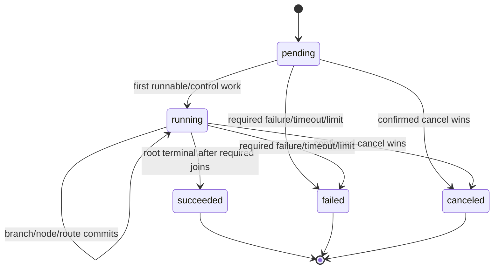
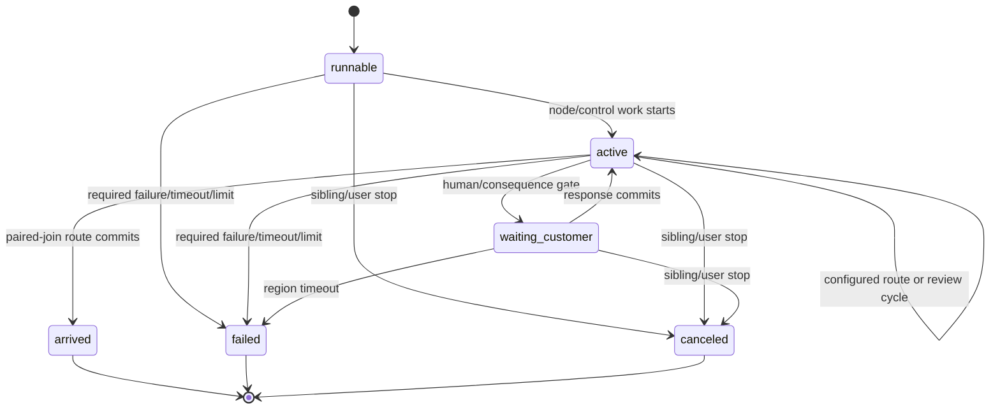

# V2 parallel execution, cancellation, and safe-restart contract

- **Status:** Approved design; implementation is owned by follow-on tickets.
- **Approval date:** 2026-08-24
- **Architecture ticket:** [HOR-457](https://linear.app/horizonshift/issue/HOR-457/v2-approve-parallel-cancellation-and-safe-restart-runtime-contract)
- **Product contract:** Obsidian `Platform V2 — Managed Digital Workforce — Product Requirements`, especially `REQ-018`–`REQ-024`, `SCN-012`–`SCN-015`, and `SCN-018`
- **Related authority:** [`v2-authentication-authority.md`](v2-authentication-authority.md), [`v2-chat-tool-confirmation.md`](v2-chat-tool-confirmation.md), and [`v2-artifact-processing.md`](v2-artifact-processing.md)
- **Implementation owners:** HOR-468, HOR-466, HOR-464, HOR-463, HOR-516, HOR-424, HOR-469, and the release-validation owner identified in section 22

This record is the repository authority for V2 structured parallel graphs, execution lanes, branch sessions and outputs, join-all scheduling, cyclic review/remediation, customer work projections, required-branch failure, cancellation fencing, consequence handling, declared checkpoints, immutable-output reuse, fresh-attempt restart, and the OPO1 runtime reset boundary. It does not implement, deploy, reset, or delete data.

The current runtime is deliberately single-active-node. This record replaces that assumption only for runtime implementation after the clean cutover in section 19. It preserves PostgreSQL authority, append-only V2 attempt evidence, per-turn dispatch fencing, Tool Gateway consequence authority, and the prohibition on silent execution replay.

## 1. Approved design decisions

The founder approved the exact revised package below on 2026-08-24. The complete approval, scope, consequences, and evidence are durable in HOR-457. A product-behavior change or a different inherited datastore, transport, concurrency, failure, isolation, cancellation, consequence, restart, or cutover model requires a new durable decision rather than an implementation-local interpretation.

### DES-HOR-457-01 — Durable authority and transport

- **Approved by:** Nuno Gonçalves
- **Approved on:** 2026-08-24
- **Scope:** HOR-457 runtime scheduling, persistence, cancellation propagation, and consequence authority.
- **Decision:** PostgreSQL remains authoritative for immutable workflow definitions, work items/attempts, execution lanes and node visits, blockers, confirmations, dispatch assignments, runtime events, and Tool Gateway invocations. Runtime events and history remain append-only evidence; mutable rows are only current-state projections/fences. Runnable work and stop propagation use PostgreSQL row locking, leases, counters, and outboxes. V2 adds no broker, cache authority, or competing execution/consequence ledger.
- **Consequences:** Follow-on runtime work must extend existing PostgreSQL authorities and cannot introduce a second queue or consequence source of truth.
- **Evidence:** Founder approval recorded in HOR-457 on 2026-08-24 before repository edits.

### DES-HOR-457-02 — Structured fork/join schema, including cyclic review

- **Approved by:** Nuno Gonçalves
- **Approved on:** 2026-08-24
- **Scope:** V2 workflow graph schema and static validation.
- **Decision:** Add explicit `parallel_fork` and paired `parallel_join` control nodes. A fork declares its join and 2–16 statically named required branch entry nodes; the join back-references the fork, declares only policy `all`, and emits the reserved deterministic outcome `joined`. Branch regions are node-disjoint; every branch path must terminate at its paired join; only the fork may enter a branch; only that branch may reach its join; nested/overlapping parallel regions, dynamic fan-out, and joins other than `all` are rejected. Directed cycles remain explicitly supported in two places: (a) wholly inside an ordinary root/sequential region, and (b) wholly inside exactly one parallel branch. Therefore `review -> address_review -> review` may repeat until `review` emits a terminal outcome both in a sequential workflow region and inside one parallel branch; each traversal creates new immutable node visits. Cycles may not contain a `parallel_fork` or `parallel_join`, cross from pre-fork to post-join and back, leave/re-enter a branch, or span branches. Validation rejects every strongly connected component that crosses one of those boundaries. In a branch review loop, only the terminal review outcome may route to the paired join.
- **Consequences:** V2 supports bounded review/remediation loops but deliberately excludes cycles through or across parallel-region boundaries and excludes nested/dynamic parallelism.
- **Evidence:** Founder approval recorded in HOR-457 on 2026-08-24 before repository edits.

### DES-HOR-457-03 — Durable lanes, branch identity, sessions, and storage boundary

- **Approved by:** Nuno Gonçalves
- **Approved on:** 2026-08-24
- **Scope:** Attempt/branch identity, pi sessions, sandbox isolation, and the storage prerequisite.
- **Decision:** Every attempt owns a durable root execution lane. Each fork visit creates a durable fork activation ID; each declared branch receives a durable branch execution ID keyed by activation plus branch key and its own lane. At most one node execution is active per lane, while an attempt may have multiple active branch lanes. Every visit/output retains attempt, lane, activation, branch, node, visit sequence, and exact execution identity. Root and branch turns retain separate pi session identities; every branch uses a distinct sandbox/session/UID lifecycle, and IDs are never reused. Branch data crosses lanes only through PostgreSQL-committed validated outputs and immutable artifact references—never through another branch’s live filesystem. Production parallel validation requires a multi-worker AgentPool backed by an RWX-capable session substrate; HOR-424/HOR-469 select and provision that substrate, and HOR-457 selects no competing RWX mechanism.
- **Consequences:** Parallelism requires lane-aware runtime records and isolated branch sessions; shared filesystem state is not a branch communication channel.
- **Evidence:** Founder approval recorded in HOR-457 on 2026-08-24 before repository edits.

### DES-HOR-457-04 — Activation, scheduling, cycles, and recovery fencing

- **Approved by:** Nuno Gonçalves
- **Approved on:** 2026-08-24
- **Scope:** Multi-scheduler eligibility, transition limits, crash recovery, and retry fencing.
- **Decision:** Activating a fork atomically records the completed fork visit, activation, all required branch/lane records, and all branch entry eligibility. All branches become logically runnable; existing one-credit worker capacity bounds simultaneous turns rather than changing branch correctness. Multiple scheduler replicas claim eligible node work with PostgreSQL locks/leases and attempt/lane compare-and-swap counters, so exactly one node visit/turn is created per eligibility. The existing transition bound applies independently to each lane; a review/remediation cycle may intentionally create successive visits until its terminal outcome, but exceeding the bound fails the attempt. An explicit graph cycle is a configured transition, not a retry. A pending node with no committed turn may be reclaimed after a scheduler crash; once a node visit/turn is committed or dispatched it is never redelivered or silently retried. Worker/dispatch loss uses the failure contract in DES-HOR-457-07.
- **Consequences:** Concurrency remains bounded by worker credits; configured graph loops remain valid while started work preserves at-most-once/no-silent-retry semantics.
- **Evidence:** Founder approval recorded in HOR-457 on 2026-08-24 before repository edits.

### DES-HOR-457-05 — Join-all and deterministic output

- **Approved by:** Nuno Gonçalves
- **Approved on:** 2026-08-24
- **Scope:** Branch arrival evidence, join readiness, and joined output.
- **Decision:** A branch reaches its paired join by atomically writing one immutable arrival tied to its terminal node visit/outcome/output/artifact references and marking that branch arrived. Duplicate arrivals are idempotently rejected by activation/branch uniqueness. No downstream node is eligible until all declared required branches for that activation have arrived. The join then records one root-lane control visit and one immutable aggregate ordered by branch declaration; each entry contains branch key, branch execution ID, terminal node execution ID, terminal outcome, validated output, and artifact references. The join emits `joined` exactly once. Branch completion order never changes the aggregate or downstream behavior.
- **Consequences:** Join behavior is deterministic and replay-safe, but V2 cannot continue on partial, quorum, race, or dynamically selected branch completion.
- **Evidence:** Founder approval recorded in HOR-457 on 2026-08-24 before repository edits.

### DES-HOR-457-06 — Customer-honest work projection

- **Approved by:** Nuno Gonçalves
- **Approved on:** 2026-08-24
- **Scope:** Work-item state and action-required projection consumed by HOR-466/HOR-516.
- **Decision:** A nonterminal attempt is `In progress` whenever any lane is running, runnable, waiting only for worker capacity, or able to complete a control transition/join. Customer action required is an independent projection and may coexist with `In progress`. The work item is `Blocked` only when every remaining nonterminal lane is waiting on an open customer-action blocker and no lane/control transition can advance. Each active human gate has its own durable blocker, so parallel branches may expose multiple open blockers. Technical failures never project `Blocked`; failed and canceled attempts project in the stopped-work area with subtype, plain-language reason, retry eligibility, known completed effects, and outcome-unknown effects. `Done` means only that the root lane reached the workflow terminal rule after all required joins, never that the business result is correct.
- **Consequences:** Status derives from all lanes rather than one active node and permits multiple simultaneous customer blockers without mislabeling technical failure.
- **Evidence:** Founder approval recorded in HOR-457 on 2026-08-24 before repository edits.

### DES-HOR-457-07 — Required failure, timeout, and no branch retry

- **Approved by:** Nuno Gonçalves
- **Approved on:** 2026-08-24
- **Scope:** Branch/turn failure, timeout, sibling shutdown, and terminal races.
- **Decision:** Any required branch node failure, worker/dispatch loss after turn commitment, lane transition-limit breach, or declared parallel-region timeout fails the whole attempt under an attempt-row first-terminal-writer fence. An optional fork timeout is wall-clock from durable activation and includes worker waiting, agent work, configured review/remediation cycles, and human-gate waiting. Failure atomically stops new scheduling, preserves all committed visits/outputs/arrivals/effects, records the failing evidence, and creates stop targets for safe active siblings. Siblings may finish only if completion wins the terminal fence first; otherwise late results are evidence and cannot advance the graph. Neither a failed branch nor a lost started turn is retried; recovery requires an explicit new attempt under DES-HOR-457-12.
- **Consequences:** Required-branch availability is fail-fast and evidence-preserving; long human review loops consume a configured region wall-clock budget.
- **Evidence:** Founder approval recorded in HOR-457 on 2026-08-24 before repository edits.

### DES-HOR-457-08 — Generalized stop boundary and cancellation races

- **Approved by:** Nuno Gonçalves
- **Approved on:** 2026-08-24
- **Scope:** Attempt cancellation/failure fencing, dispatch assignments, gateway invocation creation, and stop propagation.
- **Decision:** User cancellation and failure-driven sibling shutdown share one durable stop-intent/stop-target outbox. Confirmed user cancellation locks the attempt and uses first-terminal-writer/CAS semantics: if completion/failure committed first the proposal is stale; if cancellation commits first it immediately marks the attempt canceled, increments the scheduling fence, denies queued work, terminalizes active assignments, and records exact active turn/invocation targets before commit. Tool Gateway work-scoped invocation creation must serialize its run-active check and ledger insert against the same attempt stop boundary: an invocation that commits first is captured as in flight; a stop that commits first causes invocation creation to fail closed. After commit, leased outbox workers send best-effort `AbortTurn` and gateway/tool cancellation and retry only those control messages—not business execution. Late turn/tool completion is retained but cannot reopen or advance the attempt.
- **Consequences:** Cancellation is durable and race-deterministic but remains best effort after the scheduling/effect boundary; only control-message delivery may retry.
- **Evidence:** Founder approval recorded in HOR-457 on 2026-08-24 before repository edits.

### DES-HOR-457-09 — Consequence authority and outcome uncertainty

- **Approved by:** Nuno Gonçalves
- **Approved on:** 2026-08-24
- **Scope:** Tool consequence reporting across cancel, failure, recovery, and restart.
- **Decision:** The Tool Gateway invocation ledger remains the sole authority for external-effect outcome. Completed effects stand and are listed after cancel/failure/restart; no runtime state claims undo or compensation. If an invocation may have crossed the external boundary and a definitive result cannot be reconciled, it is or remains `outcome_unknown`; canceling a turn does not convert uncertainty into success, failure, or reversal. Definitive late results update/append gateway evidence and the customer-safe consequence projection without changing the stopped attempt. Restart never reuses an invocation as a synthetic success and never repeats a succeeded/unknown consequence silently.
- **Consequences:** The product can promise scheduling stop and honest evidence, not universal effect cancellation or undo.
- **Evidence:** Founder approval recorded in HOR-457 on 2026-08-24 before repository edits.

### DES-HOR-457-10 — Browser-only cancel/restart authorization and confirmation

- **Approved by:** Nuno Gonçalves
- **Approved on:** 2026-08-24
- **Scope:** Customer command channel, authorization, CSRF, and stale-confirmation behavior.
- **Decision:** Cancellation, revision, restart, blocker responses, and consequence confirmation are browser-cookie-only for a current Operator or Admin authorized to view/operate the installation work item. Bearer and mixed credentials are denied; exact-origin CSRF is required; recent-password authentication is not required because these are operational rather than account-security mutations. Cancel/restart is two-step: proposal creation writes an immutable digest and ten-minute expiry; confirmation performs no client-trusted recomputation and atomically rechecks authority plus the digest. The digest covers work item/attempt/version, terminal fence, active lanes/turns, known succeeded/running/unknown consequences, selected checkpoint, canonical input/guidance/artifact digests, and repeated-consequence set. Any relevant drift makes the proposal stale and requires a new review.
- **Consequences:** V2 API keys cannot cancel/restart or confirm consequences; operational commands avoid recent-auth friction but require an exact durable review/confirm boundary.
- **Evidence:** Founder approval recorded in HOR-457 on 2026-08-24 before repository edits.

### DES-HOR-457-11 — Workflow-declared safe checkpoints only

- **Approved by:** Nuno Gonçalves
- **Approved on:** 2026-08-24
- **Scope:** Workflow checkpoint declarations, static safety, attainment, and reusable evidence.
- **Decision:** An immutable workflow definition may declare checkpoints with a stable key, exact completed root-lane edge anchor `(node, outcome)`, the edge’s exact resume node, and named reusable output/artifact sources. A checkpoint is attained only when that edge commits while no parallel region is open. It may follow an ordinary root node or a completed join. It may also sit on an edge inside a root/sequential review cycle; every traversal creates a separate immutable attainment and restart selects the latest applicable one. A checkpoint may not be inside a parallel branch (including a branch review cycle), at a fork, between partial branch arrivals, or inferred from runtime state. Reusable root sources must be the anchor or statically dominate it; branch data is reusable only through the completed join aggregate, never by selecting an inner branch visit directly. Attainment snapshots exact source execution IDs, canonical output digests, and immutable artifact IDs/digests; it never copies or mutates prior evidence.
- **Consequences:** Expert workflow authors must declare safe resumptions explicitly; partial branch recovery and inferred resume remain unsupported.
- **Evidence:** Founder approval recorded in HOR-457 on 2026-08-24 before repository edits.

### DES-HOR-457-12 — Fresh-attempt restart and immutable reuse

- **Approved by:** Nuno Gonçalves
- **Approved on:** 2026-08-24
- **Scope:** Restart/revision lineage, applicability, output reuse, sessions, pins, and repeated consequences.
- **Decision:** Restart/revision always creates a new attempt on the same work item and exact immutable workflow definition, linked to its source attempt; stopped/completed attempts, visits, outputs, confirmations, invocation outcomes, and lineage remain immutable after V2 activation. The selector walks lineage newest-first and chooses the latest attained checkpoint whose source records still exist and whose workflow definition plus canonical initial inputs, revision guidance, and ordered artifact IDs/digests exactly match. Any changed input, guidance, artifact identity, or artifact digest invalidates every prior checkpoint and forces workflow entry with no reused outputs. With an applicable checkpoint, the new attempt references the approved immutable source records in explicit `reused_outputs` context; it creates no synthetic successful visits, resumes at the declared node, creates entirely new root/branch sessions, and pins currently healthy allowed tool/model versions under the normal new-attempt policy. The proposal lists every prior succeeded or outcome-unknown consequential invocation on graph paths reachable from the selected resume point; repeating those paths requires the user’s exact confirmation and a new invocation decision. If no checkpoint applies, restart falls back to entry under the same consequence review.
- **Consequences:** Input revision deliberately sacrifices checkpoint reuse; restart is auditable and safe but can repeat consequential paths only after exact confirmation.
- **Evidence:** Founder approval recorded in HOR-457 on 2026-08-24 before repository edits.

### DES-HOR-457-13 — OPO1 maintenance reset, not backward-compatible migration

- **Approved by:** Nuno Gonçalves
- **Approved on:** 2026-08-24
- **Scope:** Future OPO1 V2 runtime cutover and rollback boundary.
- **Decision:** Only OPO1 is currently deployed, so V2 runtime implementation will use a one-way maintenance reset instead of backfill or mixed-version compatibility. In a separately approved implementation/deployment ticket—not HOR-457—operators will: (1) close starts and drain runtime writers; (2) require zero active runs/turns/assignments and zero pending/running/outcome-unknown work-scoped invocations, reconciling or aborting the cutover otherwise; (3) take one cold database snapshot solely as rollback protection; (4) scale all API/runtime/dispatch/gateway writers and workers to zero; (5) destructively clear/recreate workflow-definition, work/runtime execution, dispatch/session-reference, and work-scoped gateway records in foreign-key-safe order while leaving identity, artifact bytes/metadata, and declarative deployment configuration outside the reset; (6) deploy one uniform V2 binary/protocol set, reconcile definitions from declarative configuration, and fail closed if any configured graph does not validate; (7) run sequential, cyclic-review, parallel-join, cancellation, and restart smoke tests before reopening starts. Existing sequential behavior remains a supported V2 graph capability, but definitions are freshly registered and prior persisted attempts/work items have no compatibility, backfill, or restart path. No legacy-row readers, legacy stopped-attempt handling, mixed-epoch protocol, or old-binary guards are built. Before reopening, rollback is old release plus snapshot restore; after reopening, there is no in-place downgrade—operators roll forward or restore the snapshot in a new maintenance window and accept loss of post-cutover work. The reset exception applies only to pre-V2 OPO1 data; append-only history and no-erasure rules apply to all attempts created after V2 activation. HOR-457 performs no deployment, database reset, or production-data deletion.
- **Consequences:** Follow-on implementation is simpler and deliberately abandons old runtime/work compatibility; deployment requires an outage, a clean drain, a cold snapshot, and fresh definition validation.
- **Evidence:** Founder approval recorded in HOR-457 on 2026-08-24 before repository edits.

## 2. Scope, non-goals, and invariants

### In scope

- Explicit structured `parallel_fork` and paired `parallel_join` with `all` semantics.
- Sequential and single-branch cycles, including repeated review/remediation visits.
- Durable root/branch lanes, fork activations, branch identities, arrivals, outputs, sessions, counters, and leases.
- One-credit worker scheduling, multi-scheduler fencing, process recovery, worker loss, and no execution redelivery.
- Parallel human gates, multiple blockers, customer status/action-required derivation, and stopped-work evidence.
- User cancellation, required-branch failure, queued/running/turn/tool/session stop targets, terminal races, and late evidence.
- Workflow-declared checkpoints, exact applicability, immutable output/artifact references, entry fallback, repeated-consequence confirmation, and new-attempt lineage.
- The future OPO1 maintenance reset and rollback boundary.

### Non-goals

- Runtime, API, CRD, database, dispatch, gateway, harness, UI, chart, Forge, or overlay implementation in HOR-457.
- Deployment, database reset, or deletion of OPO1 data in this ticket.
- Partial, `any`, quorum, race, conditional, or dynamically selected joins.
- Dynamic fan-out, map/reduce, nested or overlapping parallel regions, or cycles through a fork/join boundary.
- Branch/node/turn automatic retry, stopped-attempt resume in place, session resurrection, or inferred checkpoints.
- Compensation, universal undo, reversal claims, or a second consequence ledger.
- Customer graph/checkpoint authoring or customer configuration of workers, sessions, storage, tools, or models.
- Selection or provisioning of the production RWX backend.

### Non-negotiable invariants

1. Every attempt has one immutable workflow-definition snapshot, one root lane, and zero or more durable branch lanes.
2. A lane has at most one `pending|running|blocked` node execution; an attempt may have several such nodes only when they belong to different lanes.
3. Every node traversal creates a new immutable visit. A configured cycle never resets or overwrites an earlier visit.
4. An explicit review cycle is valid wholly in a root sequential region or wholly in one branch; no strongly connected component contains a fork/join or crosses a region boundary.
5. Every fork activation creates all declared required branches atomically. There is no partial activation or runtime-discovered branch.
6. A branch reaches exactly its paired join once. No branch or graph terminal bypasses its required join.
7. Join readiness is all declared arrivals for one exact activation; completion order cannot alter aggregate order.
8. Branch live filesystems are isolated. Only committed output and artifact references cross lanes.
9. A committed or dispatched node turn is never assigned as a replacement execution. Worker loss fails the attempt.
10. Every graph mutation, tool-invocation creation, and stop boundary observes the same attempt terminal fence.
11. Stop propagation retries control delivery only. It never replays a branch, node, turn, or business invocation.
12. Tool Gateway invocation state is the only external-effect outcome. Runtime stop state cannot rewrite it.
13. A stopped/completed V2 attempt and all its visits, outputs, arrivals, checkpoint attainments, confirmations, and consequences remain immutable.
14. Restart always creates a new attempt and new sessions. Reuse is by exact immutable reference, never by synthetic successful visits.
15. Any changed canonical execution input invalidates checkpoint reuse and forces entry.
16. A checkpoint is attained only on its declared root-lane edge with no open parallel activation.
17. Customer `Blocked` means no remaining lane/control transition can advance without customer action; action-required alone never implies `Blocked`.
18. The pre-V2 OPO1 reset is the only approved history-erasure exception. It cannot be reused as a normal retention or recovery mechanism.

## 3. Existing foundation and exact gaps

| Current foundation | Reuse | Exact V2 gap |
| --- | --- | --- |
| `workflow.ValidateGraph` accepts deterministic directed graphs and legal cycles, rejects unreachable nodes and cycles without terminal paths, and enforces `maxTransitions` | Keep immutable definition snapshots, complete outcome routing, terminal-path validation, and cycles | Add control-node schema, structured-region analysis, 2–16 branch validation, SCC boundary checks, checkpoint dominance, and per-lane transition semantics. |
| `runtime.node_executions` records immutable visits and `runtime.graph_transitions` records one route per source | Keep append-only visit/output evidence and exact source-outcome routing | Current unique active index is per attempt, kinds are only agent/human, transition sequence uses one linear successor, and branch arrivals/join aggregates do not exist. |
| One runtime run owns one pi session and `turns.session_id` enforces one active turn per session | Keep one active turn per session, sandbox UID isolation, and explicit `SessionEnd` | An attempt needs a root session plus independent branch sessions and durable lane/session ownership. |
| `work.ActiveNode`/`PrepareNode` and `work.current_work_items` assume one active node and one blocker | Keep atomic node preparation, human-gate evidence, completion validation, and timeline projection | Replace single-node queries/indexes and item-wide blocker uniqueness; derive progress/action-required from all lanes. |
| Dispatch persists one active assignment per turn with worker-generation fencing and durable event ACK/dedup | Keep one-credit workers, exact assignment context, late after-terminal audit, and no automatic execution replay | Schedule several lane turns, serialize node eligibility, bind sessions to lanes, and stop all active assignments under one attempt fence. |
| Harness protocol already has idempotent exact-turn `AbortTurn` and `SessionEnd` | Reuse messages and worker fencing | Add durable stop delivery targets/recovery; direct in-memory sends are not the stop authority. |
| Tool Gateway commits a ledger row before dispatch, protects exact pins/authorization, supports cancel, and classifies ambiguous writes `outcome_unknown` | Keep ledger, effect classes, consequence summaries, and result reconciliation | Make work invocation creation atomic with the attempt-active fence and add server-owned stop-target cancellation after assignments are terminal. |
| `CreateRevision` creates a new attempt and re-resolves current pins | Keep same-item lineage, exact immutable definition, new pins, and consequence review | Add stopped-attempt restart, canonical input digest, declared checkpoint attainments, source references, entry fallback, and path-reachable consequence selection. |
| Runtime/work events and gateway rows retain late/terminal evidence | Keep append-only evidence and customer-safe projections | Add fork/branch/join/stop/checkpoint semantic events and distinguish stopped subtype from one generic failed state. |
| OPO1 is the only deployment | Use a controlled outage and cold snapshot | Do not build legacy readers/backfill/mixed epochs; define a fail-closed destructive reset and fresh definition registration. |

No Inference Gateway authorization model changes are introduced: every concurrent agent turn still has one exact active assignment, worker generation, pool, model, and scope. Terminalizing that assignment continues to deny inference fail closed. Any physical view adjustment required by the new lane/session columns must preserve the existing content-free per-turn contract.

## 4. Structured graph contract

### 4.1 Normative logical schema

Field names below are the required API/CRD shape for HOR-468. Control nodes retain required localized business labels but have no prompt, model, skills, capabilities, workspace tools, human gate, output schema, or result fields.

```yaml
spec:
  graph:
    entryNode: prepare
    maxTransitions: 20 # independently enforced for each lane
    safeCheckpoints:
      - key: prepared
        after:
          node: prepare
          outcome: ready
        resumeNode: parallel_review
        reusable:
          - name: prepared_input
            node: prepare
            includeOutput: true
            includeArtifacts: true
    nodes:
      - key: prepare
        kind: agent_task
        label: {en: Prepare request, pt: Preparar pedido}
        prompt: "..."
        outcomes: [ready]

      - key: parallel_review
        kind: parallel_fork
        label: {en: Review in parallel, pt: Rever em paralelo}
        parallelFork:
          joinNode: reviews_joined
          timeout: 24h
          branches:
            - key: legal
              label: {en: Legal review, pt: Revisão jurídica}
              entryNode: legal_review
            - key: operations
              label: {en: Operations review, pt: Revisão operacional}
              entryNode: operations_review

      - key: legal_review
        kind: agent_task
        label: {en: Review, pt: Rever}
        prompt: "..."
        outcomes: [approved, needs_changes]
      - key: legal_address_review
        kind: agent_task
        label: {en: Address review, pt: Corrigir revisão}
        prompt: "..."
        outcomes: [ready_for_review]

      - key: operations_review
        kind: human_gate
        label: {en: Operations decision, pt: Decisão operacional}
        outcomes: [approved]
        humanGate: { ... }

      - key: reviews_joined
        kind: parallel_join
        label: {en: Reviews complete, pt: Revisões concluídas}
        parallelJoin:
          forkNode: parallel_review
          policy: all

      - key: publish
        kind: agent_task
        label: {en: Prepare result, pt: Preparar resultado}
        prompt: "..."
        outcomes: [completed]

    edges:
      - {from: prepare, outcome: ready, to: parallel_review}
      - {from: legal_review, outcome: needs_changes, to: legal_address_review}
      - {from: legal_address_review, outcome: ready_for_review, to: legal_review}
      - {from: legal_review, outcome: approved, to: reviews_joined}
      - {from: operations_review, outcome: approved, to: reviews_joined}
      - {from: reviews_joined, outcome: joined, to: publish}
    terminalOutcomes:
      - {node: publish, outcome: completed}
```

Control-node outcome rules:

- `parallel_fork` has no declared or emitted outcome and has no outgoing graph edge. Its branch declarations are the complete fan-out authority.
- `parallel_join` has the implicit, reserved outcome `joined`; authors do not list another outcome. One ordinary edge or terminal declaration must cover `joined`.
- An edge from a branch node to its paired join is a branch-arrival route. It does not independently execute the join.
- A branch entry and every branch member must be an `agent_task` or `human_gate`; a branch cannot contain a control node.
- A branch node cannot be a graph terminal. Graph terminal outcomes belong only to root-lane normal nodes or a root-lane join's `joined` outcome.
- `parallelFork.timeout` is optional and must be a positive duration. Absence means no region timeout beyond node/worker/transition failure.
- A root path may contain several disjoint parallel regions in sequence. They cannot nest, overlap, or participate in a cycle.

### 4.2 Static region validation

Validation computes a structured region assignment before accepting the immutable definition:

1. Index every node, declared outcome, edge, terminal route, fork declaration, branch key, branch entry, and paired join.
2. Require 2–16 unique branch keys and unique branch entries per fork. Require one unique paired join and reciprocal fork reference.
3. Start a traversal at each branch entry, stopping at the paired join. Every visited non-join node is assigned to exactly one `(fork, branch)` region.
4. Reject every ordinary graph edge whose destination is a `parallel_join` unless its source is assigned to one exact branch declared by that join's paired fork. The source outcome must be a valid terminal route for that branch. These branch-arrival routes are the only join ingress; a root-to-join edge and an edge from an unpaired fork's branch are invalid.
5. Reject a node reached from two branch entries, a branch that cannot reach the join, an edge into a branch from outside, an edge from a branch to another branch/fork/unpaired join/root node, or a branch/global terminal before the join.
6. Reject a fork or join encountered inside a branch. Because nesting/overlap is unsupported, every control node belongs to the root region.
7. Classify every remaining ordinary node as root/sequential. Require all root nodes reachable from `entryNode` under implicit fork fan-out/join convergence.
8. Run Tarjan/Kosaraju SCC analysis over ordinary edges plus the structural fork-to-entry and arrival-to-join arcs. A cyclic SCC is valid only when every member is ordinary and all members have the same region: root or one exact branch.
9. Reject any SCC containing a fork/join, nodes from multiple branches, or both root and branch nodes. This rejects post-join-to-pre-fork loops and leave/re-enter branch loops explicitly.
10. Preserve the existing rule that every node has a possible path to a graph terminal. For a branch, that path must first reach its paired join.
11. Validate `maxTransitions` in the existing 1–10,000 range and apply it to each lane independently.

### 4.3 Explicit cyclic-review semantics

Both of these are valid:

```text
root sequential region:
review --needs_changes--> address_review --ready--> review
review --approved-------> next root node or graph terminal

one branch region:
review --needs_changes--> address_review --ready--> review
review --approved-------> paired parallel_join
```

Each transition inserts a new node-execution visit. The branch identity and branch session remain the same while the loop repeats. `maxTransitions` bounds that lane, and an optional fork timeout bounds total wall-clock time for a branch loop. A human gate may appear in the loop. A consequential node revisited by an explicit loop still requires the exact repeated-consequence confirmation already required by the work domain; graph intent does not silently authorize repeating an external effect.

These are invalid:

```text
join -> node before its fork                 # repeats/crosses the region
branch A -> branch B                         # spans branches
branch node -> root node -> same branch      # leaves and re-enters
branch node -> nested fork                   # nested parallelism
post-join review -> pre-fork address_review  # SCC contains fork/join boundary
```

### 4.4 Checkpoint declaration validation

A checkpoint declaration contains:

- stable nonempty `key`, unique within the definition;
- exact `after.node` and `after.outcome` identifying a nonterminal ordinary edge;
- `resumeNode`, which must equal that edge's target;
- one or more unique reusable names, each with a source node and at least one of `includeOutput` or `includeArtifacts`.

Rules:

- The anchor and resume target are root-region nodes. The anchor may be a normal node or `parallel_join`; it may not be a fork.
- The edge must be traversable with no open parallel activation. A join's `joined` edge is eligible because all branches have already arrived.
- An anchor inside a root SCC is valid; every traversal can attain it. A branch SCC is never checkpoint-eligible.
- A reusable source is the anchor or an ordinary root node that statically dominates the anchor. A completed join is a reusable source for its aggregate.
- No inner branch node can be a reusable source. Branch output must first enter the deterministic join aggregate.
- The source output/artifact shape must be valid for the node kind. Forks have no reusable output.
- Terminal outcomes cannot anchor a checkpoint because there is no exact resume edge.

## 5. Durable execution model

### 5.1 Logical records

Names are normative logical contracts. HOR-468 may consolidate physical tables but must preserve their keys, uniqueness, immutable evidence, state constraints, and transaction boundaries.

#### `runtime.execution_lanes`

- `id`, `attempt_id`, and kind `root|parallel_branch`.
- nullable `fork_activation_id`, `branch_execution_id`, and branch key; all null for root.
- unique immutable `session_id`, session directory, sandbox/UID allocation reference, and session protocol/configuration evidence.
- current state `runnable|running|waiting_customer|waiting_join|arrived|succeeded|failed|canceled`.
- `transition_count`, `fence_generation`, creation/terminal times, and bounded terminal reason.
- unique root lane per attempt and unique lane per branch execution.

#### `runtime.fork_activations`

- immutable activation UUID, attempt/root-lane/fork-node execution/fork key/join key.
- exact branch declaration snapshot and optional `deadline_at` calculated from committed activation time.
- current state `open|joined|failed|canceled` plus fence/timestamps.
- unique `fork_node_execution_id`; a static fork is activated at most once because cycles cannot cross it.

#### `runtime.branch_executions`

- immutable UUID, activation ID, declaration-order ordinal, branch key/label/entry node, and lane ID.
- current state `runnable|active|waiting_customer|arrived|failed|canceled`.
- nullable immutable arrival ID and terminal reason/timestamps.
- unique `(activation_id, branch_key)` and `(activation_id, declaration_ordinal)`.

#### `runtime.node_executions`

Extend/replace the clean-cutover table with:

- required lane ID; nullable activation/branch IDs matching that lane;
- node key, kind `agent_task|human_gate|parallel_fork|parallel_join`;
- visit number per `(lane,node)` and monotonic lane execution sequence;
- monotonic attempt evidence sequence allocated by a PostgreSQL counter; it records commit order, not branch precedence;
- immutable context, model/skill/capability/timeout/presentation snapshots;
- state `pending|running|blocked|succeeded|failed|canceled`;
- immutable completion outcome/summary/output/artifact refs and lifecycle times.

A partial unique index enforces one `pending|running|blocked` execution per lane. Control nodes have no turn. A canceled node may retain a previously reported-but-not-settled candidate as operator evidence, but it cannot be projected as a successful branch output.

#### `runtime.execution_routes`

- exactly one route record per successfully completed non-fork node execution;
- source outcome and destination kind `node|branch_arrival|attempt_terminal`;
- nullable destination node execution/arrival ID constrained by kind;
- immutable creation time and attempt/lane identity.

Fork activation is represented by `fork_activations.fork_node_execution_id`, not by pretending it has one successor. Branch arrival is represented by an arrival destination rather than creating one join per branch.

#### `runtime.branch_arrivals`

- one immutable row per branch execution;
- terminal source execution ID, node key, outcome, canonical output, output digest, exact artifact references/digests, and arrival time;
- unique branch execution ID.

#### `runtime.join_aggregates`

- one immutable row per fork activation and join node execution;
- canonical `branches` array ordered by declaration, not arrival;
- canonical digest and creation time.

The join node's platform output is:

```json
{
  "branches": [
    {
      "key": "legal",
      "branchExecutionId": "...",
      "terminalNodeExecutionId": "...",
      "terminalOutcome": "approved",
      "output": {},
      "artifactRefs": []
    }
  ]
}
```

### 5.2 Session ownership

- Attempt creation creates the root lane and a new root pi session/sandbox identity.
- Fork activation creates a distinct session/sandbox identity and UID lifecycle for every branch before the branch becomes runnable.
- A worker may execute successive visits from the same lane/session, including configured review cycles. It cannot execute two simultaneous turns for that session.
- Another worker may execute a later visit after the prior turn settled; RWX permits the same durable session to move between workers under assignment fencing.
- Branch arrival makes its session cleanup-eligible after all committed event ACKs. Downstream work never needs the live branch filesystem.
- Root session remains available while the root lane waits for a join and resumes after join. It is cleanup-eligible only when the attempt stops/finishes.
- Session cleanup/control delivery is durable and idempotent. UID/session identity is not reused until the existing reap confirmation and grace contract permits it.

### 5.3 Context and artifact handoff

A node context contains only:

- canonical work input and exact input digest;
- exact lane, activation, branch, and current node identities;
- the previous successful visit in that lane;
- immutable latest successful root/lane outputs by exact execution ID;
- for a post-join root node, the exact join aggregate;
- explicit `reused_outputs` references for a restarted attempt;
- exact authorized artifact materializations selected for that node.

A branch receives the root context as of fork activation plus branch-local later history. It never observes another branch's partial output. A join publishes complete branch outputs only after all arrivals. Artifact bytes remain owned by the artifact service; the runtime carries immutable references and consumption evidence.

## 6. Scheduler and transaction boundaries

### 6.1 Eligibility and claims

- Runnable node eligibility is durable PostgreSQL state, not an in-memory queue.
- Schedulers use `FOR UPDATE SKIP LOCKED` or an equivalent leased claim against pending nodes/lanes.
- Every claim includes attempt terminal-fence generation and lane fence generation. Commit fails if either changed.
- A pending agent node may create exactly one turn. If the scheduler crashes before a turn commit, the node lease expires and another scheduler may prepare it.
- If a turn commits before first assignment, dispatch may assign that same turn once. It does not create a replacement turn.
- Once assignment commits, failure to deliver or worker loss is delivery uncertainty and fails the attempt; the turn is not assigned to another worker.
- Human nodes create one durable blocker and become `blocked`. Control nodes execute database-only transactions.
- Worker `Ready` remains one credit. A worker receives at most one active assignment; more runnable branches wait without changing correctness.

### 6.2 Required lock order

To avoid deadlock and make terminal races deterministic, follow-on code uses this logical order:

1. attempt terminal-fence row;
2. fork activation when applicable;
3. execution lane(s) in stable UUID order;
4. node/branch/turn/assignment rows in stable UUID order;
5. attempt sequence/counter row;
6. timeline/runtime/outbox inserts.

Normal branch work may hold a lock compatible with other active branches while remaining incompatible with terminal stop. Cancellation/failure takes the exclusive attempt stop boundary. No external network call occurs while these locks are held.

### 6.3 Fork activation

One transaction:

1. locks attempt/root lane/fork execution and verifies nonterminal matching fences;
2. validates the snapshotted fork definition;
3. marks the fork control visit succeeded;
4. creates the activation and deadline;
5. creates every branch execution, lane, branch session identity, and entry visit;
6. marks root lane `waiting_join`;
7. appends one fork event and customer-safe timeline event;
8. commits all or none.

A crash before commit leaves the fork pending and reclaimable. A crash after commit observes the complete branch set; unique keys make re-entry converge without another activation.

### 6.4 Branch arrival and join

One branch-arrival transaction:

1. locks the attempt and paired activation first;
2. locks both the arriving branch lane and root lane in stable UUID order before any node or branch row—the root lane is acquired for every arrival because the activation lock serializes the decision about whether this arrival completes the region;
3. locks the terminal node and branch records in stable UUID order, then verifies matching fences, successful source completion, and the paired-join route;
4. writes the immutable arrival and marks branch/lane arrived;
5. appends branch evidence;
6. if arrivals remain, commits without creating a join visit;
7. if this is the last arrival, creates exactly one join aggregate and join control visit under the already-held root-lane lock, marks activation joined/root runnable, emits `joined`, and routes to the next root visit or graph terminal in the same transaction.

A duplicate last-arrival race returns the existing arrival/join. No observer can see downstream eligibility without the complete aggregate, and no arrival path inverts the global lane-before-node/branch lock order.

### 6.5 Transition bound

`graph.maxTransitions` counts committed nonterminal route traversals independently for each lane. Fork activation and join completion count on the root lane; each review/address loop edge counts on its branch or root lane. Reaching the bound before a terminal/arrival route fails the attempt. With at most 16 branches and no nesting, total attempt visits remain statically bounded by `(branch lanes + root lane) * maxTransitions` plus initial control visits.

## 7. Runtime and customer state machines

### Attempt



Terminal state is first-writer-wins. Stop delivery may still be propagating after `failed|canceled`; it is a separate projection and never reopens the attempt.

### Branch



### Work projection

Projection precedence for the current attempt:

1. `succeeded` -> `Done`.
2. `failed|canceled` -> `Stopped`, subtype `failed|canceled`.
3. Any progress-capable lane/control transition -> `In progress`.
4. No progress-capable lane and at least one open customer blocker -> `Blocked`.
5. Otherwise fail closed to an operator-visible inconsistent state; never invent `Blocked` or `Done`.

`progress-capable` includes running, runnable, waiting only for worker credit, a fork ready to activate, or a join ready to commit. An open blocker yields `actionRequired=true` and contributes to `openBlockerCount`; it does not override another progress-capable branch. Multiple open blockers are ordered by branch declaration then creation time for stable customer presentation.

## 8. Failure and timeout semantics

### Required failure transaction

The first required technical failure:

1. exclusively locks the attempt stop boundary;
2. verifies it is nonterminal and records `failed` plus subtype/reason;
3. increments terminal/scheduling fence;
4. marks every `pending|running|blocked` nonfailed sibling node and open branch canceled;
5. resolves customer blockers as stopped without fabricating a customer response;
6. terminalizes active dispatch assignments;
7. captures active turn/session/invocation targets in the durable stop outbox;
8. preserves completed visits, arrivals, outputs, artifacts, confirmations, and invocation states;
9. appends technical runtime evidence and one customer-safe stopped event;
10. commits before sending cancellation messages.

The failing branch remains `failed`; siblings are `canceled` unless they had already arrived. Completed sibling evidence remains visible.

### Region timeout

- Deadline is persisted at fork activation from the immutable positive duration.
- Wall-clock includes scheduler/worker waiting, active turns, all configured branch cycles, human gates, consequence gates, and process downtime.
- A PostgreSQL-leased sweeper attempts the same required-failure transaction with subtype `parallel_timeout`.
- If join completion committed first, timeout is a no-op. If timeout commits first, late arrival cannot create the join.

### Worker and process loss

- Worker disconnect/reconnect fences the exact assignment generation as today.
- A committed assigned turn lost before settlement fails the required branch/attempt; it is never assigned to a replacement worker.
- A scheduler crash before node/turn commit is safe lease recovery, not execution retry.
- A process crash after branch arrival commit observes the immutable arrival and may complete the join once.
- Late worker events use existing after-terminal append/dedup evidence and cannot mutate branch/attempt state.
- The Tool Gateway independently reconciles orphaned writes to `outcome_unknown` and reads to failed under its existing authority.

A Tool Gateway's existing same-invocation policy for proven-idempotent transport remains separately governed by its immutable descriptor and ledger. It does not create another branch/node/turn or another invocation and is not branch retry.

## 9. Cancellation and stop propagation

### 9.1 Logical records

#### `work.control_proposals`

- immutable UUID, work item/current attempt, kind `cancel|restart|revision`, initiating human/session, creation and ten-minute expiry;
- exact customer-safe consequence/checkpoint/reuse/repeat projection;
- canonical server-only proposal payload and SHA-256 digest;
- state `pending|confirmed|expired|stale` plus decision evidence and bounded stale reason;
- one decision CAS; same confirmation replay is idempotent.

#### `runtime.stop_intents`

- immutable UUID and unique attempt ID;
- kind `user_cancel|required_failure|worker_loss|node_timeout|parallel_timeout|transition_limit`;
- resulting attempt terminal state/subtype, terminal fence, source node/branch where applicable, actor/reason, and creation time;
- propagation state `pending|propagating|settled` is delivery evidence only.

#### `runtime.stop_targets`

- immutable stop intent plus kind `turn|tool_invocation|session` and exact target UUID/string;
- state `pending|leased|delivered|settled|unreachable`, lease generation/owner/expiry, bounded attempt count and last control error;
- unique `(stop_intent_id,target_kind,target_id)`.

Queued/pending nodes, blockers, and assignments are terminalized in the stop transaction and are not network outbox targets.

Target lifecycle and terminal evidence are exact:

- `pending` and `leased` mean delivery has not converged. `delivered` means the exact control was accepted or deduplicated by its owner, but the target's safe terminal condition has not yet been proved. All three states are nonterminal for propagation.
- A `turn` target is `settled` only after the exact child/turn is observed stopped and its assignment is terminal. It may be `unreachable` after bounded delivery only when the assignment is already terminal/fenced, the exact worker generation is no longer authoritative, and all later gateway/inference authorization for that turn fails closed. An unreachable child may produce after-terminal evidence but cannot advance or create a new effect.
- A `tool_invocation` target is propagation-terminal only when its exact Tool Gateway row is `succeeded|failed|outcome_unknown`; a cancel acceptance alone is merely `delivered`. Bounded control-delivery failure may leave the target `unreachable`, but that state is aggregate-eligible only after the ledger independently reaches one of those terminal outcomes. `dispatching|running` is never eligible.
- A `session` target is `settled` only when the approved session owner/reaper verifies the exact sandbox path absent and records the result. If its worker is unreachable and absence cannot be proved, the target may become `unreachable` only while the exact session ID remains never-reusable and its UID/GID allocation remains durably non-recyclable. That preserved isolation fence makes delivery terminal for restart while the leaked directory remains an alerted maintenance backlog; a later verified reap may advance the target to `settled`. Neither restart nor reset may delete or recycle that fence while the directory may exist.

A reconciler sets `stop_intents.propagation_state='settled'` in one transaction if and only if the target set is complete under the attempt's terminal fence, no target is `pending|leased|delivered`, every `unreachable` target satisfies the kind-specific proof above, every exact work-scoped invocation is outside `dispatching|running`, and all invocation ambiguity has been classified by the Tool Gateway ledger. An intent with no targets may be created already `settled`. Otherwise it is `pending` until first lease and `propagating` until this full predicate holds. `unreachable` stops blind control redelivery; it never by itself claims that a turn, effect, or sandbox was canceled.

### 9.2 Customer cancellation sequence

```mermaid
sequenceDiagram
    participant B as Browser
    participant API as Product API
    participant DB as PostgreSQL
    participant O as Stop worker
    participant D as Dispatch/Harness
    participant G as Tool Gateway

    B->>API: create cancel proposal (cookie + CSRF)
    API->>DB: lock item/attempt; snapshot lanes, turns, consequences, fence
    DB-->>API: immutable proposal + digest + 10m expiry
    API-->>B: completed/active/unknown effects and consequence copy
    B->>API: confirm proposal + digest
    API->>DB: current authority + digest recheck; exclusive attempt lock
    DB->>DB: canceled + fence++ + assignments terminal + exact stop targets
    DB-->>API: commit stopped evidence
    API-->>B: canceled/stopping-safe-work result
    O->>DB: lease exact targets
    par active turn
        O->>D: AbortTurn(exact turn)
    and active invocation
        O->>G: cancel exact invocation target
    and session cleanup
        O->>D: SessionEnd when eligible
    end
    D-->>DB: late events are after-terminal evidence
    G-->>DB: definitive late result or outcome_unknown
```

The customer receives durable stopped state after the database commit; network cancellation success is never a prerequisite for that response and never an undo claim.

### 9.3 Invocation creation race

Tool Gateway work-scoped `BeginInvocation` must use a transaction-scoped scope resolver:

1. take a lock compatible with active branch work but conflicting with attempt stop;
2. verify attempt nonterminal, exact node/turn/assignment active, worker generation, pool, capability, and immutable pin;
3. validate arguments/artifacts/resource policy and render consequence summary;
4. insert or resolve the unique invocation ledger row;
5. commit before runner dispatch.

If invocation commit wins, cancellation waits and then includes the row in stop/consequence evidence. If cancellation wins, the active check fails and no invocation row/effect is created. There is no gap where a new work invocation can begin after the stop snapshot.

The stop worker uses a server-owned exact-target gateway operation tied to `runtime.stop_targets`; it validates target invocation/attempt identity directly. It does not impersonate a browser or rely on the now-terminal supervisor assignment. The existing supervisor `CancelInvocation` remains available for a currently active turn-owned cancellation but is not the durable attempt-stop consumer.

### 9.4 First-terminal-writer examples

| Race | Winner | Required result |
| --- | --- | --- |
| Cancel vs root terminal | Root terminal first | Proposal stale; item is Done. |
| Cancel vs root terminal | Cancel first | Attempt canceled; late completion is evidence only. |
| Cancel vs invocation insert | Invocation first | Invocation is captured/listed and cancel is best effort. |
| Cancel vs invocation insert | Cancel first | Invocation creation denied before effect boundary. |
| Branch failure vs sibling completion | Sibling first | Completed sibling output remains; attempt then fails. |
| Branch failure vs sibling completion | Failure first | Sibling cannot advance/arrive; late observations are evidence. |
| Region timeout vs last arrival/join | Join first | Timeout no-op; downstream may proceed. |
| Region timeout vs last arrival/join | Timeout first | Attempt fails; last arrival cannot create join. |
| Duplicate stop delivery | Existing target state | Idempotent exact-target control; no business replay. |

## 10. Consequence projection

A stopped/restart projection joins exact work-attempt node/turn identities to `toolgateway.invocations` and groups:

- `succeeded`: external effect completed and stands;
- `outcome_unknown`: effect may have happened and was not silently repeated;
- `dispatching|running`: still in flight during stop propagation; restart is not yet eligible;
- `failed`: no successful effect claimed; retained as technical/customer-safe evidence where useful;
- read-only invocations: not shown as external consequences unless separately required as evidence.

Cancellation never changes these states. A runner result committed after stop updates the consequence projection and appends a safe timeline event such as `consequence_succeeded_after_stop` or `consequence_outcome_unknown`; it does not mutate the stopped attempt.

For a `failed|canceled` source attempt, both restart proposal creation and confirmation require its unique `stop_intent` to satisfy the section 9.1 aggregate and have `propagation_state='settled'`; checking only for the absence of `pending|leased` targets is insufficient. A `succeeded` source must have no `pending|propagating` stop intent. Every source state additionally requires zero exact work-scoped invocation in `dispatching|running`. Confirmation repeats these checks under the attempt/proposal lock and returns stale if intent, target, invocation, or consequence evidence differs from the proposal. Lease recovery must classify an ambiguous write as `outcome_unknown` before either gate can pass. This prevents a restarted path from racing original in-flight execution or effect delivery while allowing an unreachable old session only under its preserved non-recycling isolation fence.

## 11. Browser authorization and confirmation

All blocker, cancellation, restart/revision, and consequence-decision routes:

- require one current opaque browser cookie for an active Operator/Admin authorized for the installation work item;
- reject any `Authorization` header before cookie fallback, including a valid mixed request;
- require exact-origin, session-bound CSRF for unsafe methods;
- re-evaluate current account, role, item visibility, current attempt, and applicable artifact authority;
- do not require recent password authentication;
- retain initiating human, browser session, request actor, and decision attribution without using snapshots as current authority.

Normative routes for HOR-464/HOR-463 may compose with existing work paths but preserve these semantics:

```text
POST /v1/work-items/{id}/cancel-proposals
POST /v1/work-items/{id}/cancel-proposals/{proposalId}/confirm
POST /v1/work-items/{id}/restart-proposals
POST /v1/work-items/{id}/restart-proposals/{proposalId}/confirm
POST /v1/work-items/{id}/blockers/{blockerId}/responses
```

The proposal digest includes the complete server-trusted values named in DES-HOR-457-10. Confirmation submits only proposal ID and displayed digest; it cannot replace checkpoint, inputs, target IDs, or consequences. Expiry or any relevant drift transitions/returns stale and requires a new proposal.

## 12. Safe checkpoints and attainments

### 12.1 Input identity

Every V2 attempt stores a canonical `input_digest` over:

- exact immutable workflow definition ID/version/digest;
- canonical initial work source JSON used for execution;
- actionable/revision guidance, including explicit empty value;
- ordered source artifact IDs, canonical byte digests, MIME, and declared consumption modes;
- any other immutable workflow input value admitted by the start/restart contract.

Title, display-only source presentation, actor, timestamps, proposal IDs, and retry reason do not change execution input. Artifact display metadata cannot substitute for canonical byte identity.

### 12.2 `work.checkpoint_attainments`

Each attained checkpoint is append-only:

- UUID, work item/attempt/definition/checkpoint key;
- monotonically allocated attempt attainment sequence and occurrence for that key;
- anchor lane/node execution/outcome and exact resume node;
- input digest and no-open-activation proof/fence;
- immutable reusable-source manifest containing name, source execution ID, node key/visit, output digest/value reference, and exact artifact ID/digest refs;
- creation time and canonical manifest digest.

A root review cycle may attain the same checkpoint repeatedly. Each traversal inserts another occurrence; none is overwritten. The latest applicable occurrence is selected.

### 12.3 Attainment transaction

When a declared anchor edge commits:

1. lock attempt/root lane/anchor execution;
2. verify matching definition, outcome, and edge target;
3. prove there is no `open` fork activation;
4. resolve every declared source deterministically in the anchor's root lane: if the source is the anchor node, select that exact anchor execution; otherwise select the successful execution for the declared source node with the greatest lane execution sequence strictly less than the anchor execution sequence. A completed-join source selects that exact join control execution and aggregate. Lane sequence is unique, so ties are impossible; absence of a qualifying execution fails the transaction as an integrity incident rather than choosing another visit;
5. re-read canonical artifact state/digests and output digests for those exact executions;
6. insert the immutable attainment/manifest;
7. create the normal resume target node in the same original attempt;
8. append safe checkpoint evidence without presenting it as a new work item state.

A crash before commit creates neither attainment nor next node. A replay resolves the existing source route/attainment and cannot create a duplicate occurrence for the same anchor execution.

## 13. Restart selection and creation

### 13.1 Applicability algorithm

For a requested restart/revision from the current attempt:

1. Require current attempt `failed|canceled|succeeded` and no active stop/invocation propagation.
2. Resolve the exact immutable workflow definition from the source attempt. Do not upgrade to another definition.
3. Canonicalize requested inputs/guidance/artifacts and calculate the new input digest.
4. If the new digest differs from the immediate source attempt's digest, declare all prior checkpoints inapplicable; select entry and no reused output. Do not search an older attempt that happens to have the same digest.
5. If unchanged, walk the same-item attempt lineage newest-first, then each attempt's attainments newest-first.
6. Select the first attainment with the exact definition and input digest whose anchor/source/output/artifact records still exist, remain immutable, and remain authorized for reuse.
7. If none applies, select workflow entry and an empty reuse manifest.
8. Compute prior consequential invocations on graph nodes reachable from the selected resume node across the lineage. Include exact `succeeded|outcome_unknown` invocation IDs and safe summaries.
9. Persist all selection evidence in the ten-minute proposal. Any drift before confirmation makes it stale.

Graph reachability is static from `resumeNode`, respecting structured fork fan-out and cycles. A checkpoint after a join excludes pre-join branch nodes because they are not reachable from the resume node. An entry restart includes all reachable graph nodes.

### 13.2 New-attempt transaction

```mermaid
sequenceDiagram
    participant B as Browser
    participant API as Product API
    participant DB as PostgreSQL
    participant S as Scheduler

    B->>API: request restart proposal
    API->>DB: lock current item/attempt; verify stop settled
    DB->>DB: input digest + latest applicable attainment + reachable consequences
    DB-->>B: exact checkpoint/entry, reused evidence, repeated effects, digest
    B->>API: confirm exact proposal
    API->>DB: serializable authority/drift/consequence recheck
    DB->>DB: create new attempt number and lineage
    DB->>DB: snapshot exact definition + current healthy model/tool pins
    DB->>DB: create new root lane/session at resume node or entry
    DB->>DB: insert reused_output references; never synthetic visits
    DB->>DB: set work item current attempt + timeline event
    DB-->>API: commit new attempt
    S->>DB: claim new root node
```

The new attempt stores:

- `restarted_from_attempt_id`/revision feedback where applicable;
- selected checkpoint attainment ID or explicit entry fallback reason;
- exact input digest and immutable definition snapshot;
- new model/tool pins resolved under normal current-health policy;
- exact confirmed repeated-consequence IDs;
- a new root lane/session and later wholly new branch sessions.

### 13.3 `work.attempt_reused_outputs`

One append-only row per named reuse:

- new attempt and selected attainment;
- reusable name and source attempt/lane/node execution;
- source output digest/reference and exact artifact refs/digests;
- manifest digest and creation time.

The new root context exposes these under `reused_outputs`. It does not insert a successful node execution, graph route, branch arrival, Tool Gateway invocation, or value event for reused evidence. Source history remains owned by the prior attempt.

### 13.4 Repeated effects

A confirmation means only that the user accepts executing a path that previously produced the listed succeeded/unknown effects. It does not mark those old invocations repeatable, successful, undone, or reused. A later tool call creates a new gateway invocation decision with its own immutable key and current authorization. Existing upstream idempotency semantics may converge externally, but the product never assumes that outcome.

## 14. Customer and operator events

Required customer-safe semantic events include:

```text
parallel.started
parallel.branch_started
parallel.branch_action_required
parallel.branch_arrived
parallel.joined
parallel.failed
work.cancel_proposed
work.canceled
work.stop_propagation_settled
consequence.succeeded_after_stop
consequence.outcome_unknown
checkpoint.attained
restart.proposed
restart.started_from_checkpoint
restart.started_from_entry
```

Events contain business labels, branch declaration keys/order, attempt/checkpoint identity, safe reason codes, counts, and immutable artifact refs where approved. They contain no prompt, model/provider, raw tool arguments/results, runner, worker, lease, database, filesystem, or internal endpoint detail.

Operator runtime events retain exact lane/branch/node/turn/assignment/fence/target identities and technical reasons. Customer timeline and runtime audit remain separate projections of the same committed domain transition; neither replaces the owning tables.

## 15. Failure and recovery matrix

| Failure/race | Durable state | Automatic action | Customer truth | Retry/recovery |
| --- | --- | --- | --- | --- |
| Scheduler dies before node/turn commit | Pending node + expired lease | Another scheduler claims it | Still In progress | Safe claim recovery; no execution occurred. |
| Scheduler dies after turn commit before assignment | Same unassigned turn | Dispatch assigns that exact turn once | In progress | No replacement turn. |
| Assignment commits but send is lost | Assigned turn delivery uncertain | Fence/terminalize; fail attempt; stop siblings | Stopped/failed | No turn/branch retry. |
| Worker disconnects during branch turn | Assignment fenced; turn/branch failed | Stop siblings | Stopped/failed | New attempt only. |
| Worker late completion after stop | After-terminal event | ACK/dedup evidence only | Stopped remains | Never advances graph. |
| Process dies during fork transaction | All or none | Reclaim pending fork or observe complete activation | In progress | Unique activation converges. |
| Process dies after one branch arrival | Immutable arrival | Join waits/reconciles remaining arrivals | In progress/action required as applicable | No branch replay. |
| Two branches arrive together | Two immutable arrivals; one join | Locks/unique key create join once | Joined once | Idempotent duplicate handling. |
| Review loop exceeds lane bound | Exact visits retained; attempt failed | Stop siblings | Stopped/failed | New attempt only. |
| Parallel wall-clock expires at human gate | Attempt failed; blocker stopped | Stop active siblings | Stopped/failed, not Blocked | New attempt only. |
| One branch blocked, another runnable | Separate blocker + runnable lane | Continue runnable branch | In progress + action required | Human response resolves exact blocker. |
| All remaining branches blocked | Multiple blockers | No scheduling | Blocked + action required | Any valid response may restore In progress. |
| Human response races cancel | First attempt fence writer | Winner commits; loser stale | One deterministic state | New request if still applicable. |
| Cancel wins before invocation insert | No invocation | Deny tool call | Canceled; no new effect | None. |
| Invocation insert wins before cancel | Ledger row captured | Best-effort exact cancel | Completed/in-flight/unknown listed | Ledger reconciliation only. |
| Tool write result lost after send | `outcome_unknown` | No repeat | May have happened | Reconcile; explicit restart confirmation if path repeats. |
| Tool definitive result arrives after stop | Ledger terminal + safe late event | Update consequence projection | Stopped plus definitive effect | Does not reopen attempt. |
| Stop worker crashes | Leased target expires | Another stop worker re-sends control | Stopped; propagation may be pending | Control delivery only. |
| Restart input/guidance/artifact changes | New digest | Select entry, no reuse | New attempt from entry | Expected behavior, not error. |
| Checkpoint source artifact unavailable/drifted | Candidate inapplicable/stale | Try older unchanged candidate or entry | Exact fallback disclosed | New proposal if drift occurred after display. |
| Restart path has running invocation | Restart ineligible | Wait for ledger reconciliation | Stopped; effect still in flight | Re-propose after terminal/unknown. |
| Crash during new-attempt transaction | Old attempt remains current or full new attempt exists | Idempotent proposal decision returns committed result | One new attempt at most | No partial reuse/session. |
| PostgreSQL unavailable | No authoritative transition | Fail closed; send no new work/effect | Temporary unavailable | Retry command/claim before effect boundary. |
| RWX unavailable/ambiguous | Parallel production preflight fails | Do not activate production parallel work | Operator-visible unavailable | HOR-424/HOR-469 remediation. |

## 16. Security and privacy boundaries

- Browser commands inherit the exact session, mixed-credential denial, CSRF, current-role, and attribution contract from HOR-451.
- The model, child, supervisor, and tool runner cannot create/confirm cancellation or restart proposals.
- Caller-supplied attempt, lane, branch, turn, invocation, checkpoint, artifact, or digest values are lookup hints only; server joins establish authority.
- The disposable branch child receives no other branch session path, UID, credentials, internal endpoint, or uncommitted output.
- Tool Gateway credentials remain gateway-owned. Stop workers identify exact ledger targets and receive no raw customer/tool arguments.
- Customer status/event/search responses omit prompts, model messages, chain-of-thought, tool internals, raw results, credentials, worker/pod/session/UID details, and technical stack errors.
- Normal metrics use bounded labels: state/reason class, never work/item/attempt/branch UUID, artifact name, prompt, tool arguments, or customer content.
- Database grants remain least privilege. A scheduler/stop consumer receives only required state/outbox operations; the Inference Gateway retains content-free exact `SELECT` authority only.

## 17. Observability and reconciliation

Required bounded metrics:

- runnable/running/waiting-customer branch counts;
- fork activations and joins by result/reason;
- scheduler claim latency, lease expiry, duplicate convergence, and lane transition-limit failures;
- branch/region duration histograms without workflow/customer labels that create unbounded cardinality;
- attempt stops by subtype and stop-target delivery state/age;
- active/late/outcome-unknown work consequences;
- checkpoint attainments, selected/fallback/invalidated restart counts;
- restart proposal stale reasons;
- session cleanup backlog and RWX preflight status.

Reconciliation loops:

- pending control nodes/forks whose leases expired;
- open activations whose deadline passed;
- activations with all arrivals but no join aggregate;
- nonterminal attempts with inconsistent lane/node/assignment state, failed closed to operator attention rather than fabricated progress;
- stop intents with pending/expired targets;
- terminal branch sessions awaiting cleanup;
- checkpoint attainments whose immutable references fail integrity checks (operator incident; never silently rewrite);
- gateway work invocations whose leases require existing outcome classification.

Alerts cover stuck runnable lanes with available worker credit, overdue stop targets, unknown work consequences, failed session cleanup, invalid graph reconciliation, and RWX readiness loss. Alerts never auto-retry execution.

## 18. Executable validation strategy

### 18.1 Graph/schema unit and property tests

Generate and shrink graph fixtures to prove:

- 2 and 16 branches accepted; 1, 17, duplicate keys/entries rejected;
- branch node-disjointness, paired join reciprocity, all-path-to-join, no branch terminal, and deterministic `joined` coverage;
- a root-region edge directly into a paired join and an unpaired branch-to-join bypass are rejected by generated/shrunk property fixtures;
- sequential `review -> address_review -> review -> terminal` accepted;
- the same cycle inside one branch with terminal `review -> join` accepted;
- cycle through fork/join, post-join-to-pre-fork, cross-branch, leave/re-enter, nested fork, and overlapping regions rejected;
- each node remains reachable and has a terminal path under structural semantics;
- checkpoint anchors/dominators/resume target validated, including repeated root-cycle attainment and rejection inside a branch;
- canonical serialization/digest is stable under map ordering and rejects unknown control policy.

### 18.2 Database constraint tests

Against real PostgreSQL migrations:

- one root lane, one lane per branch, one active node per lane, and several active lanes per attempt;
- unique fork activation, branch key/order, branch arrival, join aggregate, route source, session ID, and checkpoint occurrence;
- append-only mutation rejection for routes, arrivals, aggregates, attainments, reuse manifests, timeline, and V2 terminal evidence;
- legal state transitions and terminal-fence CAS;
- several blockers on different active node executions and no duplicate blocker for one visit;
- no assignment/gateway authorization after stop commit;
- exact input/output/artifact digest constraints.

### 18.3 Scheduler concurrency tests

Run at least two scheduler replicas and many goroutines with deterministic failpoints:

- all branch entries become eligible atomically;
- each node eligibility creates one visit/turn;
- one-credit workers bound simultaneous turns without starving correctness;
- concurrent branch arrivals create one join in declaration order;
- review cycles create increasing visit/lane sequence until terminal/bound;
- scheduler crash at every transaction boundary converges without execution redelivery;
- worker reconnect/loss fails the attempt and cannot reassign the turn;
- cancel/failure/timeout/root-terminal races satisfy section 9.4.

### 18.4 Gateway/dispatch/harness tests

- `BeginInvocation` vs cancel lock-order tests prove insert-before-stop is captured and stop-before-insert denies.
- Active assignment terminalization denies subsequent tool and inference boundaries.
- Stop outbox re-delivery sends exact idempotent `AbortTurn`, invocation cancel, and `SessionEnd` only.
- Target-state matrix tests prove `delivered` is nonterminal; turn/invocation `unreachable` requires its independent fence/ledger proof; session `unreachable` preserves the never-reusable session and UID/GID allocation; and the stop intent settles only under the complete section 9.1 predicate.
- Late worker sequences append/dedup after-terminal evidence and never arrive/join.
- Write cancellation after send preserves `succeeded|outcome_unknown`; no test accepts a fabricated failed/undone state.
- Distinct branch sessions/UIDs can execute on separate workers over the approved RWX substrate and cannot read each other's live directories.

### 18.5 Work projection tests

Table-driven tests cover every combination of:

- running/runnable/waiting-credit lanes;
- one/many open human or consequence blockers;
- join ready/not ready;
- failed/canceled/succeeded attempts;
- pending/in-flight/unknown/late consequences.

Assert exact customer status, action-required flag/count, blocker order, stopped subtype, retry eligibility, and safe EN/PT semantic codes without technical leakage.

### 18.6 Restart/checkpoint tests

- attainment after normal root edge, after join, and on repeated root-cycle edge;
- a root cycle in which both reusable source and anchor repeat proves each manifest selects the anchor execution exactly and the greatest successful source lane sequence before that anchor occurrence;
- no attainment during an open activation or inside a branch;
- newest applicable lineage selection and exact manifest integrity;
- changed source JSON, guidance, artifact ID, digest, MIME, or consumption mode forces entry and zero reuse;
- unavailable source record falls back deterministically;
- reused output appears only in context/reference tables, never as a successful visit/invocation/value event;
- reachable consequence computation excludes pre-checkpoint nodes and includes downstream branch/cycle paths;
- proposal and confirmation both reject `pending|propagating` stop intent, nonterminal target evidence, or a running invocation; terminal/unknown drift stales the proposal;
- an unreachable session permits restart only while its exact session/UID fence remains non-recyclable; deleting that fence is rejected;
- duplicate confirm creates exactly one new attempt and wholly new sessions.

### 18.7 Crash/failure model tests

Use deterministic barriers before/after fork commit, turn creation, assignment commit/send, completion report, branch arrival, join commit, stop commit, stop delivery, gateway ledger insert/send/result, checkpoint attainment, and restart commit. For each barrier, kill/restart the responsible process and assert PostgreSQL convergence, exact ledger counts, no repeated external write, and honest customer state.

### 18.8 OPO1 reset rehearsal

On a disposable OPO1 database and RWX copy:

1. seed current sequential/cyclic definitions, work items, attempts, blockers, assignments, session UID fences/directories (including a leaked sandbox), and work-scoped invocations;
2. prove cutover preflight rejects every authoritative nonterminal run state, including a blocked `runtime.workflow_runs.state='awaiting_approval'` row with its open `work.blockers` record and `runtime.node_executions.state='blocked'`, as well as active turns/assignments and `dispatching|running|outcome_unknown` work invocations;
3. activate an admission fence and prove it denies new starts, node/turn/assignment claims, invocation creation/effect admission, and unrelated customer/Admin mutation while exact pre-fence terminal reports, output/artifact commits, stop controls, session cleanup, and ledger reconciliation remain writable;
4. under that bounded allowlist, settle or explicitly stop every workload and reconcile every invocation to the cutover-eligible zero predicates; abort when an unknown effect cannot be resolved rather than activating the full writer fence early;
5. prove the full maintenance-fence transition is rejected while any zero predicate is false, then activate it after convergence and prove the designated maintenance coordinator is the only remaining writer;
6. enumerate every reset session and, while its allocation fence still exists, reap it through the approved owner-aware reaper and verify its directory absent; foreign-owned, symlinked, persistent-after-remove, or unreachable paths abort the rehearsal;
7. disconnect the maintenance writer, verify the database/object stores remain quiescent, and take/verify the cold snapshot;
8. run the exact foreign-key-ordered reset with all processes down, refusing to delete a session reference/allocation not present in the verified-absent manifest;
9. assert no reset-session directory remains and no reset UID was made recyclable while its path existed;
10. verify identity, artifact bytes/metadata, value/configuration authorities, and declarative sources remain;
11. deploy one V2 binary set, reconcile definitions afresh, and reject an invalid cross-boundary cycle before starts reopen;
12. pass sequential, root-cycle, branch-cycle, join-all, cancellation, and checkpoint restart smoke tests;
13. rehearse pre-reopen old-release snapshot restore and document that post-reopen downgrade is restore-and-lose-new-work or roll-forward, never mixed binary operation.

The rehearsal produces commands, versions, snapshot identity/checksum, row-count manifest, pre/post validation, and rollback evidence. It does not authorize a real deployment.

## 19. OPO1 clean-reset and rollback plan

HOR-468/HOR-464/HOR-463 implementation must produce the exact migration and operator runbook; the later deployment/release gate executes it. The simplest safe cutover is:

### Phase A — prepare without destructive mutation

- Land and validate one complete V2 binary/protocol/schema set.
- Inventory declarative workflow definitions and require each source object to be reproducible after reset.
- Define the exact physical deletion order from foreign keys and classify retained configuration versus work execution.
- Rehearse on a database copy and verify the cold-restore path.
- Publish no mixed-version compatibility promise.

### Phase B — maintenance preflight and cold snapshot

The cutover coordinator distinguishes a fail-closed **admission fence** from the later full **maintenance fence**; they are not interchangeable:

- Activate the admission fence first. Deny new Chat/API workflow starts, restart/revision attempts, customer/Admin mutations unrelated to drain, scheduler claims that would start another node/turn/assignment, new artifact operations, and new Tool Gateway invocation/effect admission. Existing exact assignments and invocations receive no widened authority.
- Keep only a cutover allowlist writable while draining: exact pre-fence turn/node/branch terminal reports and their atomic route/output/artifact/timeline evidence; assignment terminalization; stop-intent/target delivery and acknowledgement; dispatch/cancel/lease/result commits for an exact invocation whose ledger admission committed before the fence, plus fail-closed ledger recovery; session end/reap evidence; and coordinator audit. The allowlist may create a pending successor as part of today's atomic settlement transaction, but the admission fence forbids claiming it and the coordinator explicitly stops that run. It cannot create a new invocation, customer request, definition/configuration change, identity/value mutation, or unrelated reconciliation row.
- With the required API, runtime/dispatch, Tool Gateway, artifact, harness, and bounded reconciliation writers still running under that allowlist, drain or explicitly stop every workflow run/turn/assignment and settle every stop target. This is the only phase allowed to turn already-authorized in-flight work into terminal evidence.
- Against the authoritative OPO1 schema, require zero `runtime.workflow_runs` row with `state IN ('pending','running','awaiting_approval')` or `finished_at IS NULL`, zero `runtime.turns` row with `state IN ('pending','running')` or `settled_at IS NULL`, and zero `runtime.turn_assignments.state='active'`. Any inconsistent timestamp/state pair fails closed. Also require zero `dispatching|running|outcome_unknown` work-scoped gateway invocation; unknown effects must be definitively reconciled or the cutover aborts.
- Only after all zero predicates pass may the coordinator CAS from `admission_fenced` to `maintenance_fenced`. Revoke/fence every application, gateway, worker, controller, reconciler, object-store, and human writer; wait for existing allowlisted transactions to drain. The audited maintenance coordinator is then the sole temporary writer and rechecks the zero predicates under the full fence. A premature transition is rejected rather than freezing work that still needs terminalization.
- Before deleting any session reference or UID allocation, inventory every reset session's exact sandbox path and UID/GID. Use the existing owner/symlink/persist-after-remove safety contract (or an equivalent offline maintenance reaper) to reap each path, verify it absent on the approved RWX substrate, and only then mark its allocation releasable. A missing path is an idempotent success; a foreign-owned, symlinked, unreachable, or persistent path aborts cutover and leaves its allocation fence intact.
- Disconnect the maintenance coordinator and prove no PostgreSQL write-capable session/transaction or retained-object mutation source remains. Then take and verify one cold PostgreSQL snapshot. It is rollback protection, not a backfill source; retained object mutation stays frozen so snapshot restore cannot produce metadata/byte divergence.

### Phase C — process stop and destructive reset

With every mutation source already fenced, scale Product API, runtime/scheduler/dispatch, Tool Gateway, harness workers, identity/artifact writers, controllers/reconcilers, and maintenance jobs to zero and verify none remains. Then:

- clear work execution data: work items, attempts, blockers, feedback, execution-linked artifact references, timeline/value execution rows, checkpoints, reuse, and control proposals;
- re-verify the reset-session manifest, then clear runtime workflow runs, lanes, activations, branches, node visits/routes/arrivals/joins, turns/events, assignments, run-pool bindings, stop outboxes, session references, and session UID/cleanup allocations only for sessions whose RWX paths are proved absent; if any proof is missing, abort and preserve the reference/fence;
- clear work-attempt tool pins and work-scoped Tool Gateway invocations/related retained execution rows;
- clear materialized workflow definitions and definition-owned pool bindings that will be reconciled from declarative configuration;
- create/validate the V2 runtime/work schema in foreign-key-safe order.

Retain identity/authentication authority, artifact metadata and immutable bytes, tool descriptors/pools/grants/credential configuration, model catalogue, value-model configuration, and declarative deployment objects. An implementation runbook must list exact tables and prove no retained row has a dangling reset-domain reference.

### Phase D — uniform activation

- Deploy one uniform V2 API/runtime/dispatch/gateway/harness protocol set while starts remain closed.
- Reconcile every workflow definition from declarative configuration.
- Fail closed if any graph, cyclic region, checkpoint, pool, model, tool, artifact-input, or session/RWX prerequisite does not validate.
- Verify no old pod/process remains before opening any writer.
- Run the approved smoke suite and record exact image/chart/schema/definition identities.
- Reopen starts only after all checks pass.

### Rollback boundary

- Before starts reopen: stop the V2 set, restore the cold snapshot, deploy the old uniform release, and verify old readiness.
- After starts reopen: no in-place downgrade and no old binary may read V2 rows. Either roll forward, or enter a new maintenance window, restore the cold snapshot with the old release, and explicitly accept loss of every post-cutover work record/effect attribution.
- No legacy backfill, nullable compatibility seam, legacy stopped-attempt restart, mixed-epoch protocol, or old-binary runtime guard is required.

This section is a design/runbook requirement only. HOR-457 makes no chart, overlay, deployment, or database mutation.

## 20. Sequence summary: parallel review through restart

```mermaid
sequenceDiagram
    participant S as Scheduler
    participant DB as PostgreSQL
    participant W1 as Worker/legal branch
    participant W2 as Worker/operations branch
    participant B as Browser
    participant G as Tool Gateway

    S->>DB: activate fork atomically (2 branch lanes/sessions)
    S->>W1: AssignTurn legal_review
    S->>W2: AssignTurn operations work
    W1->>DB: review=needs_changes (visit 1)
    DB->>DB: route to address_review
    W1->>DB: address_review=ready
    DB->>DB: route to review visit 2
    W2->>DB: human gate blocker
    DB-->>B: In progress + action required
    W1->>DB: review=approved; legal arrival
    DB-->>B: Blocked (only operations gate remains)
    B->>DB: resolve exact operations blocker
    DB->>DB: operations arrival + deterministic join aggregate
    DB->>DB: attain declared post-join checkpoint
    S->>DB: downstream turn
    S->>G: work tool invocation through ledger
    G-->>DB: outcome_unknown after result loss
    DB->>DB: attempt fails; preserve checkpoint and consequence
    B->>DB: restart proposal
    DB-->>B: checkpoint reuse + repeated reachable consequence
    B->>DB: exact confirmation
    DB->>DB: new attempt/new session/reuse refs at resume node
```

## 21. PRD traceability

| Product contract | Architecture evidence |
| --- | --- |
| `REQ-018`, `SCN-012` explicit fan-out/join-all and durable branch output | Sections 4–7; DES-HOR-457-02 through 05. |
| `REQ-019`, `SCN-012` human gate while another branch advances | Sections 7, 14, and 18.5; DES-HOR-457-06. |
| `REQ-019`, `SCN-013` required failure, evidence retention, no branch retry | Sections 8, 15, and 18.3; DES-HOR-457-07. |
| `REQ-020` completion not correctness | Section 7 projection and invariant 17. |
| `REQ-021` actionable blockers | Sections 7, 11, and 18.5. |
| `REQ-022`, `SCN-014` honest cancellation | Sections 9–11 and race/failure tests; DES-HOR-457-08 through 10. |
| `REQ-023` stopped and outcome-unknown work | Sections 7, 10, 14, and 15. |
| `REQ-024`, `SCN-015` declared checkpoint, fresh attempt, immutable reuse/entry fallback | Sections 12–13 and 18.6; DES-HOR-457-11/12. |
| `SCN-018` crash recovery without duplicate consequence | Sections 6, 8–10, 15, and 18.7. |
| Product preserve-history principle | Post-V2 invariants, append-only logical records, and restart by reference. |
| Founder-approved cyclic review clarification | Sections 4.2/4.3, scheduler bound, tests, and reset smoke suite. |
| Founder-approved OPO1 reset exception | Sections 18.8/19 and DES-HOR-457-13. |

## 22. Ownership and delivery sequence

- **HOR-468:** graph/CRD/canonical schema, structured validation/SCC rules, lanes/activations/branches/arrivals/join aggregates, scheduler, per-branch sessions, region timeout, failure fencing, migrations/reset implementation, and concurrency/property tests.
- **HOR-466:** customer-safe multi-branch/process projections, action-required versus Blocked, multiple blockers, timeline/SSE, EN/PT, responsive/accessibility behavior.
- **HOR-464:** cookie-only cancel proposals/confirmation, attempt stop transaction, dispatch/gateway/session target outbox, stopped subtype/retry eligibility, late consequence projection, and race tests.
- **HOR-463:** checkpoint schema/validation/attainment, input digest, restart proposal/confirmation, lineage selection, immutable reuse references, entry fallback, path-reachable consequence review, and UI/API attempt history.
- **HOR-516:** interaction/presentation design must consume these status, blocker, consequence, checkpoint, and stopped-work semantics without redefining them.
- **HOR-424/HOR-469:** select/provision/validate the production RWX/BYO substrate; they do not redefine lane/session semantics.
- **Shared release validation:** exact multi-worker RWX E2E, process recovery, consequence integrity, clean-reset rehearsal, deployment evidence, and rollback boundary.

HOR-468 should establish the schema and attempt-terminal lock seam consumed by HOR-464/HOR-463. HOR-464 must land before restart execution is enabled, because restart eligibility depends on settled stop/consequence state. HOR-466 may build projections after the runtime records are stable. No Todo/cycle placement bypasses these dependency gates.

## 23. Acceptance checklist

HOR-457's architecture deliverable is complete when review confirms:

- [x] Founder-approved `DES-HOR-457-01` through `DES-HOR-457-13` are durable in Linear and reproduced exactly here.
- [x] Graph schema, validation, join-all, branch identity/output, scheduler/recovery, and session/RWX assumptions are explicit.
- [x] Sequential and one-branch review/remediation cycles are valid, while every fork/join-crossing cycle is explicitly rejected.
- [x] State machines, transaction/lock/fence invariants, sequence diagrams, failure matrix, customer projections, and consequence authority are explicit.
- [x] Checkpoint declaration/attainment, applicability, immutable reuse, revised-input invalidation, consequence confirmation, entry fallback, and fresh-attempt lineage are explicit.
- [x] OPO1 clean reset, preconditions, retained/deleted authority classes, uniform activation, and rollback boundary are explicit without performing deployment or deletion.
- [x] Executable unit/property/database/concurrency/gateway/harness/E2E/reset-rehearsal strategies trace to the PRD.
- [x] Follow-on implementation ownership and semantic publication classification are explicit.

Semantic publication for HOR-457 is **none**. Merge integrates an approved repository architecture record; implementation, release publication, OPO1 deployment, and any data reset remain separately gated work.
